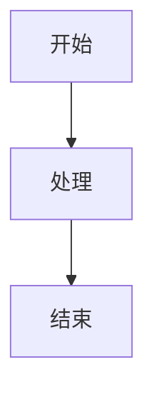

# 常见 Markdown 文档使用方法速查

## 1. 标题
### 1.1 一级标题
#### 1.1.1 二级标题
##### 1.1.1.1 三级标题
###### 1.1.1.1.1 四级标题

## 2. 表格
### 2.1 基础表格
| 列1标题 | 列2标题 | 列3标题 |
|---------|---------|---------|
| 单元格1 | 单元格2 | 单元格3 |
| 单元格4 | 单元格5 | 单元格6 |

### 2.2 对齐方式
| 左对齐 | 居中对齐 | 右对齐 |
|:-------|:--------:|-------:|
| 左内容 | 中内容   | 右内容 |

### 2.3 表格内换行
| 项目 | 描述 |
|------|------|
| 多行 | 第一行 第二行 |

### 2.4 表格内嵌套
| 功能 | 示例 |
|------|------|
| 加粗 | **加粗文本** |
| 斜体 | *斜体文本* |
| 链接 | [链接文本](https://example.com) |

## 3. Mermaid 流程图
### 3.1 基础流程图

