# “一单一检”产品需求文档（PRD）

## 1. 文档信息

| 项目    | 内容                       |
| ----- | ------------------------ |
| 产品名称  | 一单一检                     |
| 文档版本  | V0.38                    |
| 文档状态  | 业务流程、页面方案与权限模型初稿，持续评审中   |
| 编制日期  | 2026-09-01               |
| 适用范围  | 检查任务、自查、互查、稽查、整改、复核与申诉 |
| 需求负责人 | 待补充                      |

### 1.1 参考材料

- 《一单一检信息化建设方案2026042309(1).pdf》
- 《2026.5.12一单一检沟通.docx》
- 本轮产品与业务沟通确认结论

### 1.2 文档约定

- “已确认”表示已在本轮沟通中明确，可用于后续原型和研发设计。
- 当前检查范围暂统一描述为“合同业务范围”，具体检查环节、检查项和模板内容后续与业务确认。

### 1.3 阅读导航

| 阅读目标                | 建议章节                     |
| ------------------- | ------------------------ |
| 快速了解为什么建设、解决什么问题    | 第2-4章：背景、目标、术语           |
| 确认谁参与、对应功能用例及能看什么数据 | 第5-6章：角色、人物功能用例与权限       |
| 评审业务流程和状态规则         | 第7-10章：业务对象、流程、状态、规则     |
| 确认系统需要建设哪些页面        | 第12章：页面信息架构与页面清单 |
| 确认每个页面承载哪些功能        | 第11章：功能架构与能力清单                |
| 供产品、研发、测试细化         | 第13章：数据留痕与审计要求          |

***

## 2. 产品背景

当前合同合规检查存在检查过程分散、检查标准不统一、数据留痕不足、跨单位监督能力不足以及整改闭环不完整等问题。项目拟建设统一的“一单一检”能力，以合同类单据为业务对象，形成检查任务的自查、互查、稽查、整改、复核和申诉线上闭环。

本产品不改变合同本身的上架状态和业务办理结果。检查任务负责记录风险、推动整改、形成监督数据，检查结果不拦截合同上架。

## 3. 产品目标

### 3.1 业务目标

1. 统一检查任务入口、流程和检查标准。
2. 支持本单位自查、跨单位互查和局级稽查。
3. 实现检查任务派发、执行、回退、整改、复核、申诉全过程线上留痕。
4. 支持人工检查项和系统识别项协同执行。
5. 实现原始判定及检查结论不可覆盖，申诉结果、合规判定结果、整改复核结果和闭环状态分层记录。

### 3.2 非目标

以下内容暂不作为本版已确认目标：

- 年度或季度稽查计划在线下制定和管理。
- 暂不细化不同合同类型的具体检查范围和检查项。
- 不通过检查结果拦截合同上架，线下进行管理。

***

## 4. 术语定义

| 术语      | 定义                                                      |
| ------- | ------------------------------------------------------- |
| 一单      | 一份合同类单据，包括普通合同、框架协议、补充协议等；当前统一按合同业务范围管理                 |
| 自查      | 由合同所属单位的合规专员执行的检查                                       |
| 互查      | 由非合同所属单位的合规专家执行的跨单位检查                                   |
| 稽查      | 由局管理员独立发起、稽查专家执行的检查                                     |
| 原始判定结果  | 人工检查项在任务首次正式提交时形成的判定，或系统识别项首次返回的检测结果，永久保留，不被申诉覆盖      |
| 原始检查结论  | 检查任务首次提交时基于各检查项原始判定结果形成的检查项及总体结论，永久保留，不被后续处置覆盖            |
| 申诉结果    | 按检查项记录为未申诉、处理中、通过或不通过；通过或不通过由局管理员作出，申诉处理中不提前改变合规判定结果            |
| 合规判定结果  | 检查项当前用于总体合规结论计算的结果，仅取合规或不合规；无申诉或申诉不通过时与原始判定结果一致，申诉通过时为合规；整改及复核结果不参与计算，也不改变该结果 |
| 整改复核结果  | 对整改材料的复核结论，单独记录为未整改、待复核、复核通过或复核不通过；仅影响问题闭环，不改变原始判定结果、原始检查结论或合规判定结果 |
| 申诉      | 合同经办人针对自查、互查或稽查中的具体不合规检查项提出申诉；首次不合规或整改复核不通过后，在符合规则时按检查项发起，由局管理员处理 |
| 问题闭环    | 不合规问题已通过整改复核，或申诉通过后合规判定结果已更新为合规，达到允许进入后续检查阶段的状态；闭环状态与合规判定结果分开记录，整改复核通过不将原不合规判定改为合规 |
| 回退      | 检查人主动申请将已分派但尚未完成的任务退回待分派池                               |
| 自动收回    | 检查任务超过配置时限后由系统自动回收；当前仅适用于自查，收回后按合同所属组织的派发模式重新处理         |

***

## 5. 用户角色与职责

| 角色       | 核心职责                                                                                        | 备注（角色类型）         |
| -------- | ------------------------------------------------------------------------------------------- | ---------------- |
| 合同经办人    | 在“我的任务”查看本人负责合同的自查、互查、稽查不合规事项；按检查项选择提交整改或发起申诉                           | 实质业务角色（合同关系）     |
| 单位供应链负责人 | 配置本组织自查派发模式；人工指定或调整自查人员；审批自查任务回退                                                            | 权限点角色（RBAC）      |
| 合规专员     | 执行本单位自查；发起系统检测；复核本人检查问题的整改；申请自查任务回退                                      | 实质业务角色（人员资格）     |
| 合规专家     | 执行跨单位互查；复核本人检查问题的整改；申请互查任务回退                                                   | 实质业务角色（人员资格）     |
| 稽查专家     | 执行稽查；复核本人检查问题的整改；申请稽查任务回退                                                 | 实质业务角色（人员资格）     |
| 局管理员     | 发起和管理互查、稽查；审批互查、稽查任务回退；在获得对应权限点后查看组织数据范围内的自查、互查、稽查任务，处理已分派给本人的申诉并按检查项作出最终结论；维护检查模板、角色权限、时限及通知规则等配置 | 权限点角色（RBAC）      |
| 合规人员库管理员 | 在授权的资格所属组织范围内维护合规专员、合规专家和稽查专家资格                                                             | 权限点角色（RBAC）      |
| 系统       | 生成检查任务、匹配模板、派发任务、执行状态流转、催办、留痕和准入计算                                                          | 系统参与方（非用户）       |

### 5.1 角色类型与叠加规则

- 同一账号可以同时拥有合规专员、合规专家、稽查专家等多条人员资格，每条资格可归属不同组织。
- 人员资格由“人员类型 + 资格所属组织”共同确定；系统不提供角色身份切换，直接根据用户拥有的角色、人员资格、任务关系和组织范围展示对应任务及操作。
- 实质业务角色来源于合同业务关系、合规人员库资格或流程任务关系，其业务办理能力不通过静态RBAC权限点授予。
- 权限点角色是权限点与组织数据范围的集合，包括单位供应链负责人、局管理员和合规人员库管理员。
- 同一用户可以同时具有实质业务角色和权限点角色，各角色可访问的任务和功能在同一账号下叠加展示；最终操作权限仍由“角色来源 + 业务关系或任务关系 + 组织范围 + 当前流程状态”逐项决定。

### 5.2 人物功能用例

#### 5.2.1 业务办理角色用例图

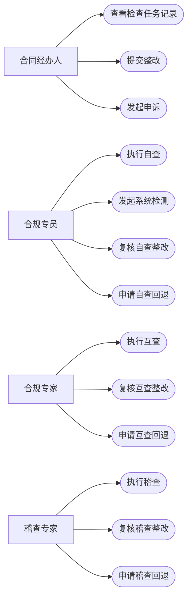

#### 5.2.2 管理与支撑角色用例图

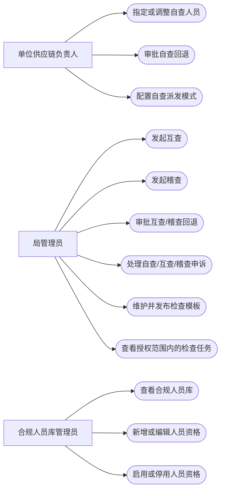

#### 5.2.3 合同经办人

| 用例编号     | 用例名称     | 前置条件               | 主流程                      | 结果                            |
| -------- | -------- | ------------------ | ------------------------ | ----------------------------- |
| UC-H-001 | 查看检查任务记录 | 用户为合同经办人且合同已生成检查任务 | 进入本人合同列表，查看阶段、结论、问题和处置记录 | 用户获得本人负责合同的检查信息               |
| UC-H-002 | 发起自查申诉 | 自查检查项首次判定不合规或整改复核不通过，且该项此前未申诉并在时限内 | 在“我的任务—自查”进入详情，勾选不认可的检查项并提交申诉原因和材料 | 申诉进入局管理员待办，问题闭环前合同暂不可互查 |
| UC-H-003 | 提交整改     | 自查、互查或稽查存在待处置或复核不通过问题 | 在“我的任务”对应页签进入详情，勾选问题并提交整改说明和材料 | 生成原检查人的整改复核待办                 |
| UC-H-004 | 发起互查申诉 | 互查检查项首次判定不合规或整改复核不通过，且该项此前未申诉并在时限内 | 在“我的任务—互查”进入详情，勾选检查项并提交申诉理由和材料 | 申诉进入局管理员待办                  |
| UC-H-005 | 发起稽查申诉 | 稽查检查项首次判定不合规或整改复核不通过，且该项此前未申诉并在时限内 | 在“我的任务—稽查”进入详情，勾选检查项并提交申诉理由和材料 | 申诉进入局管理员待办                |

#### 5.2.4 单位供应链负责人

| 用例编号     | 用例名称     | 前置条件          | 主流程                      | 结果                 |
| -------- | -------- | ------------- | ------------------------ | ------------------ |
| UC-L-001 | 指定自查人员   | 本单位存在待派发自查记录  | 选择合同和本单位合规专员并确认          | 生成合规专员自查待办         |
| UC-L-002 | 调整自查人员   | 自查任务未提交       | 选择新的合规专员并确认调整            | 任务转交并记录调整日志        |
| UC-L-003 | 审批自查回退   | 收到自查回退申请      | 查看原因并通过或驳回               | 任务返回待分派池或由原检查人继续办理 |
| UC-L-004 | 配置自查派发模式 | 拥有组织业务配置维护权限点 | 在组织数据范围内选择组织并设置自动派发或人工指定 | 新生成的自查任务按该组织当前配置派发 |

#### 5.2.5 合规专员

| 用例编号      | 用例名称     | 前置条件           | 主流程                   | 结果                       |
| --------- | -------- | -------------- | --------------------- | ------------------------ |
| UC-SC-001 | 执行自查     | 已收到自查任务        | 填写人工项、发起系统检测、处理必检项并提交 | 形成不可覆盖的自查原始结论            |
| UC-SC-002 | 申请自查回退   | 自查任务未提交且无法继续处理 | 填写原因并申请回退             | 进入单位供应链负责人审批             |
| UC-SC-003 | 复核自查整改   | 本人检查问题已提交整改      | 在“我的任务—自查”进入详情，查看材料并逐项作出复核结论 | 按问题闭环情况流转至自查待处置、复核不通过或已自查状态 |

#### 5.2.6 合规专家

| 用例编号      | 用例名称     | 前置条件                | 主流程                  | 结果                          |
| --------- | -------- | ------------------- | -------------------- | --------------------------- |
| UC-MC-001 | 执行互查     | 已收到跨单位互查任务          | 在不可查看自查结果的前提下独立检查并提交 | 形成互查原始结论                    |
| UC-MC-002 | 复核互查整改   | 本人检查问题已提交整改         | 在“我的任务—互查”进入详情，查看材料并作出复核结论 | 按是否全部闭环流转至互查待处置、复核不通过或已互查状态 |
| UC-MC-003 | 申请互查回退   | 互查任务未提交且无法继续处理      | 填写原因并申请回退            | 进入局管理员审批                    |

#### 5.2.7 稽查专家

| 用例编号      | 用例名称     | 前置条件                | 主流程                     | 结果                    |
| --------- | -------- | ------------------- | ----------------------- | --------------------- |
| UC-AC-001 | 执行稽查     | 已收到稽查任务且不是该合同原互查人员  | 查看关联历史记录，执行检查并提交        | 形成稽查原始结论              |
| UC-AC-002 | 复核稽查整改   | 本人检查问题已提交整改         | 在“我的任务—稽查”进入详情，查看材料并作出复核结论 | 更新问题处理结果和单据当前检查状态     |
| UC-AC-003 | 申请稽查回退   | 稽查任务未提交且无法继续处理      | 填写原因并申请回退               | 进入局管理员审批              |

#### 5.2.8 局管理员

| 用例编号     | 用例名称      | 前置条件                   | 主流程                               | 结果                                         |
| -------- | --------- | ---------------------- | --------------------------------- | ------------------------------------------ |
| UC-A-001 | 发起互查      | 互查候选池存在可用合同            | 设置范围、比例或数量，确认抽取与派发                | 生成跨单位互查任务                                  |
| UC-A-002 | 发起稽查      | 稽查候选池存在可用合同            | 设置候选范围、抽取方式和派发规则                  | 生成符合回避要求的稽查任务                              |
| UC-A-003 | 审批互查/稽查回退 | 收到回退申请                 | 查看原因并通过或驳回                        | 任务回池重派或原检查人继续办理                            |
| UC-A-004 | 处理申诉      | 拥有对应检查类型的“处理申诉”权限点，且申诉已分派给本人 | 在“我的任务”对应页签进入详情，按检查项审查材料并作出最终结论 | 申诉通过项的合规判定结果更新为合规并闭环；申诉不通过项保持不合规并转为必须整改，由经办人提交材料并由原检查人复核；全部问题闭环后进入下一阶段或已稽查 |
| UC-A-005 | 维护检查模板    | 拥有“维护检查模板”权限点          | 维护模板基础信息、阶段/分组、检查项、检查标准和填写规则并保存草稿 | 形成可预览、待发布的模板草稿                             |
| UC-A-006 | 发布模板版本    | 拥有“发布检查模板版本”权限点且发布校验通过 | 预览模板并确认发布                         | 生成只读已发布版本，供后续新任务匹配和形成快照                    |
| UC-A-007 | 查看检查任务    | 拥有“查看自查任务”“查看互查任务”或“查看稽查任务”权限点 | 在“检查任务记录”按已授权检查类型和组织数据范围查询列表、详情和流转记录 | 获得授权范围内的只读任务信息，不产生办理权限 |

#### 5.2.9 合规人员库管理员

| 用例编号      | 用例名称    | 前置条件                    | 主流程                           | 结果                      |
| --------- | ------- | ----------------------- | ----------------------------- | ----------------------- |
| UC-PL-001 | 查看合规人员库 | 拥有人员库查看权限点              | 在资格所属组织数据范围内按人员类型、组织和状态查询     | 获得授权范围内的人员资格信息          |
| UC-PL-002 | 新增人员资格  | 拥有人员库管理权限点              | 从统一用户中选择人员，新增人员类型、资格所属组织和资格状态 | 用户以启用状态进入对应资格所属组织的候选人员库 |
| UC-PL-003 | 编辑人员资格  | 拥有人员库管理权限点且资格所属组织在数据范围内 | 独立修改某条资格的组织、状态或说明             | 保存该条人员资格并记录变更日志，不影响其他资格 |
| UC-PL-004 | 停用合规人员  | 拥有人员库管理权限点              | 查看未完成任务提示，确认停用                | 人员不再接收新任务，历史记录保留        |
***

## 6. 权限与数据可见性

### 6.1 授权原则

1. **管理类功能采用权限点控制。**检查模板、模板匹配、合规人员库、跨本人业务关系的自查/互查/稽查任务查询、申诉处理、互查/稽查发起与派发和系统配置等能力均配置独立权限点；台账权限点不在本PRD负责范围内。
2. **本人检查任务的查看和办理不配置静态权限点。**合同经办人、当前检查人和历史办理人查看本人直接关联任务，以及检查人执行自查、互查、稽查，由人员资格、合同关系、任务分派或历史办理关系和当前流程状态共同决定。“查看自查/互查/稽查任务”权限点用于授权管理人员在组织数据范围内查询非本人直接关联任务，不产生任务办理权限。
3. **整改、复核和发起申诉由业务关系控制，处理申诉还需权限点。**合同经办人处理本人合同的整改并发起申诉；原检查人处理对应整改复核。处理申诉仅授权局管理员，并必须同时满足“拥有对应检查类型的申诉处理权限点 + 申诉已分派给本人 + 当前申诉状态允许处理”。

### 6.2 权限点目录

| 权限名称     | 控制范围              | 建议授予角色           |
| -------- | ----------------- | ---------------- |
| 查看检查模板   | 模板列表和详情           | 局管理员（按权限点授权）     |
| 维护检查模板   | 新增、编辑、复制、停用       | 局管理员（按权限点授权）     |
| 发布检查模板版本 | 发布新版本             | 局管理员（按权限点授权）     |
| 维护模板匹配规则 | 合同属性与模板关系         | 局管理员（按权限点授权）     |
| 查看合规人员库  | 人员资格列表和详情         | 人员库管理员、相关管理角色    |
| 维护合规人员库  | 新增、编辑、启用、停用人员资格   | 人员库管理员           |
| 查看组织业务配置 | 查看组织级业务参数         | 单位供应链负责人（按权限点授权） |
| 维护组织业务配置 | 配置本组织自查派发模式等组织级参数 | 单位供应链负责人（按权限点授权） |
| 查看自查任务 | 查询组织数据范围内的自查任务列表、详情和流转记录 | 局管理员、相关管理角色（按权限点授权） |
| 查看互查任务 | 查询组织数据范围内的互查任务列表、详情和流转记录 | 局管理员、相关管理角色（按权限点授权） |
| 查看稽查任务 | 查询组织数据范围内的稽查任务列表、详情和流转记录 | 局管理员、相关管理角色（按权限点授权） |
| 自查派发管理   | 人工指定或调整自查人员       | 单位供应链负责人         |
| 发起互查     | 创建互查批次            | 局管理员             |
| 互查派发管理   | 人工指定或调整互查专家       | 局管理员             |
| 发起稽查     | 创建稽查批次            | 局管理员             |
| 稽查派发管理   | 人工指定或调整稽查专家       | 局管理员             |
| 处理自查申诉 | 处理已分派给本人的自查申诉并按检查项作出结论 | 局管理员（按权限点授权） |
| 处理互查申诉 | 处理已分派给本人的互查申诉并按检查项作出结论 | 局管理员（按权限点授权） |
| 处理稽查申诉 | 处理已分派给本人的稽查申诉并按检查项作出结论 | 局管理员（按权限点授权） |
| 角色权限管理   | 角色、权限点和数据范围       | 局管理员（按权限点授权）     |
| 时限配置     | 各类工作日时限           | 局管理员（按权限点授权）     |
| 通知规则配置   | 通知事件、渠道和频次        | 局管理员（按权限点授权）     |

以下操作不设置独立静态权限点：查看本人直接关联任务、执行本人检查任务、保存检查草稿、提交本人检查、申请本人任务回退、合同经办人整改或发起申诉、原检查人复核整改。系统通过人员资格、任务关系、业务关系和流程状态实时校验。处理申诉不属于此范围，必须校验对应处理权限点。

### 6.3 数据可见性与办理依据

| 用户/人员类型  | 可查看范围                    | 办理操作的授权依据               | 关键限制                            |
| -------- | ------------------------ | ----------------------- | ------------------------------- |
| 合同经办人    | 本人负责合同的检查、整改、复核和申诉记录 | 合同经办人业务关系               | 不可查看其他经办人的合同记录                  |
| 合规专员     | 分派给本人的自查任务及本人历史自查记录      | 当前有效资格或历史资格快照 + 当前任务分派关系 | 不可处理未分派给本人的任务                   |
| 合规专家     | 分派给本人的互查任务及本人历史互查记录      | 当前有效资格或历史资格快照 + 当前任务分派关系 | 互查执行时不可查看自查结果                   |
| 单位供应链负责人 | 本组织业务配置、待分派任务及自查派发记录     | 组织业务配置/自查派发权限点 + 组织数据范围 | 不可配置或派发组织范围外的任务                 |
| 稽查专家     | 分派给本人的稽查任务及其关联历史记录       | 当前有效资格或历史资格快照 + 当前任务分派关系 | 不具备全局任意查询权限                     |
| 局管理员及其他管理人员 | 拥有某类“查看任务”权限点时，可查看组织数据范围内对应类型的任务记录；局管理员另可查看分派给本人的申诉 | 对应任务查看权限点 + 组织数据范围；处理申诉时再叠加对应处理权限点、申诉分派关系和当前状态 | 查看权限不授予检查、整改、复核或申诉处理能力；申诉处理仅限局管理员且操作需留痕 |
| 人员库管理员   | 资格所属组织在授权范围内的人员资格记录      | 人员库权限点 + 资格所属组织数据范围     | 账号所属组织不决定其维护权限；不能因人员库管理权限办理检查任务 |

“我的任务”页面按检查类型设置“自查、互查、稽查”三个页签。页签展示遵循以下规则：

1. 用户为合同经办人时，按本人负责合同实际存在的检查类型展示“自查、互查、稽查”页签；用户存在启用的合规专员、合规专家或稽查专家资格时，同时展示与资格对应的检查类型页签和任务。
2. 用户作为某类任务的检查人、原检查人或历史办理人时，即使对应人员资格已停用或被移出人员库，仍按业务关系展示该类型页签及其历史任务；局管理员在存在自查、互查或稽查申诉待办、已办关系时展示对应任务，但处理按钮仅在拥有对应“处理申诉”权限点且当前申诉允许办理时展示。
3. 人员资格失效后不得接收新任务；若存量任务仍分派给本人且当前状态允许办理，用户按任务生成时保存的资格快照继续完成任务。已被收回、回退或重新派发给他人的任务只读展示，不允许原检查人继续编辑或提交。
4. 用户既无合同经办关系、有效资格或历史办理关系，也不具备局管理员的申诉待办或已办关系时，不展示对应页签；三个页签均不满足展示条件时，页面显示“暂无可查看的任务”，不默认暴露任何任务数据。
5. 页签展示仅代表存在可访问入口，任务数据和操作按钮仍须按任务关系、历史关系、当前状态及服务端权限校验逐条控制。

具备“查看自查任务”“查看互查任务”或“查看稽查任务”权限点的管理人员，通过“检查任务记录”页面查询组织数据范围内的对应类型任务；该权限不将范围内任务全部生成为“我的任务”，也不产生办理按钮。

***

## 7. 业务对象与关联关系

### 7.1 检查任务对象

- 普通合同、框架协议、补充协议分别形成独立检查任务。
- 当前统一按“合同业务范围”处理，具体类型差异由后续模板配置承接。
- 合同评审完成后生成“一单一检”检查任务并锁定适用模板版本。
- 后续模板修改不追溯已生成任务。

### 7.2 一标多合同

- 采购前置共享事项按采购项目检查一次。
- 合同阶段单独检查项按单份合同分别检查。
- 自查、互查、稽查分别独立产生共享结果，不跨检查类型复用。
- 同一检查类型下，共享事项只由一名检查人检查一次，其他关联合同引用该结果。
- 被引用结果需展示来源采购项目、原检查人和检查时间，引用方不可直接修改。
- 每份合同仍形成完整、可追溯的独立检查任务记录。

### 7.3 合规人员资格模型

#### 7.3.1 定位与组织模型

合规人员库用于管理具备检查资格的人员，是任务派发的候选人员来源，不承担系统管理权限配置。人员库至少包含三类人员：

- 合规专员：可被分派本单位自查任务。
- 合规专家：可被分派跨单位互查任务。
- 稽查专家：可被分派稽查任务。

同一用户可以同时拥有多条人员资格记录。每条记录分别维护“人员类型 + 资格所属组织 + 资格状态”，不同人员类型可以归属不同组织；同一人员类型也允许按实际需要归属多个组织。

人员资格模型必须区分以下两个组织概念：

- **账号所属组织**：来自统一用户中心，表示账号当前所属单位，仅用于人员基础信息展示，不参与检查任务的单位回避判断。
- **资格所属组织**：在合规人员资格记录中维护，表示该项资格归属哪个组织的候选人员库，用于候选池范围、资格管理权限、任务派发以及与合同所属组织进行单位回避判断。

例如，同一用户的账号所属组织为“四局二公司”，可以分别存在以下三条资格记录：

| 人员类型 | 资格所属组织 | 业务含义                |
| ---- | ------ | ------------------- |
| 合规专员 | 四局二公司  | 可承接四局二公司的自查任务       |
| 合规专家 | 四局二公司  | 作为四局二公司的互查专家参与跨单位互查 |
| 稽查专家 | 四局     | 进入四局级稽查专家候选池        |

#### 7.3.2 核心数据字段

| 字段       | 说明                            |
| -------- | ----------------------------- |
| 用户账号     | 关联统一用户中心账号，不在本系统重复创建用户        |
| 姓名       | 从用户中心带入                       |
| 账号所属组织   | 从用户中心带入，只读；仅用于人员基础信息展示，不参与单位回避判断 |
| 人员类型     | 合规专员、合规专家、稽查专家；每条资格记录只对应一种类型  |
| 资格所属组织   | 该项人员资格归属的组织，用于候选池范围、资格管理、任务派发和单位回避判断 |
| 资格状态     | 启用、停用                         |
| 资格或来源说明  | 记录入库依据，具体是否必填待确认              |
| 备注       | 管理说明                          |
| 创建人/创建时间 | 操作留痕                          |
| 更新人/更新时间 | 操作留痕                          |

#### 7.3.3 人员资格业务规则

1. 将用户加入人员库后，用户只获得被分派对应任务的资格，不自动获得任何管理权限点。
2. 同一条资格记录中，“用户账号 + 人员类型 + 资格所属组织”不得重复；不同资格记录的启停状态相互独立。
3. 系统自动或人工派发时，只能选择人员类型和资格所属组织符合要求且状态为启用的资格记录。
4. 自查候选人的合规专员资格所属组织必须与合同所属组织一致。
5. 互查候选人从符合派发范围的合规专家资格记录中选择；当该资格记录的资格所属组织与合同所属组织相同时，该资格记录必须被回避，不得用于该合同的互查任务。
6. 稽查候选人从本次稽查发起组织可使用的稽查专家资格记录中选择，并执行双重回避：一是该资格记录的资格所属组织不得与合同所属组织相同，二是候选用户不得为该合同的原互查人员。
7. 停用某一条人员资格后，仅该资格不得再接收新任务，不影响同一用户的其他启用资格；历史任务和资格快照永久保留。
8. 人员存在未完成任务时，系统需在停用前提示，并按后续确定的任务转交规则处理。
9. 人员类型、资格所属组织和资格状态变化均需记录变更前后值。
10. 同一用户存在多条人员资格记录时，单位回避按本次参与候选的具体资格记录逐条判断；资格所属组织与合同所属组织相同的记录不可选，其他符合派发范围且通过全部回避校验的启用资格记录可正常参与候选。

### 7.4 检查模板模型

#### 7.4.1 模板层级

检查模板采用“模板—版本—检查阶段/分组—检查项”四层结构。任务生成时引用一个已发布模板版本，并保存完整快照。

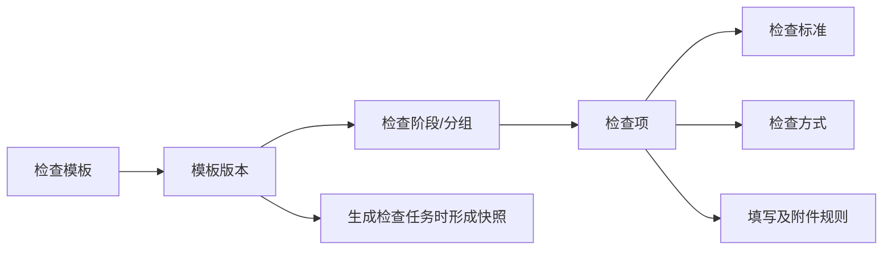

#### 7.4.2 模板基础字段

| 字段       | 说明                                |
| -------- | --------------------------------- |
| 模板名称     | 用于识别模板，如检查任务模板                    |
| 模板版本号    | 发布时形成，不允许同一模板下重复                  |
| 适用检查类型   | 自查、互查、稽查，可多选                      |
| 适用范围     | 与合同属性的匹配关系由PG-072模板匹配规则维护，具体属性待确认 |
| 模板状态     | 草稿、已发布、已停用                        |
| 生效时间     | 控制新生成任务可匹配的起始时间                   |
| 模板说明     | 说明模板用途和适用边界                       |
| 创建人/创建时间 | 操作留痕                              |
| 更新人/更新时间 | 操作留痕                              |

#### 7.4.3 检查阶段/分组字段

参考现有稽查页面中的“约标阶段、发标阶段”等展示方式，模板支持按业务阶段或检查分组组织检查项。本PRD不预置具体阶段名称，由有权限的维护人员配置。

| 字段      | 说明                   |
| ------- | -------------------- |
| 阶段/分组名称 | 执行页面用于归类展示检查项        |
| 阶段/分组说明 | 对该组检查范围进行说明          |
| 排序号     | 控制阶段/分组在执行页面的顺序      |
| 启用状态    | 停用后不进入后续发布版本，新任务不再使用 |

#### 7.4.4 检查项字段

| 字段      | 说明                                    |
| ------- | ------------------------------------- |
| 检查项名称   | 简要描述需要检查的事项                           |
| 检查标准    | 展示判断依据、合规要求或检查口径；没有单独标准时可为空，执行页面显示“/” |
| 所属阶段/分组 | 关联模板内的检查阶段或分组                         |
| 适用检查类型  | 从模板适用的自查、互查、稽查范围中选择，可多选               |
| 检查方式    | 人工检查、系统识别、共享引用                        |
| 风险等级    | 高、中、低，用于分类和统计，不自动触发稽查                 |
| 是否必检    | 必检项未完成时不允许提交任务                        |
| 备注填写规则  | 非必填、始终必填、不合规时必填                       |
| 附件填写规则  | 非必填、始终必填、不合规时必填                       |
| 不合规补充要求 | 配置问题原因、制度依据等字段是否必填；首版两者均必填            |
| 系统检测能力  | 系统识别项关联的检测能力或规则标识，人工项不填写              |
| 排序号     | 控制检查项在阶段/分组内的展示顺序                     |
| 启用状态    | 控制是否进入后续发布版本                          |

#### 7.4.5 模板定义与任务填写边界

参考图中的稽查明细表，字段归属划分如下：

| 页面字段 | 数据归属   | 说明                    |
| ---- | ------ | --------------------- |
| 序号   | 模板快照   | 根据阶段和检查项排序生成          |
| 检查阶段 | 模板快照   | 来源于阶段/分组名称            |
| 检查项  | 模板快照   | 来源于检查项名称              |
| 检查标准 | 模板快照   | 检查任务执行时只读展示           |
| 原始判定结果 | 任务执行数据 | 人工项选择合规/不合规；系统项取首次检测结果，提交后不可覆盖 |
| 申诉结果 | 申诉处置数据 | 未申诉、处理中、通过或不通过；由局管理员按检查项作出结论 |
| 合规判定结果 | 系统计算数据 | 综合原始判定结果和申诉结果计算；整改及复核结果不参与计算 |
| 整改复核结果 | 整改处置数据 | 未整改、待复核、复核通过或复核不通过，与合规判定结果分开记录 |
| 闭环状态 | 系统计算数据 | 未闭环或已闭环；根据申诉通过或整改复核通过计算 |
| 检查备注 | 任务执行数据 | 按检查项的备注填写规则校验         |
| 检查附件 | 任务执行数据 | 按检查项的附件填写规则校验         |

#### 7.4.6 模板版本规则

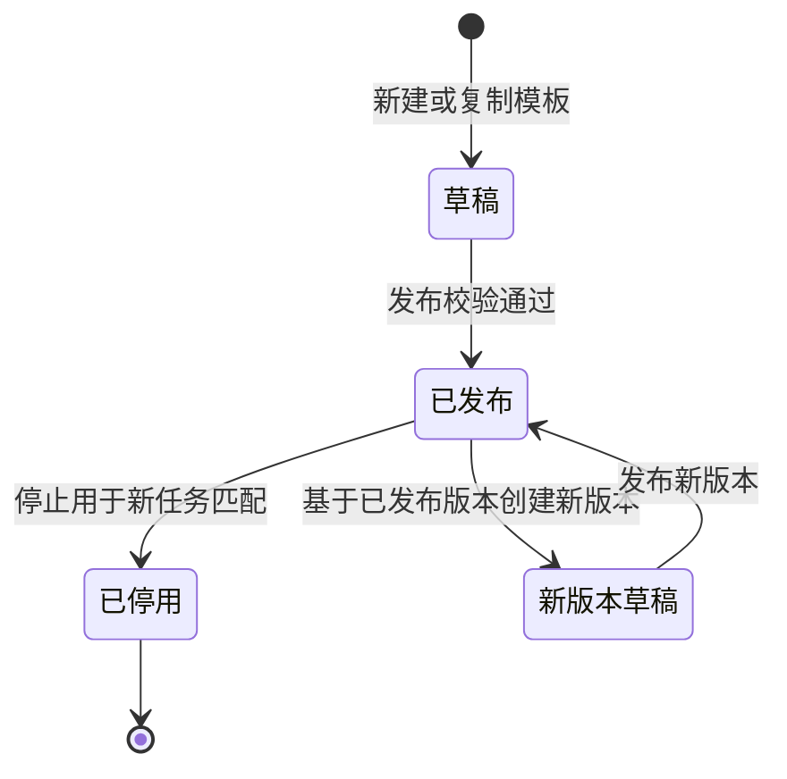

1. 草稿可编辑；已发布版本不得直接修改，只能基于该版本创建新版本草稿。
2. 发布前至少存在一个启用的阶段/分组，且模板选择的每一种适用检查类型至少存在一个启用的必检项。
3. 系统识别项发布前必须关联有效的系统检测能力。
4. 模板发布后仅影响后续新生成任务，不改变已生成任务的模板快照。
5. 任务快照至少保存模板名称、版本、阶段/分组、检查项、检查标准、检查方式、风险等级及填写规则。
6. 已发布版本不得物理删除；停用后不再匹配新任务，但历史任务继续展示原版本和快照。
7. 生成自查、互查或稽查任务时，只将适用于当前检查类型的启用检查项写入任务快照。

***

## 8. 总体业务流程

### 8.1 检查主流程泳道图

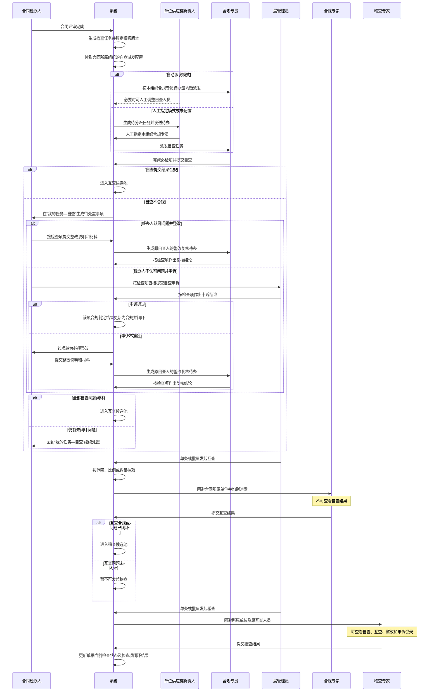

### 8.2 后续检查准入关系

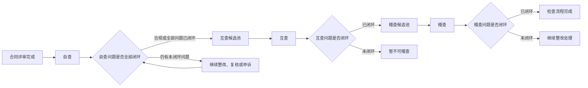

### 8.3 互查抽取与派发

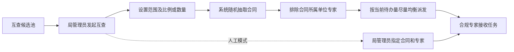

### 8.4 稽查抽取与派发

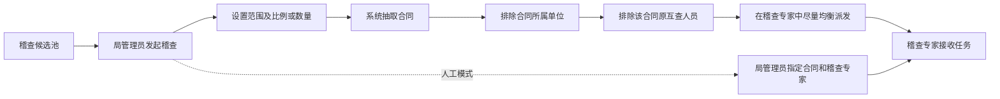

### 8.5 任务回退泳道图

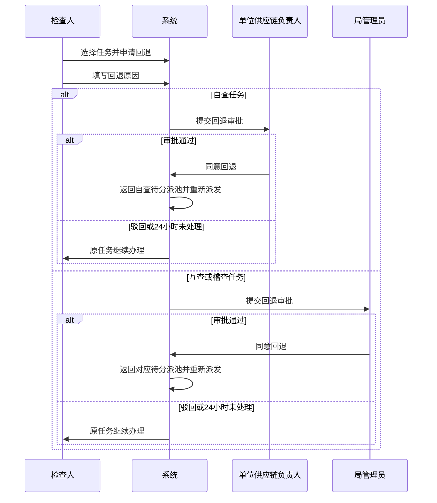

人工派发和系统自动派发使用相同的回退审批规则，与具体派发操作人无关。

### 8.6 系统检测流程

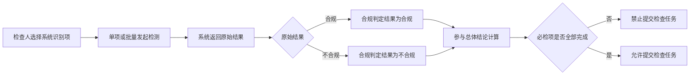

### 8.7 整改、复核及申诉泳道图

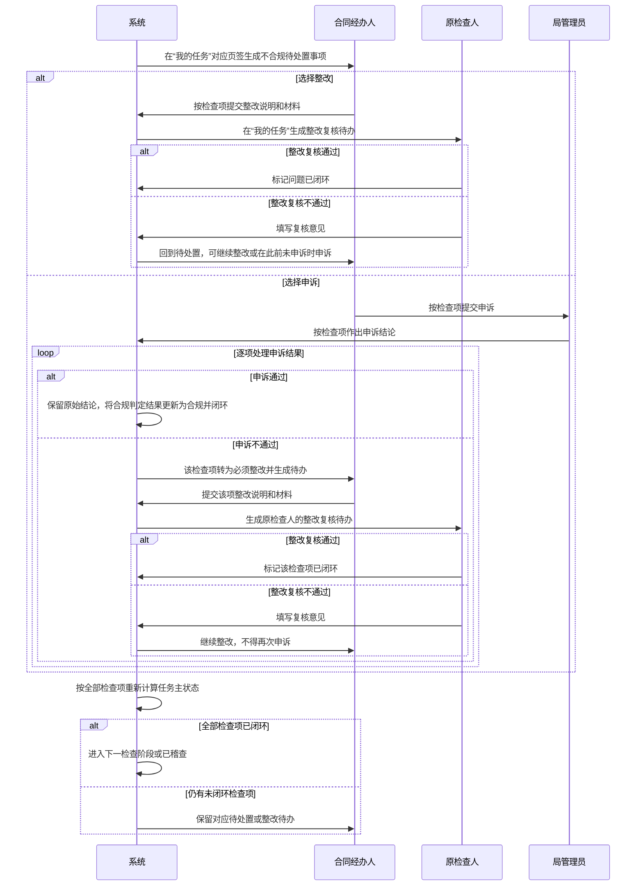

### 8.8 自查问题闭环流程

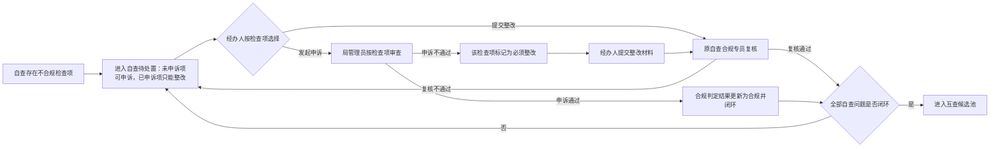

***

## 9. 状态模型

一份检查任务只维护一个“当前检查状态”字段。自查、互查、稽查、整改、复核、申诉、任务回退和自动收回均在这一套状态中流转；申诉单、整改轮次、回退申请等对象只记录办理明细和处理结果，不再各自形成另一套主状态机。

### 9.1 检查任务状态总表

下表每行代表一个可被保存的当前检查状态。状态机中的所有节点必须直接引用本表状态，不得增加表外状态。

| 状态编码 | 状态名称      | 状态说明                      | 可流向状态                              |
| ---- | --------- | ------------------------- | ---------------------------------- |
| CS-001 | 自查待派发     | 自查任务尚未确定检查人               | 自查待处理                             |
| CS-002 | 自查待处理     | 已确定合规专员，尚未开始办理            | 自查中、自查回退审批中、自查已收回               |
| CS-003 | 自查中       | 合规专员正在执行人工检查或系统检测         | 自查回退审批中、自查已收回、自查待处置、已自查 |
| CS-005 | 自查回退审批中   | 自查任务回退申请等待单位供应链负责人审批      | 自查待派发、自查待处理、自查中               |
| CS-006 | 自查已收回     | 自查任务超过办结时限并被系统自动收回        | 自查待派发、自查待处理                      |
| CS-007 | 自查待处置     | 自查存在尚未闭环的不合规检查项，合同经办人可按项整改或在具备资格时申诉 | 自查待复核、自查申诉中                 |
| CS-008 | 自查待复核     | 合同经办人已提交整改，等待原自查合规专员复核     | 自查待处置、自查复核不通过、已自查               |
| CS-009 | 自查复核不通过   | 原自查合规专员复核不通过，等待合同经办人继续处置    | 自查待处置、自查待复核、自查申诉中             |
| CS-031 | 自查申诉中     | 局管理员正在按检查项处理自查申诉          | 自查待处置、自查待复核、自查复核不通过、已自查        |
| CS-010 | 已自查       | 自查已完成且结论合规，或全部自查问题已闭环；可发起和派发互查 | 互查待处理                      |
| CS-012 | 互查待处理     | 已确定合规专家，尚未开始办理            | 互查中、互查回退审批中                      |
| CS-013 | 互查中       | 合规专家正在执行互查                | 互查回退审批中、互查待处置、已互查        |
| CS-015 | 互查回退审批中   | 互查任务回退申请等待局管理员审批          | 已自查、互查待处理、互查中               |
| CS-016 | 互查待处置     | 互查存在尚未闭环的不合规检查项，合同经办人可按项整改或在具备资格时申诉 | 互查待复核、互查申诉中                 |
| CS-017 | 互查待复核     | 合同经办人已提交整改，等待原检查人复核       | 互查待处置、互查复核不通过、已互查               |
| CS-018 | 互查复核不通过   | 原检查人复核不通过，等待合同经办人继续处置      | 互查待处置、互查待复核、互查申诉中               |
| CS-019 | 互查申诉中     | 局管理员正在按检查项处理互查申诉          | 互查待处置、互查待复核、互查复核不通过、已互查        |
| CS-020 | 已互查       | 互查已完成且结论合规，或全部互查问题已闭环；可发起和派发稽查 | 稽查待处理                      |
| CS-022 | 稽查待处理     | 已确定稽查专家，尚未开始办理            | 稽查中、稽查回退审批中                      |
| CS-023 | 稽查中       | 稽查专家正在执行稽查                | 稽查回退审批中、稽查待处置、已稽查        |
| CS-025 | 稽查回退审批中   | 稽查任务回退申请等待局管理员审批          | 已互查、稽查待处理、稽查中               |
| CS-026 | 稽查待处置     | 稽查存在尚未闭环的不合规检查项，合同经办人可按项整改或在具备资格时申诉 | 稽查待复核、稽查申诉中                 |
| CS-027 | 稽查待复核     | 合同经办人已提交整改，等待原检查人复核       | 稽查待处置、稽查复核不通过、已稽查               |
| CS-028 | 稽查复核不通过   | 原检查人复核不通过，等待合同经办人继续处置      | 稽查待处置、稽查待复核、稽查申诉中               |
| CS-029 | 稽查申诉中     | 局管理员正在按检查项处理稽查申诉          | 稽查待处置、稽查待复核、稽查复核不通过、已稽查        |
| CS-030 | 已稽查       | 稽查已完成且结论合规，或全部稽查问题已闭环     | 无                                  |

### 9.2 检查任务统一状态机

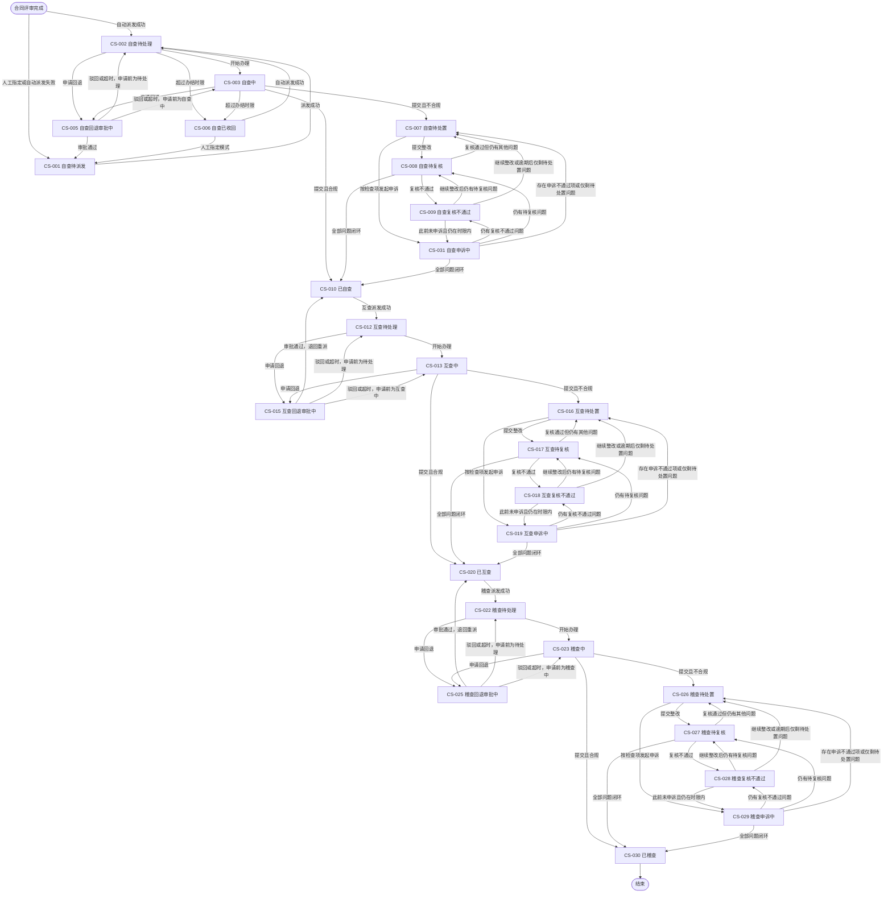

### 9.3 统一状态流转规则

1. 每个检查任务任一时点只能有一个当前检查状态；状态变化必须记录流转前状态、流转后状态、触发事件、操作人和操作时间。
2. 自查回退审批通过后进入CS-001“自查待派发”；互查回退审批通过后退回CS-010“已自查”，稽查回退审批通过后退回CS-020“已互查”，并在派发记录中进入待重新派发。驳回或24小时超时自动驳回后，返回申请回退前的待处理或检查中状态。
3. 仅自查超过办结时限后进入CS-006“自查已收回”；互查、稽查超时只提醒、催办和留痕，当前检查状态不变化。
4. 自查按问题逐项整改、复核和申诉；只有全部问题闭环，单据才进入CS-010“已自查”，仍有任一未闭环问题时继续停留在自查整改闭环状态。
5. 互查、稽查同样按问题逐项整改、复核和申诉；只有全部问题闭环，单据才分别进入CS-020“已互查”或CS-030“已稽查”。
6. 同一申诉单可以包含多个检查项，检查项处理结果分别记录；单据状态只根据是否仍存在未通过或未闭环检查项决定下一状态。
7. 同一单据的多个自查、互查或稽查问题处于不同办理环节时，当前检查状态按“申诉中 > 复核不通过 > 待复核 > 待处置”的优先级取值；每次问题处理后重新计算，全部闭环后进入下一阶段或检查完成。
8. 每个不合规检查项首次进入待处置时，经办人可选择整改或申诉。申诉通过时保留原始判定和原始检查结论，将该项合规判定结果更新为合规并闭环；申诉不通过时合规判定结果保持不合规，该项标记为“必须整改”，由经办人提交整改材料、原检查人复核，通过后方可闭环，且不得基于同一原始检查结论重复申诉。整改复核不通过后，仅此前未申诉过且仍在申诉时限内的检查项可发起一次申诉。
9. 原始判定结果和原始检查结论不因整改或申诉发生变化。只有申诉结果可以改变合规判定结果；整改提交及整改复核仅改变整改复核结果、闭环状态和当前检查状态，不改变原始判定结果、原始检查结论或合规判定结果。
10. 互查或稽查尚未派发、等待人工指定、派发失败或等待重试时，单据分别保持CS-010“已自查”或CS-020“已互查”；仅派发成功后进入CS-012“互查待处理”或CS-022“稽查待处理”。
11. 同一单据存在有效的待派发互查/稽查记录、处理中批次或已派发任务时，不得重复发起同类型检查；未被抽中或尚未派发成功的单据保持原状态，不自动进入下一阶段。
12. 合同业务状态由合同业务系统维护，不随一单一检的当前检查状态变化。

***

## 10. 核心业务规则

| 规则编号   | 业务规则                                                        |
| ------ | ----------------------------------------------------------- |
| BR-001 | 合同评审完成后生成检查任务并锁定模板版本                                        |
| BR-002 | 模板更新不追溯已生成的检查任务                                             |
| BR-003 | 检查任务结果不拦截合同上架                                               |
| BR-004 | 自查存在未闭环问题的合同不得进入互查候选池                                        |
| BR-005 | 自查、互查、稽查首次形成不合规检查项后，合同经办人可按检查项选择提交整改或在申诉时限内直接发起申诉 |
| BR-006 | 自查、互查、稽查申诉均由局管理员按检查项作出最终结论；申诉通过的检查项保留原始结论、将合规判定结果更新为合规并闭环；申诉不通过的检查项合规判定结果保持不合规并转为必须整改，由合同经办人提交整改材料并由原检查人复核，复核通过后方可闭环；逾期未申诉的检查项仍可整改 |
| BR-007 | 互查人员不得查看自查结果                                                |
| BR-008 | 互查任务按人员资格记录执行单位回避：合规专家的资格所属组织不得与合同所属组织相同；账号所属组织不参与该项回避判断 |
| BR-009 | 自查、互查结论不一致本身不自动触发稽查；当自查与互查结论不一致，且该合同的高风险不合规检查项超过3项时，系统将其标记为“稽查优先督办项”并在稽查候选列表自动置顶，但仍由局管理员决定是否发起稽查 |
| BR-010 | 互查问题闭环后方可进入稽查候选池                                            |
| BR-011 | 稽查任务执行双重回避：稽查专家的资格所属组织不得与合同所属组织相同，且候选用户不得为该合同原互查人员 |
| BR-012 | 稽查专家可查看本人稽查任务关联的自查、互查、整改和申诉记录                               |
| BR-013 | 原始判定结果和原始检查结论永久保留，不被整改或申诉覆盖                               |
| BR-016 | 自查、互查、稽查问题仅在整改复核通过，或申诉通过且合规判定结果已更新为合规后视为闭环；整改复核通过只更新整改复核结果和闭环状态，不改变合规判定结果 |
| BR-017 | 申诉不通过或逾期未申诉时，自查、互查、稽查问题不自动关闭；申诉不通过的检查项必须由合同经办人提交整改材料，并经原检查人复核通过后闭环，但整改复核通过不改变其不合规的合规判定结果 |
| BR-018 | 所有必检项完成后方可提交检查任务                                 |
| BR-019 | 人工检查项必须选择合规或不合规；不合规时问题原因和制度依据必填                             |
| BR-020 | 系统识别项必须取得系统原始结果，并以该结果形成原始判定结果；后续合规判定结果按原始判定结果和申诉结果计算 |
| BR-024 | 任一必检项的合规判定结果为不合规，则当前总体合规结论为不合规；整改及整改复核结果不参与总体合规结论计算 |
| BR-025 | 风险等级只用于问题分类、整改优先级、统计展示和人工筛选，不自动触发稽查                         |
| BR-026 | 自查回退由单位供应链负责人审批                                             |
| BR-027 | 互查、稽查回退由局管理员审批                                              |
| BR-028 | 回退审批超过24小时未处理时自动驳回，原检查人继续办理                                 |
| BR-029 | 仅自查任务超时后自动收回；自动派发模式重新派发，人工指定模式返回待分派                         |
| BR-030 | 互查、稽查超时只提醒、催办、留痕并纳入考核，不自动收回                                 |
| BR-031 | 整改、复核和申诉时限按工作日分别配置                      |
| BR-032 | 同一账号可拥有多个角色和人员资格，系统不提供身份切换；菜单、任务和操作在同一账号下按角色、资格、业务关系、组织范围及流程状态综合授权 |
| BR-033 | 模板、人员库、跨本人业务关系的任务查询、申诉处理、任务发起派发和系统配置等管理能力采用RBAC权限点控制；台账权限点不在本PRD范围内 |
| BR-034 | 查看及办理本人直接关联的检查任务不配置静态权限点，由人员资格、合同关系、任务分派或历史办理关系和流程状态共同授权 |
| BR-035 | 角色是权限点集合，角色同时配置组织数据范围                                       |
| BR-036 | 合规人员资格只表示可被分派对应任务，不自动授予管理权限                                |
| BR-037 | 新增、编辑、启用、停用人员资格必须具备人员库管理权限点，且资格所属组织在操作人的组织数据范围内             |
| BR-038 | 自动或人工派发只能选择人员类型、资格所属组织符合要求且状态为启用的人员资格记录                     |
| BR-039 | 某项人员资格停用后不得凭该资格接收新任务，不影响同一用户的其他启用资格；历史任务和资格快照不得删除           |
| BR-040 | 整改、复核和发起申诉根据合同、当前检查人、原检查人等业务关系授权；处理申诉仅限局管理员，并需同时具备对应自查、互查或稽查申诉处理权限点、申诉分派关系且当前状态允许处理 |
| BR-041 | 各组织独立维护本组织的自查派发模式，可选择自动派发或人工指定                              |
| BR-042 | 组织业务配置只能由具备对应权限点的单位供应链负责人在其组织数据范围内查看和维护                     |
| BR-043 | 自动派发模式按本组织有效合规专员待办量均衡派发；人工指定模式生成待分派任务，由单位供应链负责人指定合规专员       |
| BR-044 | 组织派发模式变更只影响变更后新生成的自查任务，不改变已派发任务；未配置时按人工指定模式进入待分派并提醒单位供应链负责人 |
| BR-045 | 资格所属组织用于资格归属、候选池范围、人员库管理权限及与合同所属组织的单位回避；账号所属组织仅作人员基础信息展示，不参与单位回避判断 |
| BR-046 | 检查模板由模板版本、检查阶段/分组和检查项组成，检查项必须归属一个阶段/分组                      |
| BR-047 | 检查项名称、检查标准、检查方式、风险等级及填写规则属于模板定义；原始判定结果、申诉结果、合规判定结果、整改复核结果、闭环状态、检查备注和检查附件属于任务及处置数据 |
| BR-048 | 已发布模板版本只读，修改模板内容必须创建新版本；新版本不追溯已生成任务                         |
| BR-049 | 检查任务生成时必须保存模板、阶段/分组和检查项完整快照，历史展示不得依赖当前模板数据                  |
| BR-050 | 人工项原始判定结果固定为合规或不合规；备注、附件及不合规补充字段按检查项模板规则校验                    |
| BR-051 | 一个模板可适用于多种检查类型，生成任务时只加载适用于当前自查、互查或稽查类型的启用检查项                |
| BR-052 | 每条申诉必须关联检查任务、检查项和不可覆盖的原始判定结果，并记录申诉类型、发起人、处理人、材料、状态和结论     |
| BR-053 | 同一申诉单可包含多个检查项，但每个检查项必须独立形成处理结论和业务影响；自查仅在全部问题通过整改复核或申诉实现闭环后更新为可互查 |
| BR-054 | 同一检查项针对同一原始检查结论最多发起一次申诉；整改复核不通过后，仅此前未申诉且仍在时限内的检查项可申诉 |
| BR-055 | “我的任务”统一承载经办人的不合规处置、原检查人的整改复核以及局管理员的申诉待办，并按自查、互查、稽查页签聚合展示；每条任务按用户角色、资格、任务关系和当前状态控制数据及操作 |
| BR-056 | 单个任务的生成、派发、处理、回退、超时收回、整改、复核、申诉和状态变化统一形成任务流转记录；普通查看、自动保存等操作不进入业务流转记录 |
| BR-057 | 互查、稽查不设置独立待派发主状态；未派发、派发失败、等待人工指定或等待重试时分别保持“已自查”或“已互查”，待派发情况由派发记录和页面视图承载，且存在有效待派发记录、处理中批次或已派发任务时不得重复发起 |
| BR-058 | “查看自查任务”“查看互查任务”“查看稽查任务”分别授权管理人员查询组织数据范围内对应类型的非本人直接关联任务，不产生任务待办或办理权限；本人直接关联任务仍按业务关系查看 |

***

## 11. 功能架构与能力清单

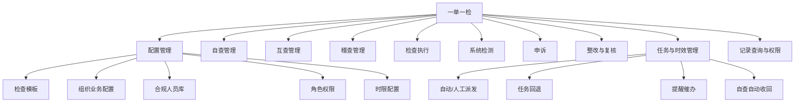

功能清单按功能编号、所属能力域、主要角色、优先级和功能说明维护，作为本章功能架构的明细清单；第12章页面信息架构仅维护页面、页面规格和页面承载关系。

统一工作台、统一用户、组织主数据、统一权限、消息通知和附件存储等属于基础服务或平台支撑能力。本次仅描述其与一单一检的集成边界，不将基础服务页面作为本次重点建设页面。

### 11.2 能力清单

#### 11.2.1 优先级定义

| 优先级 | 定义                 |
| --- | ------------------ |
| P0  | 核心闭环，上线必须具备        |
| P1  | 提升管理效率，建议首期或紧随首期实现 |
| P2  | 分析或增强能力，可后续迭代      |

#### 11.2.2 功能总表

| 功能编号        | 模块   | 功能名称         | 主要角色                 | 建议优先级 | 功能说明                                               |
| ----------- | ---- | ------------ | -------------------- | ----- | -------------------------------------------------- |
| F-BASE-001  | 配置管理 | 检查模板管理       | 局管理员（具备对应权限点）        | P0    | 新增、复制、编辑、预览、发布和停用检查模板                              |
| F-BASE-002  | 配置管理 | 模板匹配规则       | 局管理员（具备对应权限点）        | P0    | 根据合同属性匹配模板；具体属性待业务确认                               |
| F-BASE-003  | 配置管理 | 模板版本锁定       | 系统                   | P0    | 生成任务时保存模板快照，后续更新不追溯                                |
| F-BASE-004  | 配置管理 | 风险等级配置       | 局管理员（具备对应权限点）        | P0    | 维护高、中、低风险等级及展示信息                                   |
| F-BASE-005  | 基础服务 | RBAC角色与权限点配置 | 局管理员（具备对应权限点）        | 基础服务 | 对接基础权限服务，本期不展开页面说明                             |
| F-BASE-008  | 配置管理 | 时限配置         | 局管理员（具备对应权限点）        | P0    | 分别配置启动、办结、整改、复核、申诉等工作日时限                       |
| F-BASE-009  | 配置管理 | 通知规则配置       | 局管理员（具备对应权限点）        | P1    | 配置提醒节点、接收人和通知渠道                                    |
| F-BASE-010  | 配置管理 | 合规人员库查询      | 合规人员库管理员             | P0    | 按账号所属组织、资格所属组织、人员类型和资格状态查询人员资格                     |
| F-BASE-011  | 配置管理 | 人员资格新增/编辑    | 合规人员库管理员             | P0    | 从统一用户中选择人员，并逐条配置人员类型、资格所属组织和资格状态                   |
| F-BASE-012  | 配置管理 | 人员资格启用/停用    | 合规人员库管理员             | P0    | 独立控制每条人员资格是否可以接收新任务                                |
| F-BASE-013  | 配置管理 | 多组织多资格管理     | 合规人员库管理员             | P0    | 支持同一用户的不同人员资格分别归属不同组织                              |
| F-BASE-014  | 配置管理 | 派发候选人员过滤     | 系统                   | P0    | 按人员类型、资格所属组织和启用状态生成候选池，再将资格所属组织与合同所属组织比对执行单位回避，并按业务关系执行人员回避 |
| F-BASE-016  | 配置管理 | 组织业务配置查询     | 单位供应链负责人（具备对应权限点）    | P0    | 在组织数据范围内查看各组织当前生效的业务配置                             |
| F-BASE-017  | 配置管理 | 组织自查派发模式配置   | 单位供应链负责人（具备对应权限点）    | P0    | 按组织设置自动派发或人工指定，并记录配置变更                             |
| F-BASE-018  | 配置管理 | 模板阶段/分组管理    | 局管理员（具备对应权限点）        | P0    | 新增、编辑、启停和排序模板内的检查阶段或分组                             |
| F-BASE-019  | 配置管理 | 模板检查项管理      | 局管理员（具备对应权限点）        | P0    | 配置检查项名称、检查标准、适用类型、检查方式、风险等级及填写规则                   |
| F-BASE-020  | 配置管理 | 模板版本管理       | 局管理员（具备对应权限点）        | P0    | 基于已发布版本创建新版本草稿，保留历史版本并控制生效状态                       |
| F-BASE-021  | 配置管理 | 模板预览及发布校验    | 局管理员（具备对应权限点）        | P0    | 按执行页样式预览模板，并在发布前校验阶段、检查项和系统检测能力完整性                 |
| F-OBJ-001   | 检查任务 | 自动生成检查任务     | 系统                   | P0    | 合同评审完成后生成一单一检检查任务                                    |
| F-OBJ-002   | 检查任务 | 一标多合同关联      | 局管理员（具备对应权限点）、检查人    | P0    | 建立采购项目与多份合同的关联关系                                   |
| F-OBJ-003   | 检查任务 | 共享结果引用       | 检查人                  | P0    | 同一检查类型内引用采购项目共享结果                                  |
| F-SELF-001  | 自查管理 | 自查候选任务生成     | 系统                   | P0    | 检查任务生成后进入自查分派范围                                  |
| F-SELF-002  | 自查管理 | 自查自动派发       | 系统                   | P0    | 组织配置为自动派发时，按本组织有效合规专员待办量尽量均衡派发                     |
| F-SELF-003  | 自查管理 | 自查人工指定       | 单位供应链负责人             | P0    | 组织配置为人工指定或未配置时完成首次派发，并可按权限调整未提交任务的检查人              |
| F-SELF-004  | 自查管理 | 我的任务—自查页签    | 合同经办人、合规专员、局管理员、历史办理人 | P0    | 统一展示自查检查、待处置、待复核、申诉及历史任务；申诉处理按钮另按处理权限点控制 |
| F-SELF-005  | 自查管理 | 自查申诉         | 合同经办人                | P0    | 对首次不合规或复核不通过、此前未申诉且仍在时限内的自查检查项发起申诉              |
| F-SELF-006  | 自查管理 | 自查申诉处理       | 局管理员（具备“处理自查申诉”权限点） | P0    | 按检查项作出最终结论；未闭环问题退回继续整改，全部闭环后更新为CS-010“已自查”        |
| F-MUT-001   | 互查管理 | 互查候选池        | 局管理员                 | P0    | 展示自查合规或全部自查问题已闭环的可互查合同                           |
| F-MUT-002   | 互查管理 | 单条发起互查       | 局管理员                 | P0    | 选择单份合同发起互查                                         |
| F-MUT-003   | 互查管理 | 批量抽取互查       | 局管理员                 | P0    | 按范围、比例或数量随机抽取                                      |
| F-MUT-004   | 互查管理 | 跨单位回避        | 系统                   | P0    | 排除资格所属组织与合同所属组织相同的合规专家资格记录                         |
| F-MUT-005   | 互查管理 | 互查均衡派发       | 系统                   | P0    | 按当前待办量尽量均衡分派                                       |
| F-MUT-006   | 互查管理 | 互查人工指定/调整    | 局管理员                 | P0    | 人工指定或调整合同和合规专家                                     |
| F-MUT-007   | 互查管理 | 互查结果隔离       | 系统                   | P0    | 合规专家执行互查时不可查看自查结果                                  |
| F-AUD-001   | 稽查管理 | 稽查候选池        | 局管理员                 | P0    | 展示互查问题已闭环的可稽查合同                                    |
| F-AUD-002   | 稽查管理 | 单条/批量发起稽查    | 局管理员                 | P0    | 设置范围、比例或数量并发起稽查                                    |
| F-AUD-003   | 稽查管理 | 稽查优先督办识别     | 系统                   | P0    | 自查与互查结论不一致且高风险不合规检查项超过3项时，标记为稽查优先督办项并在候选列表置顶 |
| F-AUD-004   | 稽查管理 | 稽查回避         | 系统                   | P0    | 排除资格所属组织与合同所属组织相同的稽查专家资格记录，并排除该合同原互查人员            |
| F-AUD-005   | 稽查管理 | 稽查均衡派发       | 系统                   | P0    | 在稽查专家中按待办量尽量均衡分派                                   |
| F-AUD-006   | 稽查管理 | 稽查历史调阅       | 稽查专家                 | P0    | 查看本人稽查任务关联的历史检查和处置记录                               |
| F-TASK-008  | 任务管理 | 统一派发任务页      | 单位供应链负责人、局管理员         | P0    | 按自查、互查、稽查页签展示待派发或待发起单据，并在页内完成发起、派发和调整             |
| F-EXEC-001  | 检查执行 | 检查任务详情       | 各检查人                 | P0    | 按模板快照展示合同信息、检查阶段/分组、检查项、检查标准和任务信息                  |
| F-EXEC-002  | 检查执行 | 人工检查项判断      | 各检查人                 | P0    | 逐项选择合规或不合规并记录不可覆盖的原始判定结果                           |
| F-EXEC-003  | 检查执行 | 检查备注及附件      | 各检查人                 | P0    | 按模板规则填写检查备注、上传附件；不合规时填写问题原因和制度依据                   |
| F-EXEC-004  | 检查执行 | 检查草稿保存       | 各检查人                 | P0    | 手动保存并定时自动保存草稿                                      |
| F-EXEC-005  | 检查执行 | 提交前校验        | 系统                   | P0    | 按模板快照校验必检项、备注、附件和不合规补充信息                |
| F-EXEC-006  | 检查执行 | 总体结论计算       | 系统                   | P0    | 基于各检查项合规判定结果计算当前总体合规结论；整改及复核结果不参与计算              |
| F-EXEC-007  | 检查执行 | 检查结果锁定       | 系统                   | P0    | 提交后锁定原始检查任务记录                                        |
| F-EXEC-008  | 检查执行 | 检查项快速筛选      | 各检查人                 | P1    | 按阶段/分组筛选，并支持只看不合规项、只看未判定或待检测项                      |
| F-SYS-001   | 系统检测 | 单项发起检测       | 各检查人                 | P0    | 对选中的系统识别项发起检测                                      |
| F-SYS-002   | 系统检测 | 批量发起检测       | 各检查人                 | P0    | 批量执行多个系统识别项                                        |
| F-SYS-003   | 系统检测 | 检测结果回写       | 系统                   | P0    | 回写系统原始结果、时间及检测依据                                   |
| F-REC-001   | 整改闭环 | 整改通知         | 系统                   | P0    | 向合同经办人的“我的任务”对应页签推送自查、互查、稽查不合规待处置事项             |
| F-REC-002   | 整改闭环 | 单合同整改        | 合同经办人                | P0    | 从“我的任务”进入任务详情，按检查项提交整改说明和材料；申诉不通过项自动纳入必须整改范围 |
| F-REC-003   | 整改闭环 | 批量整改         | 合同经办人                | P1    | 对多份合同批量提交整改材料，待业务确认                                |
| F-REC-004   | 整改闭环 | 整改复核         | 原检查人                 | P0    | 在“我的任务”对应页签进入详情，单独记录一般整改及申诉不通过项的整改复核结果；复核通过后对应问题闭环，但不改变合规判定结果 |
| F-APP-001   | 申诉   | 统一申诉对象及状态    | 系统                   | P0    | 按“检查任务 + 检查项 + 原始检查结论”记录申诉类型、发起人、材料、处理人、状态和结论，并按逐项申诉结果计算合规判定结果或生成必须整改待办 |
| F-APP-003   | 申诉   | 自查申诉         | 合同经办人、局管理员（具备“处理自查申诉”权限点） | P0    | 首次不合规或整改复核不通过后，在“我的任务—自查”按检查项发起和处理申诉；通过项合规判定结果更新为合规，未通过项保持不合规并转入整改复核 |
| F-APP-004   | 申诉   | 互查申诉         | 合同经办人                | P0    | 首次不合规或整改复核不通过后，在“我的任务—互查”按符合资格的检查项发起申诉           |
| F-APP-005   | 申诉   | 互查申诉处理       | 局管理员（具备“处理互查申诉”权限点） | P0    | 按检查项作出互查申诉结论；通过项的合规判定结果更新为合规并闭环，未通过项保持不合规并生成必须整改待办，在整改复核通过后仅更新闭环状态 |
| F-APP-006   | 申诉   | 稽查申诉         | 合同经办人                | P0    | 首次不合规或整改复核不通过后，在“我的任务—稽查”按符合资格的检查项发起申诉           |
| F-APP-007   | 申诉   | 稽查申诉处理       | 局管理员（具备“处理稽查申诉”权限点） | P0    | 按检查项作出稽查申诉结论；通过项的合规判定结果更新为合规并闭环，未通过项保持不合规并生成必须整改待办，在整改复核通过后仅更新闭环状态 |
| F-TASK-001  | 任务管理 | 任务回退申请       | 各检查人                 | P0    | 对未完成任务填写原因并申请回退                                    |
| F-TASK-002  | 任务管理 | 自查回退审批       | 单位供应链负责人             | P0    | 审批自查任务回退                                           |
| F-TASK-003  | 任务管理 | 互查/稽查回退审批    | 局管理员                 | P0    | 审批互查、稽查任务回退                                        |
| F-TASK-004  | 任务管理 | 回退超时驳回       | 系统                   | P0    | 24小时未审批时自动驳回                                       |
| F-TASK-005  | 任务管理 | 自查自动收回       | 系统                   | P0    | 自查超过配置办结时限后自动收回，并按所属组织派发模式重新派发或返回待分派               |
| F-TASK-006  | 任务管理 | 互查/稽查超时催办    | 系统                   | P0    | 超时提醒、催办、留痕，不自动收回                                   |
| F-TASK-007  | 任务管理 | 超时及回退统计      | 局管理员                 | P1    | 统计催办、超时、自动收回和回退数量                                  |
| F-QUERY-001 | 查询权限 | 我的任务         | 合同经办人、各检查人、局管理员、历史办理人 | P0    | 按自查、互查、稽查页签统一展示检查执行、不合规处置、整改复核、申诉处理及历史任务，并按角色、资格和任务关系提供对应操作 |
| F-QUERY-002 | 查询权限 | 检查任务记录       | 合同经办人、具备对应任务查看权限的管理人员 | P0    | 合同经办人按业务关系查看本人合同记录；管理人员按检查类型权限点和组织数据范围查看任务 |
| F-QUERY-003 | 查询权限 | 任务流转记录       | 合同经办人、当前及历史检查人、局管理员、管理人员 | P0    | 在单个任务详情中按权限查看生成、派发、处理、回退、超时收回、整改、复核、申诉及状态变化等关键业务事件 |
| F-QUERY-004 | 查询权限 | 自查任务查询       | 具备“查看自查任务”权限点的管理人员 | P0 | 在组织数据范围内查询自查任务列表、详情和流转记录，不产生办理权限 |
| F-QUERY-005 | 查询权限 | 互查任务查询       | 具备“查看互查任务”权限点的管理人员 | P0 | 在组织数据范围内查询互查任务列表、详情和流转记录，不产生办理权限 |
| F-QUERY-006 | 查询权限 | 稽查任务查询       | 具备“查看稽查任务”权限点的管理人员 | P0 | 在组织数据范围内查询稽查任务列表、详情和流转记录，不产生办理权限 |
| F-NOTI-001  | 消息通知 | 待办通知         | 相关角色                 | P0    | 任务派发、整改、复核、申诉和回退审批等待办提醒                          |
| F-NOTI-002  | 消息通知 | 超时预警         | 相关角色及管理人             | P0    | 按配置时限发送预警和催办                                       |
| F-NOTI-003  | 消息通知 | 结果通知         | 相关发起人、合同经办人、单位供应链负责人 | P0    | 推送检查、整改、复核和申诉结果                                  |

### 11.3 功能能力—页面承载映射

| 页面范围 | 主要关联功能编号 |
| --- | --- |
| PG-001、PG-002、PG-004 工作台 | F-QUERY-001、F-QUERY-003、F-NOTI-001、F-NOTI-002、F-EXEC-001 至 F-EXEC-008、F-SYS-001 至 F-SYS-003、F-TASK-001、F-REC-001 至 F-REC-004、F-APP-001、F-APP-003 至 F-APP-007 |
| PG-010、PG-011、PG-014 检查任务 | F-QUERY-002 至 F-QUERY-006、F-OBJ-001 至 F-OBJ-003、F-REC-002、F-REC-004、F-APP-003 至 F-APP-007 |
| PG-020 派发任务 | F-QUERY-003、F-SELF-001 至 F-SELF-003、F-MUT-001 至 F-MUT-006、F-AUD-001 至 F-AUD-005、F-TASK-002、F-TASK-003、F-TASK-005、F-TASK-008 |
| PG-069 至 PG-079 配置管理 | F-BASE-001 至 F-BASE-005、F-BASE-008 至 F-BASE-021 |

***

## 12. 页面信息架构与页面清单

### 12.1 页面设计原则

- 以“统一工作台 + 业务模块菜单”组织页面；不设置角色身份切换入口，系统根据当前账号拥有的角色、人员资格和业务关系综合展示菜单、任务与操作。
- 管理类菜单和操作按钮按RBAC权限点展示；检查任务记录按本人业务关系或对应检查类型的查看权限点展示；检查办理入口按人员资格和本人任务动态展示。
- 页面是否展示不代表最终授权，所有管理和办理操作均需由服务端再次校验。
- “我的任务”统一承载检查执行、不合规处置、整改复核和申诉处理；自查、互查、稽查通过顶部页签聚合展示，并根据角色、人员资格、任务关系和状态控制数据及操作。
- 检查任务详情作为统一业务档案页；单次自查、互查、稽查任务记录在检查任务记录详情中展示。
- 整改、复核和申诉均从“我的任务”对应页签进入单次检查任务详情办理。
- 发起互查、发起稽查、人工派发等复杂操作使用“派发任务”页内步骤面板或抽屉；简单确认使用弹窗。
- P0 页面需优先支持桌面端；移动端或中建通适配范围待确认。

### 12.2 菜单与页面信息架构

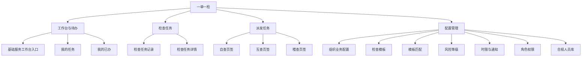

### 12.3 页面清单总表

> 页面编号用于后续原型、功能清单、接口和测试用例关联。抽屉、弹窗也单独编号，便于明确交互边界。

| 页面编号   | 一级模块  | 页面名称        | 页面形态  | 主要角色             | 优先级 | 核心用途                             |
| ------ | ----- | ----------- | ----- | ---------------- | --- | -------------------------------- |
| PG-001 | 工作台   | 统一工作台       | 基础服务入口 | 全部登录用户           | 基础服务 | 使用基础服务提供的统一工作台进入业务菜单，不提供角色身份切换           |
| PG-002 | 工作台   | 我的任务        | 页面    | 合同经办人、各检查人、局管理员、历史办理人 | P0  | 以自查、互查、稽查页签承载检查执行、不合规处置、整改复核、申诉处理、历史任务及任务流转记录 |
| PG-004 | 工作台   | 我的已办        | 页面    | 全部业务角色           | P0  | 查询本人已完成的检查、整改、复核和申诉            |
| PG-010 | 检查任务  | 检查任务记录      | 页面    | 合同经办人、具备任务查看权限的管理人员 | P0 | 经办人查询本人合同任务；管理人员按自查、互查、稽查查看权限点和组织数据范围查询任务；待办操作统一进入PG-002 |
| PG-011 | 检查任务  | 检查任务详情      | 页面    | 按数据权限开放          | P0  | 汇总单份合同的全阶段检查任务、问题、整改和申诉轨迹        |
| PG-014 | 检查任务  | 单次检查任务记录详情    | 页面/抽屉 | 按数据权限开放          | P0  | 展示一次自查、互查或稽查任务的模板快照、结果、处置明细和任务流转记录 |
| PG-020 | 任务管理  | 派发任务        | 页面    | 单位供应链负责人、局管理员 | P0  | 以自查、互查、稽查页签完成候选查询、发起、派发、调整、批次跟踪及任务流转记录查询 |
| PG-021 | 任务管理  | 派发任务操作面板     | 抽屉/步骤面板 | 单位供应链负责人、局管理员 | P0  | 执行人员选择、抽取规则、回避校验、派发确认、失败处理并展示单个任务流转记录 |
| PG-069 | 配置管理  | 组织业务配置      | 页面    | 单位供应链负责人（按权限点开放） | P0  | 按组织集中维护自查派发模式等组织级业务参数            |
| PG-070 | 配置管理  | 检查模板列表      | 页面    | 局管理员（按权限点开放）     | P0  | 管理模板、版本、状态和适用范围                  |
| PG-071 | 配置管理  | 检查模板编辑      | 页面    | 局管理员（按权限点开放）     | P0  | 配置检查阶段/分组、检查项、检查标准、检查方式和填写规则     |
| PG-072 | 配置管理  | 模板匹配规则      | 页面    | 局管理员（按权限点开放）     | P0  | 配置合同属性与检查模板的匹配关系                 |
| PG-073 | 配置管理  | 风险等级配置      | 页面    | 局管理员（按权限点开放）     | P0  | 维护高、中、低风险等级及展示顺序                 |
| PG-075 | 配置管理  | 时限配置        | 页面    | 局管理员（按权限点开放）     | P0  | 配置启动、办结、整改、复核和申诉时限           |
| PG-076 | 配置管理  | RBAC角色权限配置  | 基础服务入口 | 局管理员（按权限点开放）     | 基础服务 | 对接基础权限服务，本期不展开页面说明           |
| PG-077 | 配置管理  | 通知规则配置      | 页面    | 局管理员（按权限点开放）     | P1  | 配置通知事件、接收人、频次和渠道                 |
| PG-078 | 配置管理  | 合规人员库       | 页面    | 合规人员库管理员         | P0  | 按资格所属组织和人员类型查询、维护可参与检查的人员资格      |
| PG-079 | 配置管理  | 合规人员资格新增/编辑 | 页面/抽屉 | 合规人员库管理员         | P0  | 从统一用户中选择人员，配置人员类型、资格所属组织和资格状态    |

### 12.4 角色与页面矩阵

| 角色       | 默认首页         | 主要业务页面                                                                               |
| -------- | ------------ | ------------------------------------------------------------------------------------ |
| 合同经办人    | PG-001 统一工作台 | PG-002、PG-010、PG-011、PG-014、PG-004                                     |
| 单位供应链负责人 | PG-001 统一工作台 | PG-020、PG-021、PG-069、PG-004；PG-010及配置页面按权限点显示 |
| 合规专员     | PG-001 统一工作台 | PG-002、PG-014、PG-004                              |
| 合规专家     | PG-001 统一工作台 | PG-002、PG-014、PG-004                              |
| 稽查专家     | PG-001 统一工作台 | PG-002、PG-014、PG-004                       |
| 局管理员     | PG-001 统一工作台 | PG-002、PG-014、PG-020、PG-021、PG-070 至 PG-077、PG-004；PG-010、申诉处理及配置页面/操作按对应权限点显示 |
| 合规人员库管理员 | PG-078 合规人员库 | PG-078、PG-079、PG-004                                                                 |

### 12.5 关键页面规格

#### 12.5.1 【我的任务】页面

**页面编码**：PG-002

**页面目标**：统一查看和办理当前用户作为合同经办人、检查人或局管理员需要处理的自查、互查、稽查任务，并保留本人历史办理记录。检查人在本页进入检查执行视图，整改、复核和申诉从列表进入PG-014单次检查任务详情办理。

**顶部页签与任务展示**：

- 页面不提供角色身份选择或切换入口，直接按当前账号的全部有效角色、人员资格、任务关系和历史办理关系聚合任务。
- 顶部按自查、互查、稽查设置页签；账号对某类任务不存在任何可访问关系时不展示对应页签，三类页签均无任务时展示空状态。
- 用户作为合同经办人时，展示本人负责合同中处于待处置、待复核、复核不通过、申诉中及已闭环状态的任务；首次不合规后进入对应页签待办。
- 用户作为检查人时，展示分派给本人的检查执行任务，以及由本人原检查结论产生的整改复核任务；互查任务仍按任务场景隐藏自查结果，不因同一账号还拥有其他角色而放开。
- 用户为局管理员时，在自查、互查、稽查页签展示分派给本人的申诉任务；拥有对应“处理申诉”权限点且当前状态允许办理时，才展示处理操作。
- 资格停用或被移出人员库后，只要存在该类型历史任务关系仍保留对应页签；仍分派给本人且状态允许办理的存量任务依据任务资格快照继续完成，已重新派发的任务只读；没有有效资格且没有历史任务关系不展示该页签。
- 已被重新派发给他人的任务展示“任务已重新派发”，不可继续编辑或提交。

**页内状态视图**：待办理、进行中、待处置、待复核、复核不通过、申诉处理中、已完成、已收回/已重新派发。PG-004“我的已办”承载本人完成的检查、整改、复核和申诉处理记录。

**列表建议字段**：任务类型、任务编号、合同编号、合同名称、所属单位、采购项目、当前状态、待本人处理事项、问题总数、待处置数、待复核数、申诉中数量、任务接收/派发时间、剩余时限、超时标识、模板版本、最近更新时间、操作。

**经办人操作列**：

| 当前状态或本人事项 | 操作列 | 进入详情后的能力 |
| --- | --- | --- |
| 自查/互查/稽查待处置 | 整改 | 勾选待处置不合规项，选择“提交整改”或“发起申诉” |
| 自查/互查/稽查待复核 | 查看 | 查看已提交整改材料及复核进度，不得重复提交同一轮整改 |
| 自查/互查/稽查复核不通过 | 整改 | 对复核不通过项继续提交整改；此前未申诉且仍在时限内的检查项也可选择申诉 |
| 自查/互查/稽查申诉中 | 查看申诉 | 查看申诉进度；同一任务中其他待处置项仍可继续整改或申诉 |
| 问题全部闭环或进入下一阶段 | 查看 | 查看检查、整改、复核和申诉完整记录 |

当同一任务包含多个不同状态的检查项时，操作列按当前用户仍可执行的最高优先操作展示；存在待处置或复核不通过项时显示“整改”，仅存在申诉中或待复核项时显示“查看申诉”或“查看”。

**检查人及局管理员操作列**：原检查人存在待复核事项时显示“复核”；局管理员存在申诉待办，且具备对应“处理自查申诉”“处理互查申诉”或“处理稽查申诉”权限点时，显示“处理申诉”；检查任务尚未提交时按原规则显示“开始检查”或“继续检查”。

**检查执行视图**：

**建议页面结构**：

- 顶部任务栏：检查类型、任务编号、剩余时限、单据当前检查状态、检查人、保存状态。
- 合同信息区：合同基础信息、所属单位、采购项目、一标多合同关联关系。
- 检查进度区：已完成项数、总必检项数、系统检测执行情况。
- 检查项区：按检查阶段/分组折叠展示，支持人工项、系统识别项和共享引用项。
- 快速筛选区：支持“只看不合规项”“只看未判定/待检测项”，并可按阶段/分组筛选。
- 问题区：不合规原因、制度依据和附件。
- 历史区：仅稽查可见关联自查、互查、整改和申诉历史；互查不得展示自查结果。
- 底部操作区：保存草稿、申请回退、批量发起系统检测、提交检查。

**检查项建议字段**：

| 字段      | 说明                                               |
| ------- | ------------------------------------------------ |
| 序号      | 按模板阶段/分组及检查项排序生成                                 |
| 检查阶段/分组 | 当前模板快照中的阶段或分组名称                                  |
| 检查项名称   | 当前模板快照中的检查项                                      |
| 检查标准    | 当前模板快照中的检查口径，执行时只读                               |
| 检查方式    | 人工检查、系统识别、共享引用                                   |
| 风险等级    | 高、中、低                                            |
| 原始判定结果  | 人工首次判断或系统首次检测结果，提交后不可修改                           |
| 申诉结果    | 未申诉、处理中、通过、不通过；由局管理员按检查项处理                      |
| 合规判定结果  | 综合原始判定结果和申诉结果计算，仅展示合规或不合规                        |
| 整改复核结果  | 未整改、待复核、复核通过、复核不通过；与合规判定结果分开记录                 |
| 闭环状态    | 未闭环、已闭环；申诉通过或整改复核通过后更新                           |
| 检查备注    | 按模板配置校验非必填、始终必填或不合规时必填                           |
| 检查附件    | 按模板配置校验非必填、始终必填或不合规时必填                           |
| 问题原因    | 人工不合规时必填                                         |
| 制度依据    | 人工不合规时必填                                         |
| 来源信息    | 共享引用时展示来源项目、检查人和时间                               |

**检查执行规则**：

1. 人工检查项必须选择“合规”或“不合规”；选择“不合规”时，问题原因和制度依据必填，备注及附件按模板规则校验。
2. 支持通过“只看不合规项”集中填写问题原因、制度依据、备注和附件，并支持保存草稿及定时自动保存。
3. 模板中的系统识别项均属于必检项，支持单项或批量发起检测；系统保存原始结果、执行时间和必要的检测依据。
4. 共享引用项展示来源采购项目、检查人和时间，引用方不得修改来源结果。

**原始判定来源**：

| 检查方式 | 原始判定结果来源 |
| ---- | -------- |
| 人工检查 | 检查人首次提交的合规或不合规判定 |
| 系统识别 | 系统首次返回的合规或不合规检测结果 |
| 共享引用 | 合法引用来源检查项的原始判定结果 |

**合规判定结果计算**：

| 原始判定结果 | 申诉结果 | 合规判定结果 | 整改要求 |
| ------- | ---- | ------ | ---- |
| 合规 | 无需申诉 | 合规 | 无需整改 |
| 不合规 | 未申诉或处理中 | 不合规 | 按当前流程等待申诉结果或提交整改 |
| 不合规 | 申诉通过 | 合规 | 无需整改 |
| 不合规 | 申诉不通过或未在时限内申诉 | 不合规 | 必须整改或按规则继续整改 |

整改提交、整改复核通过或整改复核不通过均不参与合规判定结果计算。整改复核结果单独记录，仅用于判断问题是否闭环以及是否允许进入下一检查阶段。

**提交阻断条件**：

1. 存在未完成的必检项。
2. 人工不合规项缺少问题原因或制度依据。
3. 存在尚未取得结果的系统识别项。
4. 备注、附件或其他字段不满足模板快照中的必填规则。
5. 共享检查项尚未完成或未形成合法引用。
6. 当前任务的模板快照缺失阶段、检查项或必需配置。

**PG-014详情处置区**：

1. 按检查项展示原始判定、问题原因、制度依据、当前处置状态、是否仍可申诉、整改轮次、复核意见、申诉材料和最终申诉结论。
2. 合同经办人可勾选一个或多个当前允许本人处置的不合规检查项；不同检查类型不得跨任务合并提交。
3. 点击“提交整改”时，所选检查项逐项填写整改说明并上传材料，提交后进入对应待复核状态，生成原检查人待办。
4. 点击“发起申诉”时，仅允许选择首次不合规或整改复核不通过、此前未申诉且仍在申诉时限内的检查项；申诉理由必填，材料按配置校验。
5. 同一任务允许部分检查项提交整改、部分检查项发起申诉；每个检查项独立流转，任务主状态按第9章聚合规则计算。
6. 已分派该申诉且具备对应检查类型“处理申诉”权限点的局管理员，按检查项提交申诉结果后，申诉通过项保留原始判定和原始检查结论，将合规判定结果更新为合规并直接闭环，不再生成整改待办，也不展示“提交整改”；申诉不通过项的合规判定结果继续保持不合规，标记为必须整改并生成合同经办人待办，隐藏“发起申诉”，仅保留“提交整改”。
7. 合同经办人对申诉不通过项提交整改说明和材料后，该项进入待复核并生成原检查人待办；原检查人逐项复核，复核通过后闭环，复核不通过则退回经办人继续整改且不得再次申诉。局管理员和原检查人均不得修改原始判定结果及原始检查结论。
8. 同一申诉包含多个检查项时，各项按申诉结果独立流转；只有全部检查项均通过申诉或整改复核实现闭环后，任务才进入下一检查阶段或“已稽查”。

**任务流转记录**：

- PG-014详情设置独立的“任务流转记录”区，按时间倒序展示当前任务的关键业务事件，不记录普通查看、页面访问和草稿自动保存等低价值操作。
- 记录范围包括任务生成、发起、派发、调整检查人、开始处理、检查提交、回退申请及审批、超时、自动收回、重新派发、整改提交、整改复核、申诉提交、逐项申诉结果、申诉通过后的合规判定结果更新、申诉不通过转为必须整改、问题闭环和进入下一检查阶段。
- 每条记录至少展示事件类型、事件说明、流转前状态、流转后状态、操作人或系统、操作时间、处理意见及关联业务单号；派发和调整事件补充原检查人、新检查人及派发方式。
- 合同经办人、当前及历史检查人、局管理员和具备数据权限的管理人员按权限查看；互查人员不得通过流转记录查看自查结论或其他受限内容。

**待办与通知**：检查任务派发或重新派发后通知目标检查人；即将超时和已经超时时通知当前处理人及配置的管理人员；检查结果提交后通知合同经办人；整改、复核和申诉分别在生成待办、处理完成及临近时限时通知对应处理人。通知发送结果由消息服务单独留痕，不作为任务流转记录中的独立业务事件。

**筛选项**：当前页签对应的任务类型、当前状态、本人事项类型、合同编号/名称、所属单位、风险等级、是否超时、时间范围、是否只看待办、是否只看本人原检查任务。

**操作边界**：允许查看任务、进入或继续检查执行、办理整改/复核/申诉、查看历史详情和申请回退；不允许在本页抽取候选合同、发起批次、调整他人任务处理人或修改已提交原始结论。

#### 12.5.2 【检查任务记录、检查任务详情】页面

**页面编码**：PG-010（检查任务记录）、PG-011（检查任务详情）

**页面目标**：通过PG-010按权限和业务关系查询检查任务，并进入PG-011查看单份合同的完整检查任务档案。

**PG-010查询权限与列表**：

- 合同经办人无需额外权限点，按合同经办关系查看本人负责合同的自查、互查和稽查任务记录。
- 管理人员拥有“查看自查任务”“查看互查任务”或“查看稽查任务”权限点时，显示对应检查类型页签，并只查询组织数据范围内的任务。
- 查看权限点只开放列表、详情和任务流转记录，不将任务加入“我的任务”，不展示检查、整改、复核或处理申诉按钮。
- 列表建议字段：检查类型、任务编号、合同编号、合同名称、所属组织、合同经办人、当前检查人、当前状态、原始检查结论、问题数、未闭环数、是否超时、模板版本、最近更新时间和操作。
- 支持按检查类型、合同编号/名称、所属组织、检查人、当前状态、结论、是否超时和时间范围筛选。

**PG-011详情查看校验**：每次进入详情时，服务端必须重新校验用户是否为该合同经办人、当前/历史办理人，或同时具备对应检查类型的查看权限点和组织数据范围。自查、互查、稽查记录分别校验对应查看权限，拥有其中一类查看权限不得查看其他类型记录；仅有查看权限时详情为只读。业务角色通过本人任务关系进入时，仍执行互查不得查看自查结果等原有数据隔离规则。

**建议页面页签**：

1. 概览：合同信息、当前检查状态、当前结论、未闭环问题数量和下一步可办理操作。
2. 自查记录：原始结论、整改、复核、申诉及最终准入结果。
3. 互查记录：检查结果、整改、复核和申诉。
4. 稽查记录：检查结果、整改、复核和申诉。
5. 问题记录：全部问题、风险等级、责任人和闭环状态。
6. 任务流转记录：按时间汇总各次自查、互查、稽查任务的关键业务事件，并可进入PG-014查看单次任务完整记录。

**关键操作**：进入单次检查任务记录、查看关联采购项目、按权限导出；整改和申诉办理统一从PG-002“我的任务”进入。

#### 12.5.3 【派发任务】页面

**页面编码**：PG-020（派发任务）、PG-021（派发操作面板）

**页面目标**：统一承载自查、互查、稽查的待派发和待发起数据，以及人员选择、批量派发、派发调整和批次结果；三类任务分别执行各自的准入、候选和回避规则。

**顶部页签及内容说明**：

- 页签权限：具备“自查派发管理”权限点且合同所属组织在数据范围内时展示自查页签；具备“发起互查”或“互查派发管理”权限点时展示互查页签；具备“发起稽查”或“稽查派发管理”权限点时展示稽查页签。用户同时具备多类权限时展示多个页签，均不具备时不展示页面入口。
- 自查：展示当前组织范围内处于“自查待派发”的合同，以及自查已收回、回退后待重新派发和自动派发失败的合同。合同评审完成后已自动派发成功的“自查待处理”不进入待派发列表，但可在派发记录中查询。自查页签不设置“待发起”视图，因为自查任务在合同评审完成后由系统直接生成。
- 互查：主状态为“已自查”的合同进入互查候选范围。尚无有效互查派发记录的合同展示在“待发起”视图；已创建派发记录但尚未确定合规专家、派发失败或回退后等待重派的合同展示在“待派发”视图，单据主状态仍保持“已自查”。候选合同必须自查合规或全部自查问题已通过整改复核或申诉闭环，且不存在待处置、待复核、复核不通过或申诉处理中；仍处于自查问题闭环的合同不得展示。只有互查派发成功后，主状态才从“已自查”进入“互查待处理”。
- 稽查：主状态为“已互查”的合同进入稽查候选范围。尚无有效稽查派发记录的合同展示在“待发起”视图；已创建派发记录但尚未确定稽查专家、派发失败或回退后等待重派的合同展示在“待派发”视图，单据主状态仍保持“已互查”。候选合同必须互查合规或全部互查问题已闭环，且不存在待处置、待复核、复核不通过或申诉处理中；展示互查问题闭环状态、原互查人员、结论是否不一致、高风险不合规检查项数量和稽查优先督办标识，禁止将未闭环问题加入稽查批次。满足优先督办条件的候选合同自动置顶，但不自动创建稽查任务；只有稽查派发成功后，主状态才从“已互查”进入“稽查待处理”。
- 批次/派发记录：在当前页内作为二级视图，展示各类检查批次的规则、抽取结果、成功派发、失败、未处理、失败原因、回避校验和任务进度，不与三类候选数据混列。

**通用列表字段**：合同编号、合同名称、所属单位、合同经办人、采购项目、风险等级、任务生成时间、模板及版本、当前检查状态、候选/派发阶段、当前检查人、剩余时限、派发模式、最近派发记录。

**自查操作**：

1. “待派发”视图仅展示当前组织数据范围内处于“自查待派发”的任务，包括人工指定模式首次派发、组织未配置时按人工指定兜底、回退审批通过后重新派发、自动派发失败后转人工处理的数据；“自查已收回”作为收回处理记录展示，转入“自查待派发”后才允许人工派发。
2. 按合同编号/名称、所属组织、合同经办人、任务生成时间、模板及版本、派发模式、自动派发失败原因和是否属于重新派发筛选；列表补充派发模式来源、历史检查人、最近回退/收回原因和最近派发结果。
3. 选择单条或同一组织内的多条待派发任务；跨组织批量勾选禁止提交。打开操作面板时展示任务编号、合同、所属组织、模板快照、当前状态、当前派发模式、办结时限以及历史派发、回退和收回记录。
4. 候选合规专员必须人员类型为合规专员、资格状态为启用且资格所属组织等于合同所属组织，不得从全量用户或RBAC角色中直接选择。候选列表展示姓名、账号、账号所属组织、资格所属组织、当前待办量、进行中任务量、即将超时任务量、系统建议标识和不可选原因。
5. 单条派发时人工选择一名合规专员；批量派发可选择系统按当前待办量均衡分配。组织未配置派发模式时页面明确显示“未配置，按人工指定处理”，不得跨组织自动兜底。
6. 确认前重新校验任务仍为“自查待派发”、操作人权限和组织范围未变化、候选资格仍启用且组织匹配、任务未被并发派发、模板快照完整和幂等请求有效。成功后进入“自查待处理”，保存检查人及资格快照，生成派发日志并发送待办通知。
7. “已派发/派发记录”视图查询自动派发、人工派发、回退重派、超时收回重派和人员调整结果。自动派发成功的“自查待处理”只在该视图查询，不进入“待派发”视图；自动派发失败保留失败原因并转人工处理。
8. 调整检查人仅允许“自查待处理”且尚未开始办理的任务；“自查中”应先走回退或专门转交流程，“自查回退审批中”“自查已收回”及已提交后的状态均禁止普通调整。调整时重新校验候选资格，记录原检查人、新检查人和调整原因，并分别通知双方。

**页签内二级视图及状态映射**：

| 页签 | 待发起 | 待派发 | 已派发/记录 | 回退重派入口 |
| --- | --- | --- | --- | --- |
| 自查 | 无；合同评审完成后系统直接生成自查任务 | 自查待派发；自动派发失败、回退通过或收回处理后按规则进入 | 自查待处理及后续状态的派发历史 | 自查回退审批通过后进入自查待派发；自查超时收回后按派发模式自动重派或进入自查待派发 |
| 互查 | 主状态为已自查，且不存在有效互查派发记录或处理中批次 | 主状态仍为已自查；存在待派发、派发失败或回退重派记录 | 互查待处理及后续状态的派发和批次记录 | 互查回退审批通过后主状态回到已自查，并生成待重新派发记录 |
| 稽查 | 主状态为已互查，且不存在有效稽查派发记录或处理中批次 | 主状态仍为已互查；存在待派发、派发失败或回退重派记录 | 稽查待处理及后续状态的派发和批次记录 | 稽查回退审批通过后主状态回到已互查，并生成待重新派发记录 |

“待发起”“已派发”“派发异常”“批次处理中”等仅为页面视图、批次状态或派发结果，不得新增为检查任务主状态；任务当前状态必须直接使用第9章统一状态。

**互查操作**：

1. 进入“待发起”视图，按所属单位、合同时间、合同属性、风险等级、自查最终准入结果、是否已有互查任务和进入已自查状态时间筛选候选合同；支持查看自查任务编号、自查提交时间、问题闭环进度、整改复核状态、申诉处理状态及未处理事项提示。
2. 单条勾选或批量勾选合同，系统重新校验合同当前仍为“已自查”、自查合规或全部自查问题已闭环、无有效互查任务且未被其他批次锁定；不符合条件的合同列出原因并不能进入下一步。
3. 设置抽取方式：按比例、按数量或人工勾选。按比例填写大于0且不超过100%的比例，按数量填写正整数且不得超过有效候选数；比例和数量互斥，人工勾选时不填写抽取参数。
4. 预览候选总数、预计抽取数、未被抽中的合同及抽取范围。重新抽取必须重新生成结果并记录操作；抽取比例取整规则、重复抽取排除规则由业务确认后执行。
5. 选择“系统均衡派发”或“人工指定”。系统均衡派发按回避后的合规专家当前待办量尽量均衡；人工指定支持逐合同选择专家，仅展示符合资格和回避条件的候选人。
6. 候选合规专家必须人员类型为合规专家、资格状态为启用且资格所属组织符合派发范围；系统将该资格记录的资格所属组织与合同所属组织比对，两者相同时该资格记录不可选。账号所属组织仅展示，不参与回避判断。候选列表展示姓名、账号、账号所属组织、资格所属组织、当前待办量、进行中任务量、回避状态和不可选原因。
7. 展示合同与专家分配预览，包括合同所属组织、目标专家、目标专家资格所属组织、账号所属组织、待办量、跨单位回避结果、预计办结时间和无法派发原因；人工调整后必须重新执行回避校验。
8. 最终确认前再次校验权限、组织范围、合同状态、准入条件、批次锁定、专家资格、跨单位回避和幂等请求。派发成功时主状态从“已自查”进入“互查待处理”；选择人工指定但暂不完成派发时，主状态保持“已自查”，派发记录进入待派发。
9. 批量部分成功时，成功合同进入“互查待处理”，派发失败和未抽中的合同继续保持“已自查”；失败合同在“待派发”视图展示，未抽中的合同继续在“待发起”视图展示。批次详情必须展示逐条失败原因，不得整体回滚合法成功结果。

**互查派发记录及调整**：

- “待派发”仅为页面视图和派发记录状态，不是检查任务主状态。该视图展示发起互查时暂未指定专家、系统均衡派发失败或回退审批通过后等待重新派发的记录；对应单据主状态均为“已自查”，不混入尚无有效派发记录的“待发起”候选合同。
- 具备“发起互查”但不具备“互查派发管理”权限时，可完成候选抽取和批次创建，但不得人工指定或调整专家；具备“互查派发管理”但不具备“发起互查”权限时，只能处理已有待派发记录和允许调整的已派发任务。
- 从“待派发”视图指定专家时，展示原批次、抽取规则、发起人、发起时间、派发失败原因和历史检查人，重新加载有效合规专家并执行跨单位回避；成功后主状态从“已自查”进入“互查待处理”。
- 调整检查人仅允许“互查待处理”且尚未开始办理的任务；“互查中”必须通过回退审批后重新派发，“互查回退审批中”以及互查结果已提交后的状态禁止普通调整。调整前后均保存人员资格快照、回避结果、调整原因和通知记录。

**稽查操作**：

1. 进入“待发起”视图，按所属单位、风险等级、互查闭环状态、是否已有稽查任务、是否为稽查优先督办项、互查提交时间和进入已互查状态时间筛选候选合同；展示互查任务编号、互查检查人、自查与互查结论是否一致、高风险不合规检查项数量、问题总数、已闭环数、未闭环数、互查申诉状态、稽查优先督办标识和稽查准入结果。列表默认将稽查优先督办项置顶，其余候选合同按进入“已互查”状态时间排序。
2. 勾选单条或批量候选合同，设置抽取范围及派发方式。
3. 系统校验合同当前为“已互查”、互查合规或全部问题已闭环、不存在待处置/待复核/复核不通过/申诉处理中、未生成有效稽查任务且未被其他批次锁定；同时计算自查与互查结论是否一致及高风险不合规检查项数量。两项条件同时满足“结论不一致”和“超过3项”时标记为稽查优先督办项；该标识只影响排序和提示，不绕过准入校验，也不自动发起稽查。
4. 设置抽取方式：按比例、按数量或人工勾选。比例、数量和人工选择互斥；比例必须在有效范围内，数量必须为不超过有效候选数的正整数；候选为空时禁止继续。
5. 选择“系统均衡派发”或“人工指定”。系统在回避后的稽查专家中按当前待办量尽量均衡分配；人工指定支持逐合同指定稽查专家，并展示待办量和不可选原因。
6. 候选稽查专家必须人员类型为稽查专家、资格状态为启用且资格所属组织符合派发范围；该资格记录的资格所属组织不得与合同所属组织相同，候选用户同时不得是该合同原互查人员。
7. 执行双重回避：第一重比较稽查专家资格记录的资格所属组织与合同所属组织，第二重比较候选用户账号与该合同原互查人员账号。账号所属组织不参与单位回避；同一用户拥有多条资格时，第一重按具体资格记录逐条判断，第二重只要账号命中原互查人员，该用户的所有资格记录均不可用于该合同。人工调整后必须再次执行两项回避校验。
8. 预览合同、互查闭环状态、合同所属组织、原互查人员、稽查专家、专家资格所属组织、账号所属组织、当前待办量、两项回避结果、综合校验结果和失败原因；无法通过回避的合同不得确认派发。
9. 最终确认前再次校验当前状态仍为“已互查”、互查问题仍已全部闭环、专家资格有效、双重回避通过、批次未重复创建且幂等请求有效。派发成功时主状态从“已互查”进入“稽查待处理”；先发起但等待人工派发时，主状态保持“已互查”，派发记录进入待派发。
10. 未抽中的合同继续保持“已互查”；批量部分成功时成功合同进入“稽查待处理”，失败和未处理合同在批次详情中分组展示并支持针对失败明细重试，不得因部分失败回滚成功任务。

**稽查派发记录及调整**：

- “待派发”仅为页面视图和派发记录状态，不是检查任务主状态。该视图展示发起稽查时暂未指定专家、系统均衡派发失败或回退审批通过后等待重新派发的记录；对应单据主状态均为“已互查”，不混入尚无有效派发记录的“待发起”候选合同。
- 具备“发起稽查”但不具备“稽查派发管理”权限时，可选择候选范围并创建批次，但不得人工指定或调整稽查专家；具备“稽查派发管理”但不具备“发起稽查”权限时，只能处理已有待派发记录和允许调整的已派发任务。
- 从“待派发”视图指定专家时，必须展示原批次、原互查人员和历史失败原因，并重新执行资格所属组织和原互查人员双重回避；成功后主状态从“已互查”进入“稽查待处理”。
- 调整检查人仅允许“稽查待处理”且尚未开始办理的任务；“稽查中”必须通过回退审批后重新派发，“稽查回退审批中”以及稽查结果已提交后的状态禁止普通调整。人工调整后必须重新执行双重回避并保留调整前后人员、资格快照、回避明细、调整原因和通知记录。

**批次及派发记录说明**：

- 互查、稽查批次记录至少展示批次编号、检查类型、发起人、发起时间、发起组织、抽取方式及参数、候选总数、抽取数量、派发方式、成功数量、失败数量、未处理数量、批次结果和最近更新时间。
- 批次详情按“成功、失败、未处理”分组展示合同、任务编号、派发前后状态、目标检查人、人员资格快照、回避校验明细、失败代码、失败原因和是否可重试。重试仅处理失败或未处理明细，不得重复生成成功任务。
- 自查派发记录不强制形成抽取批次，但必须逐条记录自动派发、人工派发、回退重派、超时收回重派和人员调整事件；每条事件保留原检查人、新检查人、派发方式、原因、结果、操作人和操作时间。
- 批次结果描述本次操作，不替代检查任务当前状态；批次和派发记录不得物理删除，已经产生检查任务后不得通过删除或取消批次撤销任务。

**任务流转记录**：列表进入任务详情或PG-021操作面板后，设置独立的“任务流转记录”区，与PG-014使用同一份任务事件数据。重点展示任务生成、发起、派发、派发失败、调整、回退、超时、自动收回、重新派发、开始处理及检查提交等事件；每条记录展示事件类型、前后状态、操作人或系统、时间、处理意见、原检查人、新检查人和派发方式。批次记录描述一次批量操作结果，任务流转记录描述单个任务的生命周期，两者不得互相替代。

**待办与通知**：人工指定模式下新生成自查待派发任务时通知单位供应链负责人；组织未配置自查派发模式时同时发送配置提醒；派发、调整、重新派发和回退完成后通知相关检查人；任务即将超时、已经超时或被自动收回时通知当前处理人及配置的管理人员。

**通用边界**：批量操作不得跨组织、跨检查类型或绕过准入和回避校验；确认操作需幂等，部分成功时保留成功结果并逐项展示失败和未处理原因；已经提交检查的任务不可调整检查人，已开始办理的任务原则上不可通过普通派发操作直接转交。

**派发与时效通用说明**：

1. 所有候选检查人均来源于合规人员库，系统按检查类型、人员类型、资格所属组织和启用状态筛选，再以具体资格记录的资格所属组织与合同所属组织比对执行单位回避，并按原互查人员等业务关系执行人员回避；账号所属组织不参与单位回避，不得直接从全量用户或RBAC角色中选择。
2. 派发任务页面展示任务办结时限、剩余时间、超时标识及最近催办信息；启动、办结等具体时限由PG-075按工作日配置，不在程序中写死。
3. 仅自查超过办结时限后自动收回，并按组织自查派发模式重新派发或返回待派发；互查、稽查超时只提醒、催办和留痕，不自动收回。
4. 回退审批超过24小时未处理时自动驳回，任务返回申请回退前状态并由原检查人继续办理。
5. 自动抽取、自动或人工派发、调整、失败、重试、回退重派和超时收回均写入任务流转记录。

#### 12.5.4 【组织业务配置】页面

**页面编码**：PG-069

**页面目标**：集中维护各组织独立生效的业务参数，避免组织级配置分散在不同业务页面。

**当前配置项**：

| 配置分组 | 配置项    | 可选值       | 生效规则                       |
| ---- | ------ | --------- | -------------------------- |
| 自查配置 | 自查派发模式 | 自动派发、人工指定 | 按合同所属组织读取；只影响配置生效后新生成的自查任务 |

**页面结构**：

1. 组织选择区：仅展示操作人组织数据范围内的组织；单位供应链负责人默认定位本组织。
2. 配置分组区：按自查、通知、时限等业务域分组；本期仅确认“自查配置—自查派发模式”。
3. 配置编辑区：展示当前值、生效状态、生效时间、更新人和更新时间。
4. 变更记录区：保留变更前后值、操作人、操作时间和所属组织。

**权限与校验**：查看页面需要“查看组织业务配置”权限点；修改并保存需要“维护组织业务配置”权限点，同时校验组织数据范围。未配置自查派发模式时，系统按人工指定模式生成待分派任务，并提醒本组织单位供应链负责人完成配置。

**扩展原则**：后续经业务确认的组织级通知接收、组织级时限或其他组织参数统一在本页面维护。

#### 12.5.5 【检查模板列表与编辑】页面

**页面编码**：PG-070（检查模板列表）、PG-071（检查模板编辑）

**模板列表筛选项**：模板名称、适用检查类型、模板状态、生效时间。

**模板列表建议字段**：模板名称、当前版本号、适用检查类型、模板状态、阶段/分组数量、检查项数量、系统识别项数量、生效时间、更新时间、更新人。

**模板列表操作**：查看、创建、复制、基于已发布版本创建新版本、编辑草稿、预览、发布、停用。操作按钮按查看、维护、发布模板权限点分别控制。

**模板编辑建议区块**：

- 顶部基础信息：模板名称、版本号、适用检查类型、适用范围、状态、生效时间和模板说明。
- 左侧阶段/分组目录：新增、编辑、启停和拖拽排序检查阶段/分组。
- 右侧检查项表格：维护当前阶段/分组下的检查项，支持新增、复制、编辑、启停、删除草稿项和拖拽排序。
- 底部操作区：保存草稿、模板预览、发布校验、发布新版本和返回。

**检查项编辑字段**：

| 字段分组 | 字段                            |
| ---- | ----------------------------- |
| 基础定义 | 检查项名称、所属阶段/分组、适用检查类型、排序号、启用状态 |
| 检查口径 | 检查标准、风险等级、是否必检                |
| 执行方式 | 人工检查、系统识别、共享引用                |
| 填写规则 | 备注填写规则、附件填写规则、问题原因和制度依据必填规则   |
| 系统能力 | 系统检测能力或规则标识，仅系统识别项展示          |

**模板预览**：按照实际任务执行表格预览“序号、检查阶段/分组、检查项、检查标准、判定结果、检查备注、检查附件”，其中判定结果、备注和附件仅展示控件形态，不保存执行数据。

**发布校验**：校验模板基础信息、至少一个有效阶段/分组、每种适用检查类型至少一个必检项、检查项名称、系统识别能力、排序及填写规则。检查标准允许为空，执行页面显示“/”。校验失败时定位到具体阶段和检查项。

发布新版本不得改变已生成任务的模板快照；已发布版本只读，不允许直接修改检查项。

#### 12.5.6 【时限与通知规则配置】页面

**页面编码**：PG-075（时限配置）、PG-077（通知规则配置）

**时限配置**：分别维护检查启动、检查办结、整改、复核和申诉的工作日时限，展示配置名称、适用业务、时限值、启用状态、生效时间、更新人和更新时间。具体数值不得写死在程序中，配置变更需保留前后值和生效时间。

**通知规则配置**：

- 按任务派发、重新派发、回退、超时、自动收回、检查提交、整改、复核和申诉等事件维护通知规则。
- 每条规则配置事件名称、适用检查类型、接收人角色、抄送人角色、触发时点、提醒频次、通知渠道和启用状态。
- 通知渠道在平台支持的中建通、站内信、短信等范围内选择；发送结果需记录成功、失败、失败原因和发送时间。
- 页面按通知规则配置权限点开放，新增、修改、启停规则均记录操作人、操作时间和变更前后内容。
- 是否允许用户对非关键通知设置个人偏好，由后续基础消息服务能力确定，不影响系统按已启用规则生成业务待办。

#### 12.5.7 【合规人员库及人员资格新增编辑】页面

**页面编码**：PG-078（合规人员库）、PG-079（人员资格新增/编辑）

**合规人员库列表目标**：维护可被自查、互查、稽查任务选中的有效人员，不承担用户账号和RBAC角色创建。

**列表建议筛选项**：姓名或账号、账号所属组织、资格所属组织、人员类型、资格状态。

**列表建议字段**：姓名、账号、账号所属组织、资格所属组织、人员类型、资格状态、待办任务数、更新时间、更新人。同一用户的不同资格记录分行展示。

**主要操作及权限点**：

| 操作                 | 授权要求                        |
| ------------------ | --------------------------- |
| 查看列表和详情            | “查看合规人员库”权限点 + 资格所属组织数据范围   |
| 新增人员资格             | “维护合规人员库”权限点 + 资格所属组织数据范围   |
| 编辑人员类型、资格所属组织和资格状态 | “维护合规人员库”权限点 + 资格所属组织数据范围   |
| 启用、停用人员资格          | “维护合规人员库”权限点 + 资格所属组织数据范围   |
**新增/编辑页面建议区块**：

1. 从统一用户中心搜索并选择用户。
2. 展示账号、姓名和账号所属组织，只读带入用户主数据。
3. 新增一条或多条资格明细，每条分别选择人员类型和资格所属组织。
4. 为每条资格分别配置启停状态和入库说明。
5. 保存时按每条资格所属组织校验操作人权限点和组织数据范围，并校验“用户账号 + 人员类型 + 资格所属组织”不得重复。

**关键规则**：人员入库后仅获得被派发相应检查任务的资格；实际办理检查仍要求任务已分派给本人。停用某一资格只影响该条资格，不影响同一用户的其他启用资格。历史任务必须保存当时使用的人员类型、资格所属组织和账号所属组织快照。

***
