# “一单一检”产品需求文档（PRD）

## 1. 文档信息

| 项目    | 内容                       |
| ----- | ------------------------ |
| 产品名称  | 一单一检                     |
| 文档版本  | V0.20                    |
| 文档状态  | 业务流程、页面方案与权限模型初稿，持续评审中   |
| 编制日期  | 2026-08-31               |
| 适用范围  | 合同检查、自查、互查、稽查、整改、复核与结果异议 |
| 需求负责人 | 待补充                      |

### 1.1 参考材料

- 《一单一检信息化建设方案2026042309(1).pdf》
- 《2026.5.12一单一检沟通.docx》
- 本轮产品与业务沟通确认结论

### 1.2 文档约定

- “已确认”表示已在本轮沟通中明确，可用于后续原型和研发设计。
- 当前检查范围暂统一描述为“合同检查范围”，具体检查环节、检查项和模板内容后续与业务确认。

### 1.3 阅读导航

| 阅读目标                | 建议章节                     |
| ------------------- | ------------------------ |
| 快速了解为什么建设、解决什么问题    | 第2-4章：背景、目标、术语           |
| 确认谁参与、对应功能用例及能看什么数据 | 第5-6章：角色、人物功能用例与权限       |
| 评审业务流程和状态规则         | 第7-10章：业务对象、流程、状态、规则     |
| 确认系统需要建设哪些页面        | 第11-12章：功能架构、页面信息架构与页面清单 |
| 确认每个页面承载哪些功能        | 第13章：功能清单                |
| 供产品、研发、测试细化         | 第14-17章：执行要求、时效、通知与审计    |

### 1.4 版本记录

| 版本    | 日期         | 主要变更                                                           |
| ----- | ---------- | -------------------------------------------------------------- |
| V0.1  | 2026-08-31 | 完成业务流程、功能清单、角色用例和验收场景初稿                                        |
| V0.13 | 2026-08-31 | 重构状态模型，以状态机展示检查任务、阶段准入、问题整改、申诉、误报处置和任务回退状态流转                   |
| V0.14 | 2026-08-31 | 补充检查模板、检查阶段/分组、检查项、检查标准、版本快照及任务执行字段设计                          |
| V0.15 | 2026-08-31 | 删除合规人员资格有效期，人员资格是否可用仅由启用、停用状态控制                                |
| V0.16 | 2026-08-31 | 将人事所属组织统一更名为账号所属组织，明确其与资格所属组织的边界                               |
| V0.17 | 2026-08-31 | 将系统误报处置与原申诉流程统一为检查项维度的结果异议，按系统误检、自查结论、互查结论、稽查结论区分类型和处理规则       |
| V0.18 | 2026-08-31 | 重构状态模型章节，增加状态总表和单据检查总体流转图，取消检查阶段、准入和任务状态的重复独立状态机，仅保留复杂子流程状态机   |
| V0.19 | 2026-08-31 | 将单据检查状态收敛为一套统一主状态，每个状态独立编码并在同一张状态机图中流转，不再按任务、准入、问题、异议和回退拆分子状态机 |
| V0.20 | 2026-08-31 | 将人物功能用例及用例图移至角色章节，删除报告与分析、非功能性要求、核心验收场景、待确认事项和后续产出建议，并重排后续章节编号 |

### 1.5 快速目录

- [角色与权限](#5-用户角色与职责)
- [人物功能用例](#52-人物功能用例)
- [总体业务流程](#8-总体业务流程)
- [状态模型](#9-状态模型)
- [页面信息架构与页面清单](#12-页面信息架构与页面清单)
- [功能清单](#13-功能清单)

***

## 2. 产品背景

当前合同合规检查存在检查过程分散、检查标准不统一、数据留痕不足、跨单位监督能力不足以及整改闭环不完整等问题。项目拟建设统一的“一单一检”能力，以合同类单据为业务对象，形成自查、互查、稽查、整改、复核和结果异议的线上闭环。

本产品不改变合同本身的上架状态和业务办理结果。合同检查负责记录风险、推动整改、形成监督数据，检查结果不拦截合同上架。

## 3. 产品目标

### 3.1 业务目标

1. 统一合同检查入口、流程和检查标准。
2. 支持本单位自查、跨单位互查和局级稽查。
3. 实现检查任务派发、执行、回退、整改、复核、结果异议全过程线上留痕。
4. 支持人工检查项和系统识别项协同执行。
5. 实现原始判定及检查结论不可覆盖，整改、结果异议和最终有效结果分层记录。

### 3.2 非目标

以下内容暂不作为本版已确认目标：

- 不建设完整的年度或季度稽查计划编制、审批与跟踪模块，线下管理年度计划。
- 暂不细化不同合同类型的具体检查范围和检查项。
- 不通过检查结果拦截合同上架，线下进行管理。

***

## 4. 术语定义

| 术语      | 定义                                                      |
| ------- | ------------------------------------------------------- |
| 一单      | 一份合同类单据，包括普通合同、框架协议、补充协议等；当前统一按合同检查范围管理                 |
| 自查      | 由合同所属单位的合规专员执行的检查                                       |
| 互查      | 由非合同所属单位的合规专家执行的跨单位检查                                   |
| 稽查      | 由局管理员独立发起、稽查专家执行的检查                                     |
| 原始判定结果  | 人工检查项在任务首次正式提交时形成的判定，或系统识别项首次返回的检测结果，永久保留，不被结果异议覆盖      |
| 原始检查结论  | 检查任务首次提交时基于各检查项有效结果形成的检查项及总体结论，永久保留，不被后续处置覆盖            |
| 有效结果    | 综合原始判定结果、系统误检异议结论和人工补充问题后，用于提交检查任务及计算当前总体结论的结果          |
| 检查项结果异议 | 关联“检查任务 + 检查项 + 原始判定结果”的统一异议对象，按系统误检、自查结论、互查结论、稽查结论区分类型 |
| 系统误检异议  | 检查人在任务提交前，对系统识别项“不合规”原始结果提出的检查项结果异议；通过后仅将该项有效结果调整为合规    |
| 检查结论申诉  | 合同经办人在检查结果提交后，针对具体不合规检查项提出的结果异议，包括自查、互查和稽查结论申诉          |
| 问题闭环    | 不合规问题已通过整改复核或检查结论申诉，达到允许进入后续检查阶段的状态                     |
| 回退      | 检查人主动申请将已分派但尚未完成的任务退回待分派池                               |
| 自动收回    | 检查任务超过配置时限后由系统自动回收；当前仅适用于自查，收回后按合同所属组织的派发模式重新处理         |

***

## 5. 用户角色与职责

| 角色       | 核心职责                                                                                        | 备注（角色类型）         |
| -------- | ------------------------------------------------------------------------------------------- | ---------------- |
| 合同经办人    | 查看本人负责合同的检查结果；按检查项发起自查、互查、稽查结论申诉；提交互查、稽查问题整改                                                | 实质业务角色（合同关系）     |
| 单位供应链负责人 | 配置本组织自查派发模式；人工指定或调整自查人员；审批自查任务回退                                                            | 权限点角色（RBAC）      |
| 合规专员     | 执行本单位自查；发起系统检测；按检查项发起系统误检异议；申请自查任务回退                                                        | 实质业务角色（人员资格）     |
| 合规专家     | 执行跨单位互查；复核本人检查问题的整改；按检查项发起系统误检异议；申请互查任务回退                                                   | 实质业务角色（人员资格）     |
| 稽查专家     | 执行稽查；复核本人检查问题的整改；处理本人未参与原检查的稽查结论异议；申请稽查任务回退                                                 | 实质业务角色（人员资格）     |
| 局管理员     | 发起和管理互查、稽查；审批互查、稽查任务回退；按检查项作出自查、互查结论异议的最终结论；查看全局检查记录；在获得对应权限点后维护检查模板、角色权限、异议处理规则、时限及通知规则等配置 | 权限点角色（RBAC）      |
| 配置异议处理人  | 按配置的处理规则审查系统误检异议                                                                            | 实质业务角色（结果异议任务关系） |
| 合规人员库管理员 | 在授权的资格所属组织范围内维护合规专员、合规专家和稽查专家资格                                                             | 权限点角色（RBAC）      |
| 系统       | 生成检查记录、匹配模板、派发任务、执行状态流转、催办、留痕和准入计算                                                          | 系统参与方（非用户）       |

### 5.1 角色类型与多角色规则

- 同一账号可以同时拥有合规专员、合规专家、稽查专家等多条人员资格，每条资格可归属不同组织。
- 人员资格类业务身份由“人员类型 + 资格所属组织”共同确定；系统根据用户当前选择的业务身份展示对应任务和操作范围。
- 实质业务角色来源于合同业务关系、合规人员库资格或流程任务关系，其业务办理能力不通过静态RBAC权限点授予。
- 权限点角色是权限点与组织数据范围的集合，包括单位供应链负责人、局管理员和合规人员库管理员。
- 同一用户可以同时具有实质业务角色和权限点角色，最终操作权限由“角色来源 + 业务关系或任务关系 + 当前流程状态”共同决定。

### 5.2 人物功能用例

#### 5.2.1 业务办理角色用例图

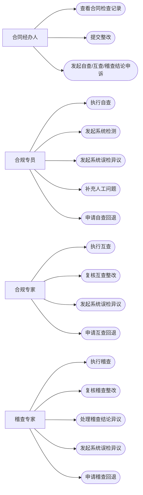

#### 5.2.2 管理与支撑角色用例图

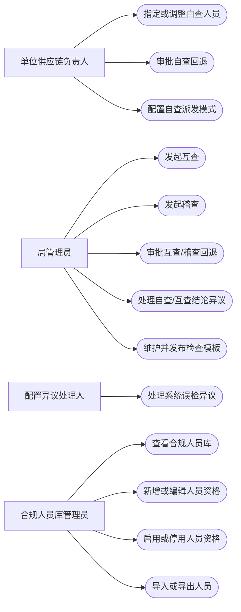

#### 5.2.3 合同经办人

| 用例编号     | 用例名称     | 前置条件               | 主流程                      | 结果                            |
| -------- | -------- | ------------------ | ------------------------ | ----------------------------- |
| UC-H-001 | 查看合同检查记录 | 用户为合同经办人且合同已生成检查记录 | 进入本人合同列表，查看阶段、结论、问题和处置记录 | 用户获得本人负责合同的检查信息               |
| UC-H-002 | 发起自查结论申诉 | 自查存在不合规检查项且在申诉时限内  | 选择检查项，填写申诉原因和材料并提交       | 结果异议进入局管理员待办，全部不合规项通过前合同暂不可互查 |
| UC-H-003 | 提交整改     | 互查或稽查存在待整改问题       | 按问题填写说明、上传材料并提交          | 生成原检查人的整改复核待办                 |
| UC-H-004 | 发起互查结论申诉 | 互查整改复核不通过且在时限内     | 选择复核不通过的检查项，提交申诉理由和材料    | 结果异议进入局管理员待办                  |
| UC-H-005 | 发起稽查结论申诉 | 稽查整改复核不通过且在时限内     | 选择复核不通过的检查项，提交申诉理由和材料    | 系统分派非原检查稽查专家处理                |

#### 5.2.4 单位供应链负责人

| 用例编号     | 用例名称     | 前置条件          | 主流程                      | 结果                 |
| -------- | -------- | ------------- | ------------------------ | ------------------ |
| UC-L-001 | 指定自查人员   | 本单位存在待派发自查记录  | 选择合同和本单位合规专员并确认          | 生成合规专员自查待办         |
| UC-L-002 | 调整自查人员   | 自查任务未提交       | 选择新的合规专员并确认调整            | 任务转交并记录调整日志        |
| UC-L-003 | 审批自查回退   | 收到自查回退申请      | 查看原因并通过或驳回               | 任务返回待分派池或由原检查人继续办理 |
| UC-L-004 | 配置自查派发模式 | 拥有组织业务配置维护权限点 | 在组织数据范围内选择组织并设置自动派发或人工指定 | 新生成的自查任务按该组织当前配置派发 |

#### 5.2.5 合规专员

| 用例编号      | 用例名称     | 前置条件           | 主流程                   | 结果                       |
| --------- | -------- | -------------- | --------------------- | ------------------------ |
| UC-SC-001 | 执行自查     | 已收到自查任务        | 填写人工项、发起系统检测、处理必检项并提交 | 形成不可覆盖的自查原始结论            |
| UC-SC-002 | 发起系统误检异议 | 系统返回不合规且认为属于误检 | 勾选检查项、填写原因和材料并提交结果异议  | 进入配置异议处理人待办，异议未办结前不可提交自查 |
| UC-SC-003 | 补充人工问题   | 系统判定合规但人工发现问题  | 新增人工补充不合规问题           | 有效结果和总体结论按不合规计算          |
| UC-SC-004 | 申请自查回退   | 自查任务未提交且无法继续处理 | 填写原因并申请回退             | 进入单位供应链负责人审批             |

#### 5.2.6 合规专家

| 用例编号      | 用例名称     | 前置条件                | 主流程                  | 结果                          |
| --------- | -------- | ------------------- | -------------------- | --------------------------- |
| UC-MC-001 | 执行互查     | 已收到跨单位互查任务          | 在不可查看自查结果的前提下独立检查并提交 | 形成互查原始结论                    |
| UC-MC-002 | 复核互查整改   | 本人检查问题已提交整改         | 查看整改材料并作出通过或不通过结论    | 按是否全部闭环流转至互查待整改、复核不通过或待稽查状态 |
| UC-MC-003 | 申请互查回退   | 互查任务未提交且无法继续处理      | 填写原因并申请回退            | 进入局管理员审批                    |
| UC-MC-004 | 发起系统误检异议 | 互查系统识别项返回不合规且认为属于误检 | 选择检查项，填写异议原因和材料并提交   | 进入配置异议处理人待办，办结前不可提交互查       |

#### 5.2.7 稽查专家

| 用例编号      | 用例名称     | 前置条件                | 主流程                     | 结果                    |
| --------- | -------- | ------------------- | ----------------------- | --------------------- |
| UC-AC-001 | 执行稽查     | 已收到稽查任务且不是该合同原互查人员  | 查看关联历史记录，执行检查并提交        | 形成稽查原始结论              |
| UC-AC-002 | 复核稽查整改   | 本人检查问题已提交整改         | 查看整改材料并作出复核结论           | 更新问题处理结果和单据当前检查状态     |
| UC-AC-003 | 处理稽查结论异议 | 本人未参与原稽查且收到异议任务     | 按检查项审查事实、制度依据和材料并作出最终结论 | 记录各检查项稽查最终申诉结论        |
| UC-AC-004 | 申请稽查回退   | 稽查任务未提交且无法继续处理      | 填写原因并申请回退               | 进入局管理员审批              |
| UC-AC-005 | 发起系统误检异议 | 稽查系统识别项返回不合规且认为属于误检 | 选择检查项，填写异议原因和材料并提交      | 进入配置异议处理人待办，办结前不可提交稽查 |

#### 5.2.8 局管理员

| 用例编号     | 用例名称      | 前置条件                   | 主流程                               | 结果                                         |
| -------- | --------- | ---------------------- | --------------------------------- | ------------------------------------------ |
| UC-A-001 | 发起互查      | 互查候选池存在可用合同            | 设置范围、比例或数量，确认抽取与派发                | 生成跨单位互查任务                                  |
| UC-A-002 | 发起稽查      | 稽查候选池存在可用合同            | 关联线下计划或填写原因，设置抽取和派发规则             | 生成符合回避要求的稽查任务                              |
| UC-A-003 | 审批互查/稽查回退 | 收到回退申请                 | 查看原因并通过或驳回                        | 任务回池重派或原检查人继续办理                            |
| UC-A-004 | 处理自查结论异议  | 收到自查结论申诉               | 按检查项审查材料并作出最终结论                   | 全部不合规项通过后流转至CS-010“待互查”，否则流转至CS-009“自查未通过” |
| UC-A-005 | 处理互查结论异议  | 收到互查结论申诉               | 按检查项审查材料并作出最终结论                   | 对应问题闭环或退回继续整改                              |
| UC-A-006 | 维护检查模板    | 拥有“维护检查模板”权限点          | 维护模板基础信息、阶段/分组、检查项、检查标准和填写规则并保存草稿 | 形成可预览、待发布的模板草稿                             |
| UC-A-007 | 发布模板版本    | 拥有“发布检查模板版本”权限点且发布校验通过 | 预览模板并确认发布                         | 生成只读已发布版本，供后续新任务匹配和形成快照                    |

#### 5.2.9 配置异议处理人

| 用例编号     | 用例名称     | 前置条件        | 主流程                                  | 结果               |
| -------- | -------- | ----------- | ------------------------------------ | ---------------- |
| UC-P-001 | 处理系统误检异议 | 按异议处理规则收到待办 | 查看系统原始结果、检测依据、异议原因和材料，按检查项作出通过或不通过结论 | 形成检查项异议记录并更新有效结果 |

#### 5.2.10 合规人员库管理员

| 用例编号      | 用例名称    | 前置条件                    | 主流程                           | 结果                      |
| --------- | ------- | ----------------------- | ----------------------------- | ----------------------- |
| UC-PL-001 | 查看合规人员库 | 拥有人员库查看权限点              | 在资格所属组织数据范围内按人员类型、组织和状态查询     | 获得授权范围内的人员资格信息          |
| UC-PL-002 | 新增人员资格  | 拥有人员库管理权限点              | 从统一用户中选择人员，新增人员类型、资格所属组织和资格状态 | 用户以启用状态进入对应资格所属组织的候选人员库 |
| UC-PL-003 | 编辑人员资格  | 拥有人员库管理权限点且资格所属组织在数据范围内 | 独立修改某条资格的组织、状态或说明             | 保存该条人员资格并记录变更日志，不影响其他资格 |
| UC-PL-004 | 停用合规人员  | 拥有人员库管理权限点              | 查看未完成任务提示，确认停用                | 人员不再接收新任务，历史记录保留        |
| UC-PL-005 | 导入/导出人员 | 拥有对应导入或导出权限点            | 选择文件导入或按筛选条件导出                | 批量处理授权组织范围内的人员数据        |

***

## 6. 权限与数据可见性

### 6.1 权限模型概述

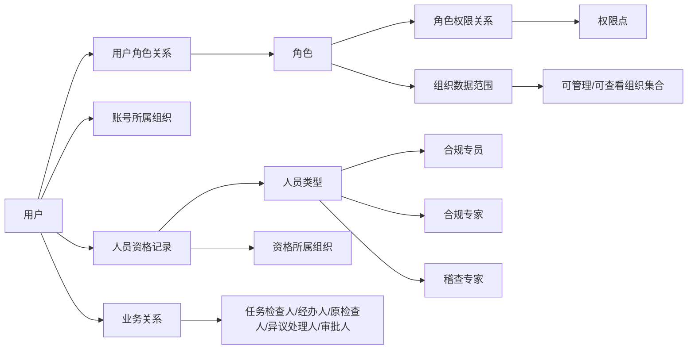

### 6.2 授权原则

1. \*\*管理类功能采用权限点控制。\*\*检查模板、模板匹配、合规人员库、互查/稽查发起与派发、系统配置和操作审计等能力均配置独立权限点；台账权限点不在本PRD负责范围内。
2. \*\*检查办理类操作不配置静态权限点。\*\*用户能否执行自查、互查、稽查，由“有效的合规人员库身份 + 任务已分派给本人 + 单据当前检查状态允许操作”共同决定。
3. \*\*整改、复核和结果异议由业务关系控制。\*\*合同经办人处理本人合同的整改和检查结论申诉；原检查人处理对应整改复核；当前检查人发起系统误检异议；按规则配置的人员处理系统误检异议。

### 6.3 权限点目录

以下为首版建议权限点。具体技术编码由现有权限平台统一定义，不在本PRD中约定。台账相关权限点不在本PRD负责范围内，未列入下表。

| 权限名称     | 控制范围              | 建议授予角色           |
| -------- | ----------------- | ---------------- |
| 查看检查模板   | 模板列表和详情           | 局管理员（按权限点授权）     |
| 维护检查模板   | 新增、编辑、复制、停用       | 局管理员（按权限点授权）     |
| 发布检查模板版本 | 发布新版本             | 局管理员（按权限点授权）     |
| 维护模板匹配规则 | 合同属性与模板关系         | 局管理员（按权限点授权）     |
| 查看合规人员库  | 人员资格列表和详情         | 人员库管理员、相关管理角色    |
| 维护合规人员库  | 新增、编辑、启用、停用人员资格   | 人员库管理员           |
| 导入合规人员   | 批量导入              | 人员库管理员，P1        |
| 导出合规人员   | 按组织范围导出           | 人员库管理员，P1        |
| 查看组织业务配置 | 查看组织级业务参数         | 单位供应链负责人（按权限点授权） |
| 维护组织业务配置 | 配置本组织自查派发模式等组织级参数 | 单位供应链负责人（按权限点授权） |
| 自查派发管理   | 人工指定或调整自查人员       | 单位供应链负责人         |
| 发起互查     | 创建互查批次            | 局管理员             |
| 互查派发管理   | 人工指定或调整互查专家       | 局管理员             |
| 发起稽查     | 创建稽查批次            | 局管理员             |
| 稽查派发管理   | 人工指定或调整稽查专家       | 局管理员             |
| 角色权限管理   | 角色、权限点和数据范围       | 局管理员（按权限点授权）     |
| 异议处理规则配置 | 系统误检异议的处理节点和人员    | 局管理员（按权限点授权）     |
| 时限配置     | 各类工作日时限           | 局管理员（按权限点授权）     |
| 通知规则配置   | 通知事件、渠道和频次        | 局管理员（按权限点授权）     |
| 查看操作审计日志 | 权限、人员、业务操作日志      | 局管理员、审计角色        |

以下操作不设置独立静态权限点：执行本人检查任务、保存检查草稿、提交本人检查、申请本人任务回退、检查人发起系统误检异议、合同经办人整改或发起检查结论申诉、原检查人复核整改、被配置处理人办理系统误检异议。系统通过人员资格、任务关系、业务关系和流程状态实时校验。

### 6.4 数据可见性与办理依据

| 用户/人员类型  | 可查看范围                    | 办理操作的授权依据               | 关键限制                            |
| -------- | ------------------------ | ----------------------- | ------------------------------- |
| 合同经办人    | 本人负责合同的检查、整改、复核和检查结论申诉记录 | 合同经办人业务关系               | 不可查看其他经办人的合同记录                  |
| 合规专员     | 分派给本人的自查任务及本人历史自查记录      | 有效合规专员身份 + 任务分派关系       | 不可处理未分派给本人的任务                   |
| 合规专家     | 分派给本人的互查任务及本人历史互查记录      | 有效合规专家身份 + 任务分派关系       | 互查执行时不可查看自查结果                   |
| 单位供应链负责人 | 本组织业务配置、待分派任务及自查派发记录     | 组织业务配置/自查派发权限点 + 组织数据范围 | 不可配置或派发组织范围外的任务                 |
| 稽查专家     | 分派给本人的稽查任务及其关联历史记录       | 有效稽查专家身份 + 任务分派关系       | 不具备全局任意查询权限                     |
| 局管理员     | 组织数据范围和现有平台规则允许的检查记录     | 局级管理身份及组织数据范围           | 查看、导出和结论操作需留痕                   |
| 配置异议处理人  | 与本人系统误检异议待办相关的数据         | 异议处理规则产生的任务关系           | 不因异议待办获得其他记录查询权限                |
| 人员库管理员   | 资格所属组织在授权范围内的人员资格记录      | 人员库权限点 + 资格所属组织数据范围     | 账号所属组织不决定其维护权限；不能因人员库管理权限办理检查任务 |

建议对敏感记录查看、导出、审批和结论发布记录访问日志，包括访问人、访问时间、当前角色、所属组织、权限点、业务对象和操作结果。

***

## 7. 业务对象与关联关系

### 7.1 合同检查对象

- 普通合同、框架协议、补充协议分别形成独立检查记录。
- 当前统一按“合同检查范围”处理，具体类型差异由后续模板配置承接。
- 合同评审完成后生成“一单一检”记录并锁定适用模板版本。
- 后续模板修改不追溯已生成任务。

### 7.2 一标多合同

- 采购前置共享事项按采购项目检查一次。
- 合同专属事项按单份合同分别检查。
- 自查、互查、稽查分别独立产生共享结果，不跨检查类型复用。
- 同一检查类型下，共享事项只由一名检查人检查一次，其他关联合同引用该结果。
- 被引用结果需展示来源采购项目、原检查人和检查时间，引用方不可直接修改。
- 每份合同仍形成完整、可追溯的独立检查记录。

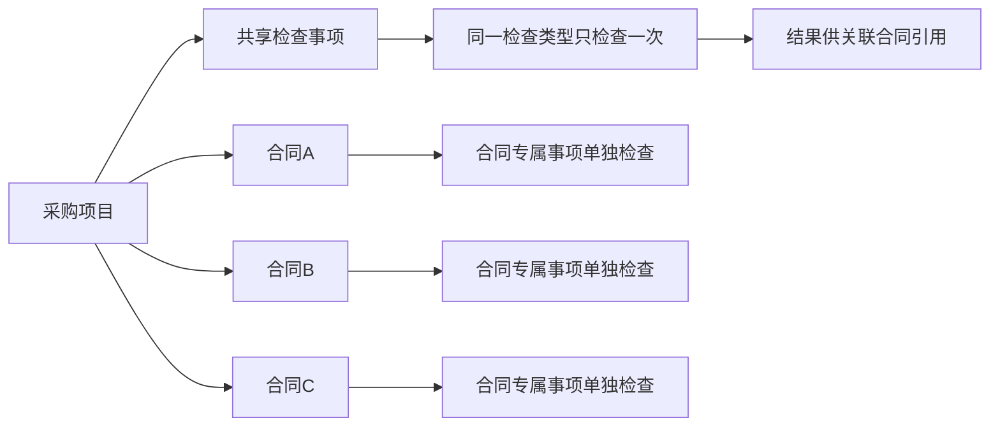

### 7.3 合规人员资格模型

#### 7.3.1 定位与组织模型

合规人员库用于管理具备检查资格的人员，是任务派发的候选人员来源，不承担系统管理权限配置。人员库至少包含三类人员：

- 合规专员：可被分派本单位自查任务。
- 合规专家：可被分派跨单位互查任务。
- 稽查专家：可被分派稽查任务和符合回避规则的稽查结论异议任务。

同一用户可以同时拥有多条人员资格记录。每条记录分别维护“人员类型 + 资格所属组织 + 资格状态”，不同人员类型可以归属不同组织；同一人员类型也允许按实际需要归属多个组织。

人员资格模型必须区分以下两个组织概念：

- **账号所属组织**：来自统一用户中心，表示账号当前所属单位，主要用于单位回避和人员基础信息展示。
- **资格所属组织**：在人员资格记录中维护，表示该项资格归属哪个组织的候选人员库，主要用于候选池范围、资格管理权限和任务派发。

例如，同一用户的账号所属组织为“四局二公司”，可以分别存在以下三条资格记录：

| 人员类型 | 资格所属组织 | 业务含义                |
| ---- | ------ | ------------------- |
| 合规专员 | 四局二公司  | 可承接四局二公司的自查任务       |
| 合规专家 | 四局二公司  | 作为四局二公司的互查专家参与跨单位互查 |
| 稽查专家 | 四局     | 进入四局级稽查专家候选池        |

#### 7.3.2 核心数据字段

| 字段       | 说明                            |
| -------- | ----------------------------- |
| 用户账号     | 关联统一用户中心账号，不在本系统重复创建用户        |
| 姓名       | 从用户中心带入                       |
| 账号所属组织   | 从用户中心带入，只读；用于单位回避和人员基础信息展示    |
| 人员类型     | 合规专员、合规专家、稽查专家；每条资格记录只对应一种类型  |
| 资格所属组织   | 该项人员资格归属的组织，用于候选池范围、资格管理和任务派发 |
| 资格状态     | 启用、停用                         |
| 资格或来源说明  | 记录入库依据，具体是否必填待确认              |
| 备注       | 管理说明                          |
| 创建人/创建时间 | 操作留痕                          |
| 更新人/更新时间 | 操作留痕                          |

#### 7.3.3 人员资格业务规则

1. 将用户加入人员库后，用户只获得被分派对应任务的资格，不自动获得任何管理权限点。
2. 同一条资格记录中，“用户账号 + 人员类型 + 资格所属组织”不得重复；不同资格记录的启停状态相互独立。
3. 系统自动或人工派发时，只能选择人员类型和资格所属组织符合要求且状态为启用的资格记录。
4. 自查候选人的合规专员资格所属组织必须与合同所属组织一致。
5. 互查候选人从符合派发范围的合规专家资格记录中选择，并根据人员的账号所属组织执行合同所属单位回避。
6. 稽查候选人从本次稽查发起组织可使用的稽查专家资格记录中选择，并根据人员的账号所属组织及原互查人员关系执行回避。
7. 停用某一条人员资格后，仅该资格不得再接收新任务，不影响同一用户的其他启用资格；历史任务和资格快照永久保留。
8. 人员存在未完成任务时，系统需在停用前提示，并按后续确定的任务转交规则处理。
9. 人员类型、资格所属组织和资格状态变化均需记录变更前后值。

### 7.4 检查模板模型

#### 7.4.1 模板层级

检查模板采用“模板—版本—检查阶段/分组—检查项”四层结构。任务生成时引用一个已发布模板版本，并保存完整快照。

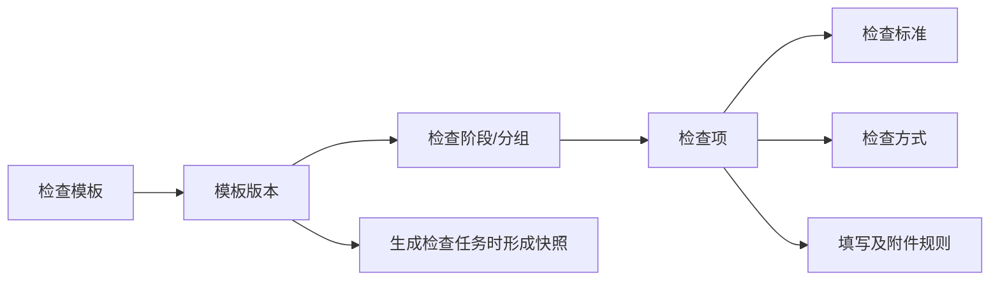

#### 7.4.2 模板基础字段

| 字段       | 说明                                |
| -------- | --------------------------------- |
| 模板名称     | 用于识别模板，如合同检查模板                    |
| 模板版本号    | 发布时形成，不允许同一模板下重复                  |
| 适用检查类型   | 自查、互查、稽查，可多选                      |
| 适用范围     | 与合同属性的匹配关系由PG-072模板匹配规则维护，具体属性待确认 |
| 模板状态     | 草稿、已发布、已停用                        |
| 生效时间     | 控制新生成任务可匹配的起始时间                   |
| 模板说明     | 说明模板用途和适用边界                       |
| 创建人/创建时间 | 操作留痕                              |
| 更新人/更新时间 | 操作留痕                              |

#### 7.4.3 检查阶段/分组字段

参考现有稽查页面中的“约标阶段、发标阶段”等展示方式，模板支持按业务阶段或检查分组组织检查项。本PRD不预置具体阶段名称，由有权限的维护人员配置。

| 字段      | 说明                   |
| ------- | -------------------- |
| 阶段/分组名称 | 执行页面用于归类展示检查项        |
| 阶段/分组说明 | 对该组检查范围进行说明          |
| 排序号     | 控制阶段/分组在执行页面的顺序      |
| 启用状态    | 停用后不进入后续发布版本，新任务不再使用 |

#### 7.4.4 检查项字段

| 字段      | 说明                                    |
| ------- | ------------------------------------- |
| 检查项名称   | 简要描述需要检查的事项                           |
| 检查标准    | 展示判断依据、合规要求或检查口径；没有单独标准时可为空，执行页面显示“/” |
| 所属阶段/分组 | 关联模板内的检查阶段或分组                         |
| 适用检查类型  | 从模板适用的自查、互查、稽查范围中选择，可多选               |
| 检查方式    | 人工检查、系统识别、共享引用                        |
| 风险等级    | 高、中、低，用于分类和统计，不自动触发稽查                 |
| 是否必检    | 必检项未完成时不允许提交任务                        |
| 备注填写规则  | 非必填、始终必填、不合规时必填                       |
| 附件填写规则  | 非必填、始终必填、不合规时必填                       |
| 不合规补充要求 | 配置问题原因、制度依据等字段是否必填；首版两者均必填            |
| 系统检测能力  | 系统识别项关联的检测能力或规则标识，人工项不填写              |
| 排序号     | 控制检查项在阶段/分组内的展示顺序                     |
| 启用状态    | 控制是否进入后续发布版本                          |

#### 7.4.5 模板定义与任务填写边界

参考图中的稽查明细表，字段归属划分如下：

| 页面字段 | 数据归属   | 说明                    |
| ---- | ------ | --------------------- |
| 序号   | 模板快照   | 根据阶段和检查项排序生成          |
| 检查阶段 | 模板快照   | 来源于阶段/分组名称            |
| 检查项  | 模板快照   | 来源于检查项名称              |
| 检查标准 | 模板快照   | 检查任务执行时只读展示           |
| 判定结果 | 任务执行数据 | 人工项选择合规/不合规；系统项展示检测结果 |
| 检查备注 | 任务执行数据 | 按检查项的备注填写规则校验         |
| 检查附件 | 任务执行数据 | 按检查项的附件填写规则校验         |

#### 7.4.6 模板版本规则

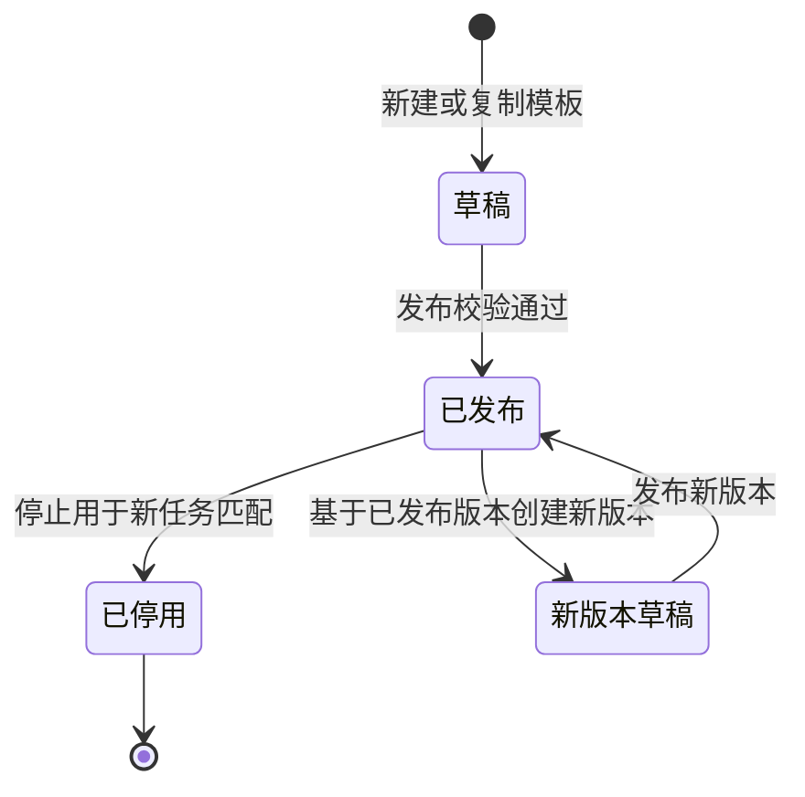

1. 草稿可编辑；已发布版本不得直接修改，只能基于该版本创建新版本草稿。
2. 发布前至少存在一个启用的阶段/分组，且模板选择的每一种适用检查类型至少存在一个启用的必检项。
3. 系统识别项发布前必须关联有效的系统检测能力。
4. 模板发布后仅影响后续新生成任务，不改变已生成任务的模板快照。
5. 任务快照至少保存模板名称、版本、阶段/分组、检查项、检查标准、检查方式、风险等级及填写规则。
6. 已发布版本不得物理删除；停用后不再匹配新任务，但历史任务继续展示原版本和快照。
7. 生成自查、互查或稽查任务时，只将适用于当前检查类型的启用检查项写入任务快照。

***

## 8. 总体业务流程

### 8.1 检查主流程泳道图

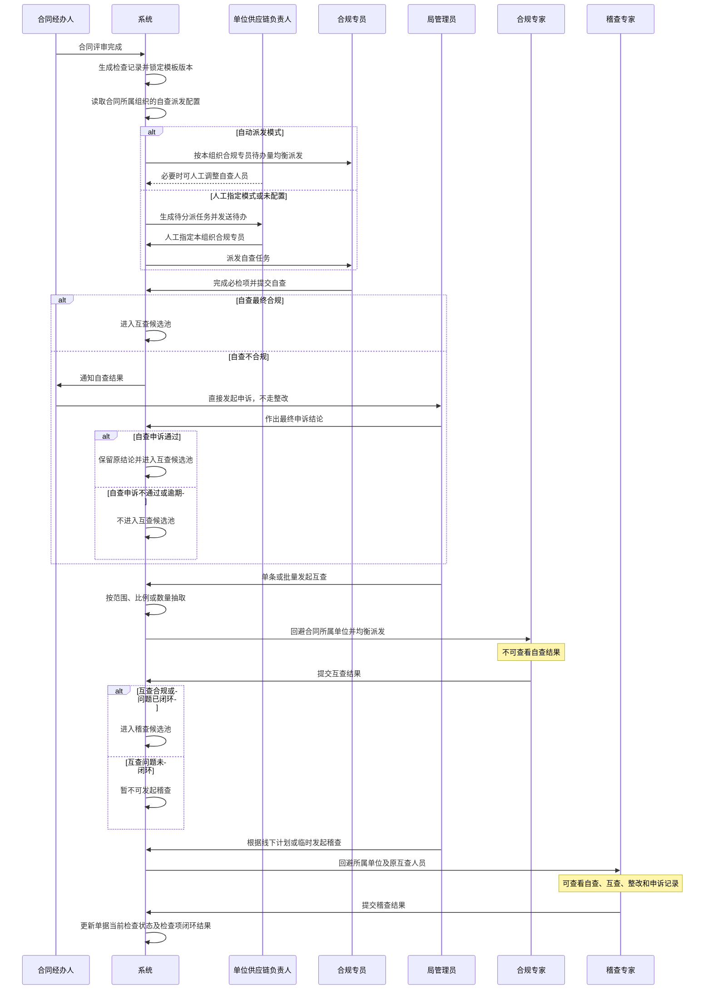

### 8.2 后续检查准入关系

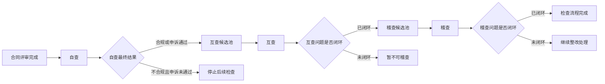

### 8.3 互查抽取与派发

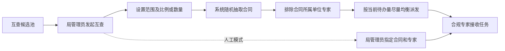

### 8.4 稽查抽取与派发

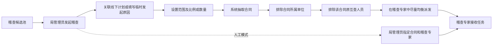

### 8.5 任务回退泳道图

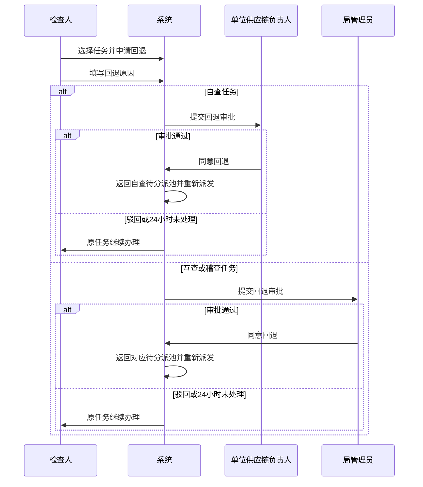

人工派发和系统自动派发使用相同的回退审批规则，与具体派发操作人无关。

### 8.6 系统检测及系统误检异议流程

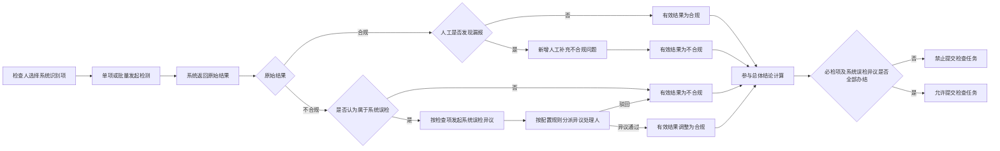

### 8.7 整改、复核及检查结论申诉泳道图

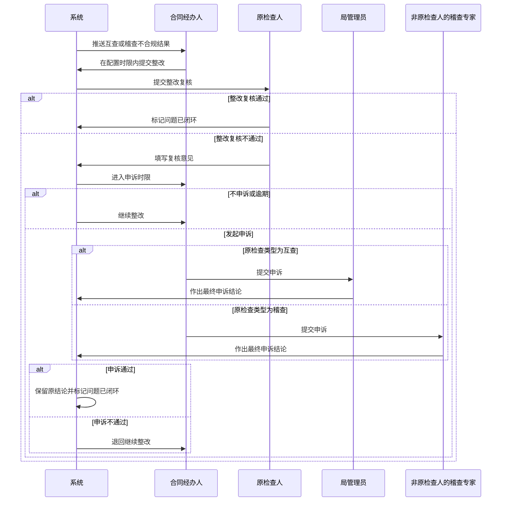

### 8.8 自查结论申诉流程

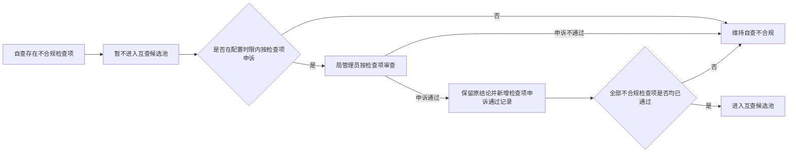

***

## 9. 状态模型

一份合同检查记录只维护一个“当前检查状态”字段。自查、互查、稽查、整改、复核、结果异议、任务回退和自动收回均在这一套状态中流转；异议单、整改轮次、回退申请等对象只记录办理明细和处理结果，不再各自形成另一套主状态机。

### 9.1 单据检查状态总表

下表每行代表一个可被保存的当前检查状态。状态编码全局唯一，状态机中的所有节点必须直接引用本表状态，不得增加表外状态。

| 状态编码   | 状态名称      | 状态说明                      | 可流向状态                              |
| ------ | --------- | ------------------------- | ---------------------------------- |
| CS-001 | 自查待派发     | 自查任务尚未确定检查人               | CS-002                             |
| CS-002 | 自查待处理     | 已确定合规专员，尚未开始办理            | CS-003、CS-005、CS-006               |
| CS-003 | 自查中       | 合规专员正在执行人工检查或系统检测         | CS-004、CS-005、CS-006、CS-007、CS-010 |
| CS-004 | 自查系统误检异议中 | 自查任务存在尚未办结的系统误检异议         | CS-003                             |
| CS-005 | 自查回退审批中   | 自查任务回退申请等待单位供应链负责人审批      | CS-001、CS-002、CS-003               |
| CS-006 | 自查已收回     | 自查任务超过办结时限并被系统自动收回        | CS-001、CS-002                      |
| CS-007 | 自查结论待申诉   | 自查提交后仍存在不合规检查项，处于申诉时限内    | CS-008、CS-009                      |
| CS-008 | 自查结论申诉中   | 局管理员正在按检查项处理自查结论申诉        | CS-009、CS-010                      |
| CS-009 | 自查未通过     | 自查仍有未申诉通过的不合规检查项，不进入互查候选池 | 无                                  |
| CS-010 | 待互查       | 自查合规或全部不合规项申诉通过，进入互查候选池   | CS-011、CS-012                      |
| CS-011 | 互查待派发     | 已发起互查但尚未确定合规专家            | CS-012                             |
| CS-012 | 互查待处理     | 已确定合规专家，尚未开始办理            | CS-013、CS-015                      |
| CS-013 | 互查中       | 合规专家正在执行互查                | CS-014、CS-015、CS-016、CS-020        |
| CS-014 | 互查系统误检异议中 | 互查任务存在尚未办结的系统误检异议         | CS-013                             |
| CS-015 | 互查回退审批中   | 互查任务回退申请等待局管理员审批          | CS-011、CS-012、CS-013               |
| CS-016 | 互查待整改     | 互查存在尚未闭环的不合规检查项，等待合同经办人整改 | CS-017                             |
| CS-017 | 互查待复核     | 合同经办人已提交整改，等待原检查人复核       | CS-016、CS-018、CS-020               |
| CS-018 | 互查复核不通过   | 原检查人复核不通过，处于继续整改或申诉选择期    | CS-016、CS-017、CS-019               |
| CS-019 | 互查结论申诉中   | 局管理员正在按检查项处理互查结论申诉        | CS-016、CS-017、CS-018、CS-020        |
| CS-020 | 待稽查       | 互查合规或全部互查问题已闭环，进入稽查候选池    | CS-021、CS-022                      |
| CS-021 | 稽查待派发     | 已发起稽查但尚未确定稽查专家            | CS-022                             |
| CS-022 | 稽查待处理     | 已确定稽查专家，尚未开始办理            | CS-023、CS-025                      |
| CS-023 | 稽查中       | 稽查专家正在执行稽查                | CS-024、CS-025、CS-026、CS-030        |
| CS-024 | 稽查系统误检异议中 | 稽查任务存在尚未办结的系统误检异议         | CS-023                             |
| CS-025 | 稽查回退审批中   | 稽查任务回退申请等待局管理员审批          | CS-021、CS-022、CS-023               |
| CS-026 | 稽查待整改     | 稽查存在尚未闭环的不合规检查项，等待合同经办人整改 | CS-027                             |
| CS-027 | 稽查待复核     | 合同经办人已提交整改，等待原检查人复核       | CS-026、CS-028、CS-030               |
| CS-028 | 稽查复核不通过   | 原检查人复核不通过，处于继续整改或申诉选择期    | CS-026、CS-027、CS-029               |
| CS-029 | 稽查结论申诉中   | 非原稽查专家正在按检查项处理稽查结论申诉      | CS-026、CS-027、CS-028、CS-030        |
| CS-030 | 检查已完成     | 稽查合规或全部稽查问题已闭环            | 无                                  |

### 9.2 单据检查统一状态机

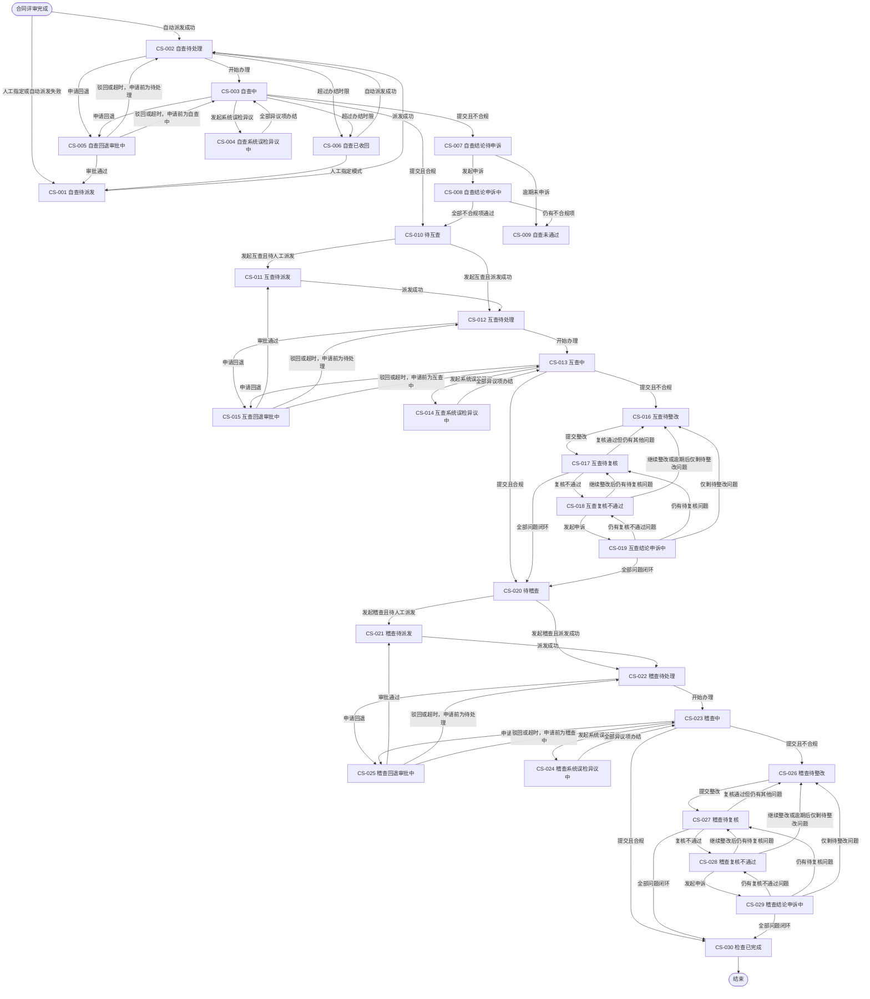

### 9.3 统一状态流转规则

1. 每份合同检查记录任一时点只能有一个当前检查状态；状态变化必须记录流转前状态、流转后状态、触发事件、操作人和操作时间。
2. 自查、互查、稽查的系统误检异议处理中，单据分别进入CS-004、CS-014、CS-024；全部异议检查项办结后返回对应“检查中”状态，不覆盖系统原始结果。
3. 回退审批通过后进入对应“待派发”状态；驳回或24小时超时自动驳回后，返回申请回退前的待处理或检查中状态。
4. 仅自查超过办结时限后进入CS-006“自查已收回”；互查、稽查超时只提醒、催办和留痕，当前检查状态不变化。
5. 自查只有全部不合规检查项申诉通过才进入CS-010“待互查”；仍有任一不合规项时进入CS-009“自查未通过”。
6. 互查、稽查按问题逐项整改、复核和申诉；只有全部问题闭环，单据才分别进入CS-020“待稽查”或CS-030“检查已完成”。
7. 同一结果异议单可以包含多个检查项，检查项处理结果分别记录；单据状态只根据是否仍存在未通过或未闭环检查项决定下一状态。
8. 同一单据的多个互查或稽查问题处于不同办理环节时，当前检查状态按“结论申诉中 > 复核不通过 > 待复核 > 待整改”的优先级取值；每次问题处理后重新计算，全部闭环后进入下一阶段或检查完成。
9. 原始判定结果和原始检查结论不因整改或结果异议发生变化，状态流转只改变当前检查状态和相应检查项的有效结果、闭环结果。
10. 处于CS-010“待互查”或CS-020“待稽查”且长期未被抽中的单据保持当前状态，不自动进入下一阶段。
11. 合同业务状态由合同业务系统维护，不随一单一检的当前检查状态变化。

***

## 10. 核心业务规则

| 规则编号   | 业务规则                                                        |
| ------ | ----------------------------------------------------------- |
| BR-001 | 合同评审完成后生成检查记录并锁定模板版本                                        |
| BR-002 | 模板更新不追溯已生成的检查任务                                             |
| BR-003 | 合同检查结果不拦截合同上架                                               |
| BR-004 | 自查最终未通过的合同不得进入互查候选池                                         |
| BR-005 | 自查不合规不走整改，可由合同经办人针对不合规检查项直接发起结论申诉                           |
| BR-006 | 自查结论申诉由局管理员按检查项作出最终结论                                       |
| BR-007 | 互查人员不得查看自查结果                                                |
| BR-008 | 互查任务必须回避合同所属单位                                              |
| BR-009 | 自查、互查结论不一致不自动触发稽查                                           |
| BR-010 | 互查问题闭环后方可进入稽查候选池                                            |
| BR-011 | 稽查任务必须回避合同所属单位和该合同原互查人员                                     |
| BR-012 | 稽查专家可查看本人稽查任务关联的自查、互查、整改和申诉记录                               |
| BR-013 | 原始判定结果和原始检查结论永久保留，不被整改或结果异议覆盖                               |
| BR-014 | 互查结论申诉由局管理员按检查项作出最终结论                                       |
| BR-015 | 稽查结论申诉由未参与原稽查的其他稽查专家按检查项作出最终结论                              |
| BR-016 | 互查、稽查问题经整改复核或申诉通过后视为闭环                                      |
| BR-017 | 申诉不通过或逾期未申诉时，互查、稽查问题继续整改，不自动关闭                              |
| BR-018 | 所有必检项完成且系统误检异议全部办结后方可提交检查任务                                 |
| BR-019 | 人工检查项必须选择合规或不合规；不合规时问题原因和制度依据必填                             |
| BR-020 | 系统识别项必须取得系统原始结果；存在系统误检异议时，以办结后的有效结果参与任务提交和总体结论计算            |
| BR-021 | 系统误检异议只允许针对系统“不合规”结果发起，通过后仅将对应检查项有效结果调整为“合规”                |
| BR-022 | 系统原始结果永久保留，系统误检异议结论只改变对应检查项有效结果                             |
| BR-023 | 系统判定合规但人工发现问题时，新增人工补充不合规问题                                  |
| BR-024 | 任一必检项的最终有效结果不合规，则总体结论不合规                                    |
| BR-025 | 风险等级只用于问题分类、整改优先级、统计展示和人工筛选，不自动触发稽查                         |
| BR-026 | 自查回退由单位供应链负责人审批                                             |
| BR-027 | 互查、稽查回退由局管理员审批                                              |
| BR-028 | 回退审批超过24小时未处理时自动驳回，原检查人继续办理                                 |
| BR-029 | 仅自查任务超时后自动收回；自动派发模式重新派发，人工指定模式返回待分派                         |
| BR-030 | 互查、稽查超时只提醒、催办、留痕并纳入考核，不自动收回                                 |
| BR-031 | 整改、复核、检查结论申诉时限按工作日分别配置；系统误检异议不单独设置申诉时限                      |
| BR-032 | 同一账号可拥有多个角色，但数据和操作权限按当前业务身份隔离                               |
| BR-033 | 模板、人员库、任务发起派发和系统配置等管理能力采用RBAC权限点控制；台账权限点不在本PRD范围内           |
| BR-034 | 检查办理不配置静态权限点，由有效人员库身份、任务分派关系和流程状态共同授权                       |
| BR-035 | 角色是权限点集合，角色同时配置组织数据范围                                       |
| BR-036 | 合规人员库身份只表示可被分派对应任务，不自动授予管理权限                                |
| BR-037 | 新增、编辑、启用、停用人员资格必须具备人员库管理权限点，且资格所属组织在操作人的组织数据范围内             |
| BR-038 | 自动或人工派发只能选择人员类型、资格所属组织符合要求且状态为启用的人员资格记录                     |
| BR-039 | 某项人员资格停用后不得凭该资格接收新任务，不影响同一用户的其他启用资格；历史任务和资格快照不得删除           |
| BR-040 | 整改、复核和结果异议根据合同、当前检查人、原检查人及异议任务等业务关系授权                       |
| BR-041 | 各组织独立维护本组织的自查派发模式，可选择自动派发或人工指定                              |
| BR-042 | 组织业务配置只能由具备对应权限点的单位供应链负责人在其组织数据范围内查看和维护                     |
| BR-043 | 自动派发模式按本组织有效合规专员待办量均衡派发；人工指定模式生成待分派任务，由单位供应链负责人指定合规专员       |
| BR-044 | 组织派发模式变更只影响变更后新生成的自查任务，不改变已派发任务；未配置时按人工指定模式进入待分派并提醒单位供应链负责人 |
| BR-045 | 账号所属组织用于单位回避，资格所属组织用于确定资格归属、候选池范围和人员库管理权限，两者分别记录、分别校验       |
| BR-046 | 检查模板由模板版本、检查阶段/分组和检查项组成，检查项必须归属一个阶段/分组                      |
| BR-047 | 检查项名称、检查标准、检查方式、风险等级及填写规则属于模板定义；判定结果、检查备注和检查附件属于任务执行数据      |
| BR-048 | 已发布模板版本只读，修改模板内容必须创建新版本；新版本不追溯已生成任务                         |
| BR-049 | 检查任务生成时必须保存模板、阶段/分组和检查项完整快照，历史展示不得依赖当前模板数据                  |
| BR-050 | 人工项判定结果固定为合规或不合规；备注、附件及不合规补充字段按检查项模板规则校验                    |
| BR-051 | 一个模板可适用于多种检查类型，生成任务时只加载适用于当前自查、互查或稽查类型的启用检查项                |
| BR-052 | 每条结果异议必须关联检查任务、检查项和不可覆盖的原始判定结果，并记录异议类型、发起人、处理人、材料、状态和结论     |
| BR-053 | 同一异议单可包含多个检查项，但每个检查项必须独立形成处理结论和业务影响；自查仅在全部不合规检查项申诉通过后更新为可互查 |

***

## 11. 功能架构

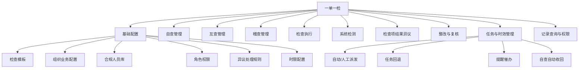

***

## 12. 页面信息架构与页面清单

### 12.1 页面设计原则

- 以“角色工作台 + 业务模块菜单”组织页面，多角色用户可切换当前业务身份。
- 管理类菜单和操作按钮按RBAC权限点展示；检查办理入口按人员库身份和本人任务动态展示。
- 页面是否展示不代表最终授权，所有管理和办理操作均需由服务端再次校验。
- 自查、互查、稽查共用一套检查任务执行页，通过检查类型、权限和历史结果可见性控制差异。
- 合同检查详情作为统一业务档案页；单次自查、互查、稽查记录在检查记录详情中展示。
- 整改、复核和结果异议从统一待办进入，同时保留对应业务模块的列表入口；系统误检异议从检查任务内发起，所有异议处理待办均进入角色工作台，不设置独立审批中心。
- 发起互查、发起稽查、人工派发等复杂操作使用独立页面或抽屉；简单确认使用弹窗。
- P0 页面需优先支持桌面端；移动端或中建通适配范围待确认。

### 12.2 菜单与页面信息架构

```mermaid
flowchart TB
    ROOT[一单一检]

    ROOT --> WB[工作台]
    WB --> WB1[角色工作台]
    WB --> WB2[我的任务]
    WB --> WB3[我的已办]

    ROOT --> CONTRACT[合同检查]
    CONTRACT --> C1[经办合同检查]
    CONTRACT --> C4[合同检查详情]

    ROOT --> SELF[自查管理]
    SELF --> S1[自查待分派]
    SELF --> S2[自查任务]

    ROOT --> MUTUAL[互查管理]
    MUTUAL --> M1[互查候选池]
    MUTUAL --> M2[互查批次]
    MUTUAL --> M3[互查任务]

    ROOT --> AUDIT[稽查管理]
    AUDIT --> A1[稽查候选池]
    AUDIT --> A2[稽查批次]
    AUDIT --> A3[稽查任务]

    ROOT --> ISSUE[整改与异议]
    ISSUE --> I1[我的整改]
    ISSUE --> I2[我的复核]
    ISSUE --> I3[我的结果异议]
    ISSUE --> I4[结果异议处理]

    ROOT --> CONFIG[配置管理]
    CONFIG --> G0[组织业务配置]
    CONFIG --> G1[检查模板]
    CONFIG --> G2[模板匹配]
    CONFIG --> G3[风险等级]
    CONFIG --> G4[异议处理规则]
    CONFIG --> G5[时限与通知]
    CONFIG --> G6[角色权限]
    CONFIG --> G7[合规人员库]

    ROOT --> AUDITLOG[操作审计]
    AUDITLOG --> R4[操作审计日志]
```

### 12.3 页面清单总表

> 页面编号用于后续原型、功能清单、接口和测试用例关联。抽屉、弹窗也单独编号，便于明确交互边界。

| 页面编号   | 一级模块  | 页面名称        | 页面形态  | 主要角色             | 优先级 | 核心用途                             |
| ------ | ----- | ----------- | ----- | ---------------- | --- | -------------------------------- |
| PG-001 | 工作台   | 角色工作台       | 页面    | 全部登录用户           | P0  | 展示当前角色的待办、预警、快捷入口和近期已办           |
| PG-002 | 工作台   | 我的任务        | 页面    | 合规专员、合规专家、稽查专家   | P0  | 汇总本人自查、互查、稽查任务并按状态筛选             |
| PG-003 | 工作台   | 检查任务执行      | 页面    | 各检查人             | P0  | 执行人工检查、系统检测、系统误检异议、草稿保存和提交       |
| PG-004 | 工作台   | 我的已办        | 页面    | 全部业务角色           | P0  | 查询本人已完成的检查、整改、复核和结果异议            |
| PG-010 | 合同检查  | 经办合同检查列表    | 页面    | 合同经办人            | P0  | 查看本人负责合同的当前检查状态、结论和未闭环问题         |
| PG-011 | 合同检查  | 合同检查详情      | 页面    | 按数据权限开放          | P0  | 汇总单份合同的全阶段记录、问题、整改和结果异议轨迹        |
| PG-014 | 合同检查  | 单次检查记录详情    | 页面/抽屉 | 按数据权限开放          | P0  | 展示一次自查、互查或稽查的模板快照、结果和留痕          |
| PG-020 | 自查管理  | 自查待分派       | 页面    | 单位供应链负责人         | P0  | 查看本单位待分派合同并人工指定或调整合规专员           |
| PG-021 | 自查管理  | 自查派发/调整     | 抽屉    | 单位供应链负责人         | P0  | 选择合规专员，查看待办量并确认派发或调整             |
| PG-030 | 互查管理  | 互查候选池       | 页面    | 局管理员             | P0  | 查询可互查合同并单条或批量发起互查                |
| PG-031 | 互查管理  | 发起互查        | 页面/抽屉 | 局管理员             | P0  | 配置抽取范围、比例或数量，预览并确认派发             |
| PG-032 | 互查管理  | 互查批次详情      | 页面    | 局管理员             | P0  | 查看批次规则、抽取结果、专家分配和任务进度            |
| PG-040 | 稽查管理  | 稽查候选池       | 页面    | 局管理员             | P0  | 查询问题已闭环且可稽查的合同                   |
| PG-041 | 稽查管理  | 发起稽查        | 页面/抽屉 | 局管理员             | P0  | 关联线下计划或填写原因，配置抽取和派发规则            |
| PG-042 | 稽查管理  | 稽查批次详情      | 页面    | 局管理员             | P0  | 查看批次、回避结果、专家分配和稽查进度              |
| PG-050 | 整改与异议 | 我的整改        | 页面    | 合同经办人            | P0  | 汇总待整改、整改中、待复核、复核不通过和已闭环问题        |
| PG-051 | 整改与异议 | 整改提交        | 页面    | 合同经办人            | P0  | 按问题提交整改说明和材料，查看历史整改轮次            |
| PG-052 | 整改与异议 | 我的复核        | 页面    | 合规专家、稽查专家        | P0  | 查看由本人原检查结论产生的待复核整改               |
| PG-053 | 整改与异议 | 整改复核        | 页面    | 原检查人             | P0  | 查看整改材料并作出通过或不通过结论                |
| PG-054 | 整改与异议 | 我的结果异议      | 页面    | 合同经办人、各检查人       | P0  | 按异议类型查看可提出、处理中和已办结的检查项结果异议       |
| PG-055 | 整改与异议 | 结果异议提交      | 页面    | 合同经办人、各检查人       | P0  | 选择检查项并提交异议理由及材料；系统误检异议由检查任务执行页进入 |
| PG-056 | 整改与异议 | 自查/互查结论异议处理 | 页面    | 局管理员             | P0  | 审查自查、互查结论申诉并按检查项作出最终结论           |
| PG-057 | 整改与异议 | 稽查结论异议处理    | 页面    | 非原检查稽查专家         | P0  | 审查稽查结论申诉并按检查项作出最终结论              |
| PG-058 | 整改与异议 | 系统误检异议处理    | 页面    | 配置异议处理人          | P0  | 审查系统原始结果、异议理由和材料并按检查项作出通过或不通过结论  |
| PG-069 | 配置管理  | 组织业务配置      | 页面    | 单位供应链负责人（按权限点开放） | P0  | 按组织集中维护自查派发模式等组织级业务参数            |
| PG-070 | 配置管理  | 检查模板列表      | 页面    | 局管理员（按权限点开放）     | P0  | 管理模板、版本、状态和适用范围                  |
| PG-071 | 配置管理  | 检查模板编辑      | 页面    | 局管理员（按权限点开放）     | P0  | 配置检查阶段/分组、检查项、检查标准、检查方式和填写规则     |
| PG-072 | 配置管理  | 模板匹配规则      | 页面    | 局管理员（按权限点开放）     | P0  | 配置合同属性与检查模板的匹配关系                 |
| PG-073 | 配置管理  | 风险等级配置      | 页面    | 局管理员（按权限点开放）     | P0  | 维护高、中、低风险等级及展示顺序                 |
| PG-074 | 配置管理  | 异议处理规则配置    | 页面    | 局管理员（按权限点开放）     | P0  | 配置系统误检异议的处理节点和人员                 |
| PG-075 | 配置管理  | 时限配置        | 页面    | 局管理员（按权限点开放）     | P0  | 配置启动、办结、整改、复核和检查结论申诉时限           |
| PG-076 | 配置管理  | RBAC角色权限配置  | 页面    | 局管理员（按权限点开放）     | P0  | 配置角色、权限点、用户角色关系和组织数据范围           |
| PG-077 | 配置管理  | 通知规则配置      | 页面    | 局管理员（按权限点开放）     | P1  | 配置通知事件、接收人、频次和渠道                 |
| PG-078 | 配置管理  | 合规人员库       | 页面    | 合规人员库管理员         | P0  | 按资格所属组织和人员类型查询、维护可参与检查的人员资格      |
| PG-079 | 配置管理  | 合规人员资格新增/编辑 | 页面/抽屉 | 合规人员库管理员         | P0  | 从统一用户中选择人员，配置人员类型、资格所属组织和资格状态    |
| PG-090 | 操作审计  | 操作审计日志      | 页面    | 局管理员、审计角色        | P1  | 查询访问、导出、审批、派发和状态变更日志             |

### 12.4 角色与页面矩阵

| 角色       | 默认首页         | 主要业务页面                                                                               |
| -------- | ------------ | ------------------------------------------------------------------------------------ |
| 合同经办人    | PG-001 角色工作台 | PG-010、PG-011、PG-050、PG-051、PG-054、PG-055、PG-004                                     |
| 单位供应链负责人 | PG-001 角色工作台 | PG-020、PG-021、PG-069、PG-004；配置页面按权限点显示                                               |
| 合规专员     | PG-001 角色工作台 | PG-002、PG-003、PG-054、PG-055、PG-014、PG-004                                            |
| 合规专家     | PG-001 角色工作台 | PG-002、PG-003、PG-052、PG-053、PG-054、PG-055、PG-014、PG-004                              |
| 稽查专家     | PG-001 角色工作台 | PG-002、PG-003、PG-052、PG-053、PG-054、PG-055、PG-057、PG-014、PG-004                       |
| 局管理员     | PG-001 角色工作台 | PG-030、PG-031、PG-032、PG-040、PG-041、PG-042、PG-056、PG-070 至 PG-077、PG-090；其中配置页面按权限点显示 |
| 配置异议处理人  | PG-001 角色工作台 | PG-058、PG-004；待处理事项从工作台进入                                                            |
| 合规人员库管理员 | PG-078 合规人员库 | PG-078、PG-079、PG-004                                                                 |

### 12.5 关键页面规格

#### 12.5.1 PG-001 角色工作台

**页面目标**：让不同角色进入系统后立即看到本人最需要处理的事项。

**建议页面区块**：

1. 当前业务身份与身份切换；人员资格身份同时展示人员类型和资格所属组织。
2. 待办数量：待检查、待整改、待复核、待异议处理、待回退审批。
3. 超时与即将超时提醒。
4. 近期已办。
5. 角色快捷入口，例如发起互查、发起稽查、自查待分派。

**关键规则**：同一账号切换角色后，待办、菜单和数据范围同步变化，不混合展示无权限数据。系统误检异议和任务回退审批在工作台待办中展示，分别进入结果异议处理页和当前业务处理区，不设置独立审批中心。

#### 12.5.2 PG-003 检查任务执行

**页面目标**：承载自查、互查、稽查三类检查任务的完整执行过程。

**建议页面结构**：

- 顶部任务栏：检查类型、任务编号、剩余时限、单据当前检查状态、检查人、保存状态。
- 合同信息区：合同基础信息、所属单位、采购项目、一标多合同关联关系。
- 检查进度区：已完成项数、总必检项数、系统检测执行情况、系统误检异议情况。
- 检查项区：按检查阶段/分组折叠展示，支持人工项、系统识别项和共享引用项。
- 快速筛选区：支持“只看不合规项”“只看未判定/待检测项”，并可按阶段/分组筛选。
- 问题区：不合规原因、制度依据、附件、人工补充问题。
- 历史区：仅稽查可见关联自查、互查、整改和申诉历史；互查不得展示自查结果。
- 底部操作区：保存草稿、申请回退、批量发起系统检测、提交检查。

**检查项建议字段**：

| 字段      | 说明                                               |
| ------- | ------------------------------------------------ |
| 序号      | 按模板阶段/分组及检查项排序生成                                 |
| 检查阶段/分组 | 当前模板快照中的阶段或分组名称                                  |
| 检查项名称   | 当前模板快照中的检查项                                      |
| 检查标准    | 当前模板快照中的检查口径，执行时只读                               |
| 检查方式    | 人工检查、系统识别、共享引用                                   |
| 风险等级    | 高、中、低                                            |
| 原始结果    | 人工首次判断或系统原始检测结果                                  |
| 有效结果    | 综合系统误检异议及人工补充问题后的结果                              |
| 检查备注    | 按模板配置校验非必填、始终必填或不合规时必填                           |
| 检查附件    | 按模板配置校验非必填、始终必填或不合规时必填                           |
| 问题原因    | 人工不合规时必填                                         |
| 制度依据    | 人工不合规时必填                                         |
| 结果异议状态  | 未提出、处理中、全部通过、部分通过、全部不通过；仅系统不合规项或已进入申诉条件的人工不合规项展示 |
| 来源信息    | 共享引用时展示来源项目、检查人和时间                               |

**提交阻断条件**：存在未完成必检项、未返回的系统检测、处理中的系统误检异议或缺失必填信息。

#### 12.5.3 PG-011 合同检查详情

**页面目标**：形成一份合同的完整检查档案。

**建议页面页签**：

1. 概览：合同信息、当前检查状态、当前结论、未闭环问题数量和下一步可办理操作。
2. 自查记录：原始结论、申诉及最终准入结果。
3. 互查记录：检查结果、整改、复核和申诉。
4. 稽查记录：检查结果、整改、复核和申诉。
5. 问题记录：全部问题、风险等级、责任人和闭环状态。
6. 流转日志：派发、回退、收回、催办和状态变化。

**关键操作**：进入单次检查记录、进入整改或申诉、查看关联采购项目、按权限导出。

#### 12.5.4 PG-020/PG-021 自查待分派及派发调整

**列表建议字段**：合同编号、合同名称、所属单位、合同经办人、生成时间、模板、当前自查人、当前检查状态、剩余时限。

**派发抽屉内容**：

- 候选合规专员及当前待办数量。
- 系统建议检查人。
- 人工选择检查人。
- 派发或调整原因；调整原因是否必填待确认。
- 确认后生成派发日志和通知。

#### 12.5.5 PG-030/PG-031 互查候选池及发起互查

**候选池筛选项**：所属单位、合同时间、合同属性、风险等级、是否已有互查任务。

**发起互查步骤**：

1. 设置合同范围。
2. 设置抽取比例或数量。
3. 预览候选数和预计抽取数。
4. 选择系统均衡派发或人工指定。
5. 校验跨单位回避。
6. 预览合同与专家分配结果。
7. 确认生成互查批次和任务。

#### 12.5.6 PG-040/PG-041 稽查候选池及发起稽查

在互查页面能力基础上增加：

- 线下计划名称、编号或临时发起原因。
- 校验互查问题是否已闭环。
- 排除合同所属单位人员。
- 排除该合同原互查人员。
- 稽查专家池及待办量预览。
- 稽查专家人工调整后的二次回避校验。

#### 12.5.7 PG-051/PG-053 整改提交与整改复核

**整改提交页**：按问题展示原检查结论、问题原因、制度依据、整改时限；经办人逐项填写整改说明和材料，可查看历史整改轮次。

**整改复核页**：原检查人对每个问题作出通过或不通过结论；不通过时必须填写复核意见，提交后进入申诉时限。

#### 12.5.8 PG-054 至 PG-058 结果异议提交与处理

**统一对象**：每条结果异议必须关联检查任务、检查项、异议类型和原始判定结果；支持一次选择多个检查项提交，但处理结论和业务影响按检查项分别记录。

**结果异议提交页**：根据异议类型展示系统原始检测依据，或原检查结论、整改及复核记录；异议理由必填，制度依据和材料是否必填按异议类型配置。系统误检异议仅允许当前检查人在任务提交前针对系统不合规项发起；检查结论申诉仅允许合同经办人在对应流程节点和时限内发起。

**系统误检异议处理页**：由配置异议处理人处理，支持按检查项通过或不通过；通过后保留系统原始结果并将对应检查项有效结果调整为合规，全部选中项办结后任务返回可继续检查状态。

**自查/互查结论异议处理页**：由局管理员处理，支持按检查项作出通过或不通过结论并填写最终意见。

**稽查结论异议处理页**：由非原检查稽查专家处理；页面必须展示回避校验结果，不允许原稽查人员进入处理操作。

#### 12.5.9 PG-069 组织业务配置

**页面目标**：集中维护各组织独立生效的业务参数，避免组织级配置分散在不同业务页面。

**当前配置项**：

| 配置分组 | 配置项    | 可选值       | 生效规则                       |
| ---- | ------ | --------- | -------------------------- |
| 自查配置 | 自查派发模式 | 自动派发、人工指定 | 按合同所属组织读取；只影响配置生效后新生成的自查任务 |

**页面结构**：

1. 组织选择区：仅展示操作人组织数据范围内的组织；单位供应链负责人默认定位本组织。
2. 配置分组区：按自查、通知、时限等业务域分组；本期仅确认“自查配置—自查派发模式”。
3. 配置编辑区：展示当前值、生效状态、生效时间、更新人和更新时间。
4. 变更记录区：保留变更前后值、操作人、操作时间和所属组织。

**权限与校验**：查看页面需要“查看组织业务配置”权限点；修改并保存需要“维护组织业务配置”权限点，同时校验组织数据范围。未配置自查派发模式时，系统按人工指定模式生成待分派任务，并提醒本组织单位供应链负责人完成配置。

**扩展原则**：后续经业务确认的组织级通知接收、组织级时限或其他组织参数统一纳入本页面，不再单独建设分散配置入口。

#### 12.5.10 PG-070/PG-071 检查模板列表与编辑

**模板列表筛选项**：模板名称、适用检查类型、模板状态、生效时间。

**模板列表建议字段**：模板名称、当前版本号、适用检查类型、模板状态、阶段/分组数量、检查项数量、系统识别项数量、生效时间、更新时间、更新人。

**模板列表操作**：查看、创建、复制、基于已发布版本创建新版本、编辑草稿、预览、发布、停用。操作按钮按查看、维护、发布模板权限点分别控制。

**模板编辑建议区块**：

- 顶部基础信息：模板名称、版本号、适用检查类型、适用范围、状态、生效时间和模板说明。
- 左侧阶段/分组目录：新增、编辑、启停和拖拽排序检查阶段/分组。
- 右侧检查项表格：维护当前阶段/分组下的检查项，支持新增、复制、编辑、启停、删除草稿项和拖拽排序。
- 底部操作区：保存草稿、模板预览、发布校验、发布新版本和返回。

**检查项编辑字段**：

| 字段分组 | 字段                            |
| ---- | ----------------------------- |
| 基础定义 | 检查项名称、所属阶段/分组、适用检查类型、排序号、启用状态 |
| 检查口径 | 检查标准、风险等级、是否必检                |
| 执行方式 | 人工检查、系统识别、共享引用                |
| 填写规则 | 备注填写规则、附件填写规则、问题原因和制度依据必填规则   |
| 系统能力 | 系统检测能力或规则标识，仅系统识别项展示          |

**模板预览**：按照实际任务执行表格预览“序号、检查阶段/分组、检查项、检查标准、判定结果、检查备注、检查附件”，其中判定结果、备注和附件仅展示控件形态，不保存执行数据。

**发布校验**：校验模板基础信息、至少一个有效阶段/分组、每种适用检查类型至少一个必检项、检查项名称、系统识别能力、排序及填写规则。检查标准允许为空，执行页面显示“/”。校验失败时定位到具体阶段和检查项。

发布新版本不得改变已生成任务的模板快照；已发布版本只读，不允许直接修改检查项。

#### 12.5.11 PG-078/PG-079 合规人员库及人员资格新增编辑

**合规人员库列表目标**：维护可被自查、互查、稽查任务选中的有效人员，不承担用户账号和RBAC角色创建。

**列表建议筛选项**：姓名或账号、账号所属组织、资格所属组织、人员类型、资格状态。

**列表建议字段**：姓名、账号、账号所属组织、资格所属组织、人员类型、资格状态、待办任务数、更新时间、更新人。同一用户的不同资格记录分行展示。

**主要操作及权限点**：

| 操作                 | 授权要求                        |
| ------------------ | --------------------------- |
| 查看列表和详情            | “查看合规人员库”权限点 + 资格所属组织数据范围   |
| 新增人员资格             | “维护合规人员库”权限点 + 资格所属组织数据范围   |
| 编辑人员类型、资格所属组织和资格状态 | “维护合规人员库”权限点 + 资格所属组织数据范围   |
| 启用、停用人员资格          | “维护合规人员库”权限点 + 资格所属组织数据范围   |
| 批量导入               | “导入合规人员”权限点 + 资格所属组织数据范围，P1 |
| 导出                 | “导出合规人员”权限点 + 资格所属组织数据范围，P1 |

**新增/编辑页面建议区块**：

1. 从统一用户中心搜索并选择用户。
2. 展示账号、姓名和账号所属组织，只读带入用户主数据。
3. 新增一条或多条资格明细，每条分别选择人员类型和资格所属组织。
4. 为每条资格分别配置启停状态和入库说明。
5. 保存时按每条资格所属组织校验操作人权限点和组织数据范围，并校验“用户账号 + 人员类型 + 资格所属组织”不得重复。

**关键规则**：人员入库后仅获得被派发相应检查任务的资格；实际办理检查仍要求任务已分派给本人。停用某一资格只影响该条资格，不影响同一用户的其他启用资格。历史任务必须保存当时使用的人员类型、资格所属组织和账号所属组织快照。

#### 12.5.12 PG-076 RBAC角色权限配置

**页面目标**：通过“角色—权限点—组织数据范围—用户”关系配置管理能力，不在此页面配置具体检查任务办理资格。

**建议页面区块**：

1. 角色列表：角色名称、状态、适用层级、用户数量、更新时间。
2. 权限点树：按模板管理、人员管理、任务管理、系统配置、操作审计等模块勾选权限点。
3. 组织数据范围：本组织、本组织及下级、指定组织、全局；最终选项需与现有权限平台保持一致。
4. 用户授权：将角色授予用户或移除用户角色关系。
5. 变更记录：记录权限点、数据范围和用户关系的变更前后值。

**关键限制**：合规专员、合规专家、稽查专家的人员资格必须在PG-078/PG-079合规人员库中维护，不能通过给用户分配RBAC角色替代。

### 12.6 页面跳转关系

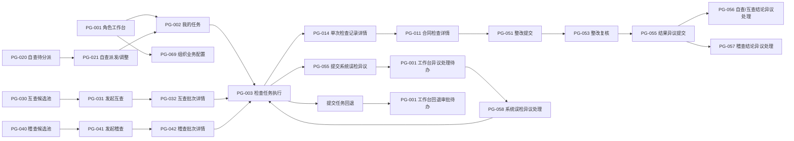

### 12.7 页面与功能模块映射

| 页面范围                      | 主要关联功能编号                                                                       |
| ------------------------- | ------------------------------------------------------------------------------ |
| PG-001 至 PG-004 工作台       | F-QUERY-001、F-NOTI-001、F-NOTI-002、F-BASE-006、F-APP-001、F-TASK-002 至 F-TASK-004 |
| PG-010、PG-011、PG-014 合同检查 | F-QUERY-002、F-OBJ-001 至 F-OBJ-003                                              |
| PG-020 至 PG-021 自查派发      | F-SELF-001 至 F-SELF-004、F-TASK-002、F-TASK-005                                  |
| PG-030 至 PG-032 互查管理      | F-MUT-001 至 F-MUT-007                                                          |
| PG-040 至 PG-042 稽查管理      | F-AUD-001 至 F-AUD-006                                                          |
| PG-003 检查任务执行             | F-EXEC-001 至 F-EXEC-008、F-SYS-001 至 F-SYS-006、F-TASK-001                       |
| PG-050 至 PG-058 整改与异议     | F-REC-001 至 F-REC-004、F-APP-001 至 F-APP-008                                    |
| PG-069 至 PG-079 配置管理      | F-BASE-001 至 F-BASE-021                                                        |
| PG-090 操作审计               | F-QUERY-005                                                                    |

***

## 13. 功能清单

### 13.1 建议优先级定义

| 优先级 | 定义                 |
| --- | ------------------ |
| P0  | 核心闭环，上线必须具备        |
| P1  | 提升管理效率，建议首期或紧随首期实现 |
| P2  | 分析或增强能力，可后续迭代      |

### 13.2 功能总表

| 功能编号        | 模块   | 功能名称         | 主要角色                 | 建议优先级 | 功能说明                                               |
| ----------- | ---- | ------------ | -------------------- | ----- | -------------------------------------------------- |
| F-BASE-001  | 基础配置 | 检查模板管理       | 局管理员（具备对应权限点）        | P0    | 新增、复制、编辑、预览、发布和停用检查模板                              |
| F-BASE-002  | 基础配置 | 模板匹配规则       | 局管理员（具备对应权限点）        | P0    | 根据合同属性匹配模板；具体属性待业务确认                               |
| F-BASE-003  | 基础配置 | 模板版本锁定       | 系统                   | P0    | 生成任务时保存模板快照，后续更新不追溯                                |
| F-BASE-004  | 基础配置 | 风险等级配置       | 局管理员（具备对应权限点）        | P0    | 维护高、中、低风险等级及展示信息                                   |
| F-BASE-005  | 基础配置 | RBAC角色与权限点配置 | 局管理员（具备对应权限点）        | P0    | 维护角色、权限点、用户角色关系和组织数据范围                             |
| F-BASE-006  | 基础配置 | 多角色身份切换      | 多角色用户                | P0    | 用户按“人员类型 + 资格所属组织”或RBAC角色切换当前业务身份并进入对应工作台          |
| F-BASE-007  | 基础配置 | 异议处理规则配置     | 局管理员（具备对应权限点）        | P0    | 配置系统误检异议的处理节点和处理人员                                 |
| F-BASE-008  | 基础配置 | 时限配置         | 局管理员（具备对应权限点）        | P0    | 分别配置启动、办结、整改、复核、检查结论申诉等工作日时限                       |
| F-BASE-009  | 基础配置 | 通知规则配置       | 局管理员（具备对应权限点）        | P1    | 配置提醒节点、接收人和通知渠道                                    |
| F-BASE-010  | 基础配置 | 合规人员库查询      | 合规人员库管理员             | P0    | 按账号所属组织、资格所属组织、人员类型和资格状态查询人员资格                     |
| F-BASE-011  | 基础配置 | 人员资格新增/编辑    | 合规人员库管理员             | P0    | 从统一用户中选择人员，并逐条配置人员类型、资格所属组织和资格状态                   |
| F-BASE-012  | 基础配置 | 人员资格启用/停用    | 合规人员库管理员             | P0    | 独立控制每条人员资格是否可以接收新任务                                |
| F-BASE-013  | 基础配置 | 多组织多资格管理     | 合规人员库管理员             | P0    | 支持同一用户的不同人员资格分别归属不同组织                              |
| F-BASE-014  | 基础配置 | 派发候选人员过滤     | 系统                   | P0    | 按人员类型、资格所属组织和启用状态生成候选池，再按账号所属组织及业务关系执行回避           |
| F-BASE-015  | 基础配置 | 合规人员导入/导出    | 合规人员库管理员             | P1    | 按权限点和组织数据范围执行批量导入或导出                               |
| F-BASE-016  | 基础配置 | 组织业务配置查询     | 单位供应链负责人（具备对应权限点）    | P0    | 在组织数据范围内查看各组织当前生效的业务配置                             |
| F-BASE-017  | 基础配置 | 组织自查派发模式配置   | 单位供应链负责人（具备对应权限点）    | P0    | 按组织设置自动派发或人工指定，并记录配置变更                             |
| F-BASE-018  | 基础配置 | 模板阶段/分组管理    | 局管理员（具备对应权限点）        | P0    | 新增、编辑、启停和排序模板内的检查阶段或分组                             |
| F-BASE-019  | 基础配置 | 模板检查项管理      | 局管理员（具备对应权限点）        | P0    | 配置检查项名称、检查标准、适用类型、检查方式、风险等级及填写规则                   |
| F-BASE-020  | 基础配置 | 模板版本管理       | 局管理员（具备对应权限点）        | P0    | 基于已发布版本创建新版本草稿，保留历史版本并控制生效状态                       |
| F-BASE-021  | 基础配置 | 模板预览及发布校验    | 局管理员（具备对应权限点）        | P0    | 按执行页样式预览模板，并在发布前校验阶段、检查项和系统检测能力完整性                 |
| F-OBJ-001   | 检查对象 | 自动生成检查记录     | 系统                   | P0    | 合同评审完成后生成一单一检记录                                    |
| F-OBJ-002   | 检查对象 | 一标多合同关联      | 局管理员（具备对应权限点）、检查人    | P0    | 建立采购项目与多份合同的关联关系                                   |
| F-OBJ-003   | 检查对象 | 共享结果引用       | 检查人                  | P0    | 同一检查类型内引用采购项目共享结果                                  |
| F-SELF-001  | 自查管理 | 自查候选任务生成     | 系统                   | P0    | 合同检查记录生成后进入自查分派范围                                  |
| F-SELF-002  | 自查管理 | 自查自动派发       | 系统                   | P0    | 组织配置为自动派发时，按本组织有效合规专员待办量尽量均衡派发                     |
| F-SELF-003  | 自查管理 | 自查人工指定       | 单位供应链负责人             | P0    | 组织配置为人工指定或未配置时完成首次派发，并可按权限调整未提交任务的检查人              |
| F-SELF-004  | 自查管理 | 自查任务工作台      | 合规专员                 | P0    | 查看待处理、进行中、已提交及回退任务                                 |
| F-SELF-005  | 自查管理 | 自查结论申诉       | 合同经办人                | P0    | 对自查不合规检查项直接发起结果异议                                  |
| F-SELF-006  | 自查管理 | 自查结论异议处理     | 局管理员                 | P0    | 按检查项作出最终结论，全部不合规项通过后将单据更新为CS-010“待互查”              |
| F-MUT-001   | 互查管理 | 互查候选池        | 局管理员                 | P0    | 展示自查最终通过的可互查合同                                     |
| F-MUT-002   | 互查管理 | 单条发起互查       | 局管理员                 | P0    | 选择单份合同发起互查                                         |
| F-MUT-003   | 互查管理 | 批量抽取互查       | 局管理员                 | P0    | 按范围、比例或数量随机抽取                                      |
| F-MUT-004   | 互查管理 | 跨单位回避        | 系统                   | P0    | 排除合同所属单位的合规专家                                      |
| F-MUT-005   | 互查管理 | 互查均衡派发       | 系统                   | P0    | 按当前待办量尽量均衡分派                                       |
| F-MUT-006   | 互查管理 | 互查人工指定/调整    | 局管理员                 | P0    | 人工指定或调整合同和合规专家                                     |
| F-MUT-007   | 互查管理 | 互查结果隔离       | 系统                   | P0    | 合规专家执行互查时不可查看自查结果                                  |
| F-AUD-001   | 稽查管理 | 稽查候选池        | 局管理员                 | P0    | 展示互查问题已闭环的可稽查合同                                    |
| F-AUD-002   | 稽查管理 | 单条/批量发起稽查    | 局管理员                 | P0    | 设置范围、比例或数量并发起稽查                                    |
| F-AUD-003   | 稽查管理 | 关联线下计划       | 局管理员                 | P1    | 填写线下计划名称、编号或临时发起原因                                 |
| F-AUD-004   | 稽查管理 | 稽查回避         | 系统                   | P0    | 排除合同所属单位及该合同原互查人员                                  |
| F-AUD-005   | 稽查管理 | 稽查均衡派发       | 系统                   | P0    | 在稽查专家中按待办量尽量均衡分派                                   |
| F-AUD-006   | 稽查管理 | 稽查历史调阅       | 稽查专家                 | P0    | 查看本人稽查任务关联的历史检查和处置记录                               |
| F-EXEC-001  | 检查执行 | 检查任务详情       | 各检查人                 | P0    | 按模板快照展示合同信息、检查阶段/分组、检查项、检查标准和任务信息                  |
| F-EXEC-002  | 检查执行 | 人工检查项判断      | 各检查人                 | P0    | 逐项选择合规或不合规，并记录原始判定结果                               |
| F-EXEC-003  | 检查执行 | 检查备注及附件      | 各检查人                 | P0    | 按模板规则填写检查备注、上传附件；不合规时填写问题原因和制度依据                   |
| F-EXEC-004  | 检查执行 | 检查草稿保存       | 各检查人                 | P0    | 手动保存并定时自动保存草稿                                      |
| F-EXEC-005  | 检查执行 | 提交前校验        | 系统                   | P0    | 按模板快照校验必检项、备注、附件、不合规补充信息及系统误检异议是否办结                |
| F-EXEC-006  | 检查执行 | 总体结论计算       | 系统                   | P0    | 任一有效结果不合规则总体不合规                                    |
| F-EXEC-007  | 检查执行 | 检查结果锁定       | 系统                   | P0    | 提交后锁定原始检查记录                                        |
| F-EXEC-008  | 检查执行 | 检查项快速筛选      | 各检查人                 | P1    | 按阶段/分组筛选，并支持只看不合规项、只看未判定或待检测项                      |
| F-SYS-001   | 系统检测 | 单项发起检测       | 各检查人                 | P0    | 对选中的系统识别项发起检测                                      |
| F-SYS-002   | 系统检测 | 批量发起检测       | 各检查人                 | P0    | 批量执行多个系统识别项                                        |
| F-SYS-003   | 系统检测 | 检测结果回写       | 系统                   | P0    | 回写系统原始结果、时间及检测依据                                   |
| F-SYS-004   | 系统检测 | 系统误检异议入口     | 各检查人                 | P0    | 从检查任务勾选系统不合规项，进入统一结果异议提交能力                         |
| F-SYS-005   | 系统检测 | 系统误检异议结果回写   | 系统                   | P0    | 异议通过时保留原始结果并将对应检查项有效结果调整为合规；不通过时维持不合规              |
| F-SYS-006   | 系统检测 | 人工补充问题       | 各检查人                 | P0    | 系统判定合规但人工发现问题时新增不合规问题                              |
| F-REC-001   | 整改闭环 | 整改通知         | 系统                   | P0    | 向合同经办人推送互查、稽查不合规问题                                 |
| F-REC-002   | 整改闭环 | 单合同整改        | 合同经办人                | P0    | 按问题提交整改说明和材料                                       |
| F-REC-003   | 整改闭环 | 批量整改         | 合同经办人                | P1    | 对多份合同批量提交整改材料，待业务确认                                |
| F-REC-004   | 整改闭环 | 整改复核         | 原检查人                 | P0    | 复核整改并作出通过或不通过结论                                    |
| F-APP-001   | 结果异议 | 统一异议对象及状态    | 系统                   | P0    | 按“检查任务 + 检查项 + 原始判定结果”记录异议类型、发起人、材料、处理人、状态和结论      |
| F-APP-002   | 结果异议 | 系统误检异议       | 各检查人、配置异议处理人         | P0    | 任务提交前按检查项提出和处理系统误检异议，处理中阻断任务提交                     |
| F-APP-003   | 结果异议 | 自查结论申诉       | 合同经办人、局管理员           | P0    | 对自查不合规检查项直接发起申诉，并按处理结论流转至CS-009“自查未通过”或CS-010“待互查” |
| F-APP-004   | 结果异议 | 互查结论申诉       | 合同经办人                | P0    | 整改复核不通过后按检查项发起互查结论申诉                               |
| F-APP-005   | 结果异议 | 互查申诉结论       | 局管理员                 | P0    | 按检查项作出互查最终申诉结论并更新问题闭环状态                            |
| F-APP-006   | 结果异议 | 稽查结论申诉       | 合同经办人                | P0    | 整改复核不通过后按检查项发起稽查结论申诉                               |
| F-APP-007   | 结果异议 | 稽查异议分派       | 系统                   | P0    | 排除原稽查人员并分派其他稽查专家                                   |
| F-APP-008   | 结果异议 | 稽查申诉结论       | 非原检查稽查专家             | P0    | 按检查项作出稽查最终申诉结论并更新问题闭环状态                            |
| F-TASK-001  | 任务管理 | 任务回退申请       | 各检查人                 | P0    | 对未完成任务填写原因并申请回退                                    |
| F-TASK-002  | 任务管理 | 自查回退审批       | 单位供应链负责人             | P0    | 审批自查任务回退                                           |
| F-TASK-003  | 任务管理 | 互查/稽查回退审批    | 局管理员                 | P0    | 审批互查、稽查任务回退                                        |
| F-TASK-004  | 任务管理 | 回退超时驳回       | 系统                   | P0    | 24小时未审批时自动驳回                                       |
| F-TASK-005  | 任务管理 | 自查自动收回       | 系统                   | P0    | 自查超过配置办结时限后自动收回，并按所属组织派发模式重新派发或返回待分派               |
| F-TASK-006  | 任务管理 | 互查/稽查超时催办    | 系统                   | P0    | 超时提醒、催办、留痕，不自动收回                                   |
| F-TASK-007  | 任务管理 | 超时及回退统计      | 局管理员                 | P1    | 统计催办、超时、自动收回和回退数量                                  |
| F-QUERY-001 | 查询权限 | 我的任务         | 各检查人                 | P0    | 按当前角色展示本人相关任务                                      |
| F-QUERY-002 | 查询权限 | 经办合同检查记录     | 合同经办人                | P0    | 查看本人合同的检查、整改和结果异议记录                                |
| F-QUERY-005 | 查询权限 | 操作及访问日志      | 局管理员、审计角色            | P1    | 查看关键操作、访问、导出和审批日志                                  |
| F-NOTI-001  | 消息通知 | 待办通知         | 相关角色                 | P0    | 任务派发、整改、复核、结果异议和回退审批等待办提醒                          |
| F-NOTI-002  | 消息通知 | 超时预警         | 相关角色及管理人             | P0    | 按配置时限发送预警和催办                                       |
| F-NOTI-003  | 消息通知 | 结果通知         | 相关发起人、合同经办人、单位供应链负责人 | P0    | 推送检查、整改、复核和结果异议结果                                  |

***

## 14. 检查执行详细要求

### 14.1 人工检查项

- 按模板快照展示序号、检查阶段/分组、检查项名称和检查标准。
- 判定结果必须选择“合规”或“不合规”，未判定项支持通过“只看未判定项”快速筛选。
- 选择“不合规”时，问题原因、制度依据为必填。
- 检查备注和检查附件按模板检查项的填写规则校验，可配置为非必填、始终必填或不合规时必填。
- 支持通过“只看不合规项”集中补充问题原因、制度依据、备注和附件。
- 支持保存草稿和定时自动保存，建议默认间隔为5秒，最终值需技术评估。

### 14.2 系统识别项

- 模板中的系统识别项均属于必检项。
- 按模板快照展示检查阶段/分组、检查项名称、检查标准和关联的系统检测能力。
- 支持单项和批量发起系统检测。
- 系统保存原始结果、执行时间和必要的检测依据。
- 系统不合规结果可由当前检查人在任务提交前按检查项发起系统误检异议。
- 系统误检异议处理中时，检查任务不可提交；异议通过仅调整对应检查项有效结果，不覆盖系统原始结果。
- 系统合规但人工发现问题时，可新增人工补充不合规问题。

### 14.3 有效结果计算

| 系统原始结果 | 系统误检异议      | 人工补充问题 | 最终有效结果 |
| ------ | ----------- | ------ | ------ |
| 合规     | 不适用         | 无      | 合规     |
| 合规     | 不适用         | 有      | 不合规    |
| 不合规    | 未提出、处理中或不通过 | 无      | 不合规    |
| 不合规    | 通过          | 无      | 合规     |
| 不合规    | 通过          | 有      | 不合规    |

### 14.4 提交校验

提交检查任务前，系统至少校验：

1. 所有必检项均已完成。
2. 人工不合规项已填写问题原因和制度依据。
3. 所有系统识别项均已取得结果。
4. 不存在处理中的系统误检异议。
5. 必填附件校验规则已满足；具体规则待确认。
6. 共享检查项已完成或已合法引用。
7. 当前任务使用的模板快照完整，不存在缺失阶段、检查项或必需配置的数据异常。

***

## 15. 任务派发与时效要求

### 15.1 派发规则

- 所有检查任务的候选人均来源于合规人员库，不直接从全量用户或RBAC角色中选择。
- 系统先按检查类型匹配人员类型和资格所属组织，再校验资格状态为启用，并根据账号所属组织和业务关系执行回避规则。
- 检查任务派发成功后，任务关系授权该检查人办理本任务，不再额外校验“执行检查”静态权限点。
- 每个组织独立配置自查派发模式，配置值为“自动派发”或“人工指定”。
- 自动派发模式下，系统从“合规专员资格所属组织 = 合同所属组织”的启用资格记录中，按人员待办量尽量均衡分配；单位供应链负责人可按权限调整未提交任务的检查人。
- 人工指定模式下，系统生成待分派任务并通知单位供应链负责人，由其从资格所属组织为本组织的有效合规专员中指定检查人。
- 组织未配置派发模式时按人工指定模式兜底，不得跨组织自动派发；系统同时发送配置提醒。
- 派发模式变更仅影响配置生效后新生成的任务，不追溯已派发任务。
- 互查由局管理员单条或批量发起，系统随机抽取并执行跨单位回避。
- 稽查由局管理员单条或批量发起，执行所属单位和原互查人员双重回避。
- 互查、稽查允许局管理员人工指定或调整检查人。
- 所有自动抽取、派发和人工调整均记录操作日志。

### 15.2 时效规则

- 启动、办结、整改、复核和检查结论申诉时限均按工作日配置；系统误检异议不设置独立申诉时限，但已发起异议未办结时阻断任务提交。
- 具体时限值不在程序中写死。
- 仅自查任务超过办结时限后自动收回；自动派发模式重新派发，人工指定模式返回待分派并通知单位供应链负责人。
- 互查、稽查超时仅提醒、催办、留痕并纳入后续考核，不自动收回。
- 回退审批24小时未处理时自动驳回。

### 15.3 年度稽查计划

- 年度或季度稽查计划在线下制定和管理。
- 系统不建设完整计划管理模块。
- 局管理员发起稽查时，可填写或关联线下计划名称、编号；临时稽查填写发起原因。
- 计划稽查和临时稽查进入相同的后续流程。

***

## 16. 通知与待办

### 16.1 建议通知事件

- 人工指定模式下的新自查待分派任务。
- 组织未配置自查派发模式时的配置提醒。
- 检查任务派发、重新派发和回退结果。
- 检查任务即将超时和已经超时。
- 系统误检异议处理待办及处理结果。
- 检查结果提交。
- 整改待办、整改复核待办和复核结果。
- 检查结论申诉待办、处理结果和申诉时限提醒。
- 自查自动收回和重新派发。

### 16.2 通知配置说明

- 中建通、站内信、短信等具体通知渠道。
- 各事件的接收人、抄送人和提醒频率。
- 是否支持用户自定义非关键通知。

***

## 17. 数据留痕与审计要求

以下数据需长期保留并可追溯：

- 检查记录、模板版本和检查项快照。
- 人工检查判断、问题原因、制度依据和附件。
- 系统原始检测结果和检测时间。
- 检查项结果异议的类型、关联原始判定、申请材料、处理过程、逐项结论及生效后的有效结果。
- 人工补充问题。
- 任务派发、调整、回退、收回、重新派发及超时记录。
- 整改材料、复核结论、申诉材料和最终申诉结论。
- 单据当前检查状态的每次变化，包括流转前状态、流转后状态、触发事件、操作人和操作时间。
- 组织业务配置的变更前后值、生效时间、操作人和所属组织。
- 重要记录的查看、导出、异议处理和审批日志。

原始记录不得物理删除。是否需要设置归档年限、脱敏规则和导出水印，待安全与合规团队确认。

***

