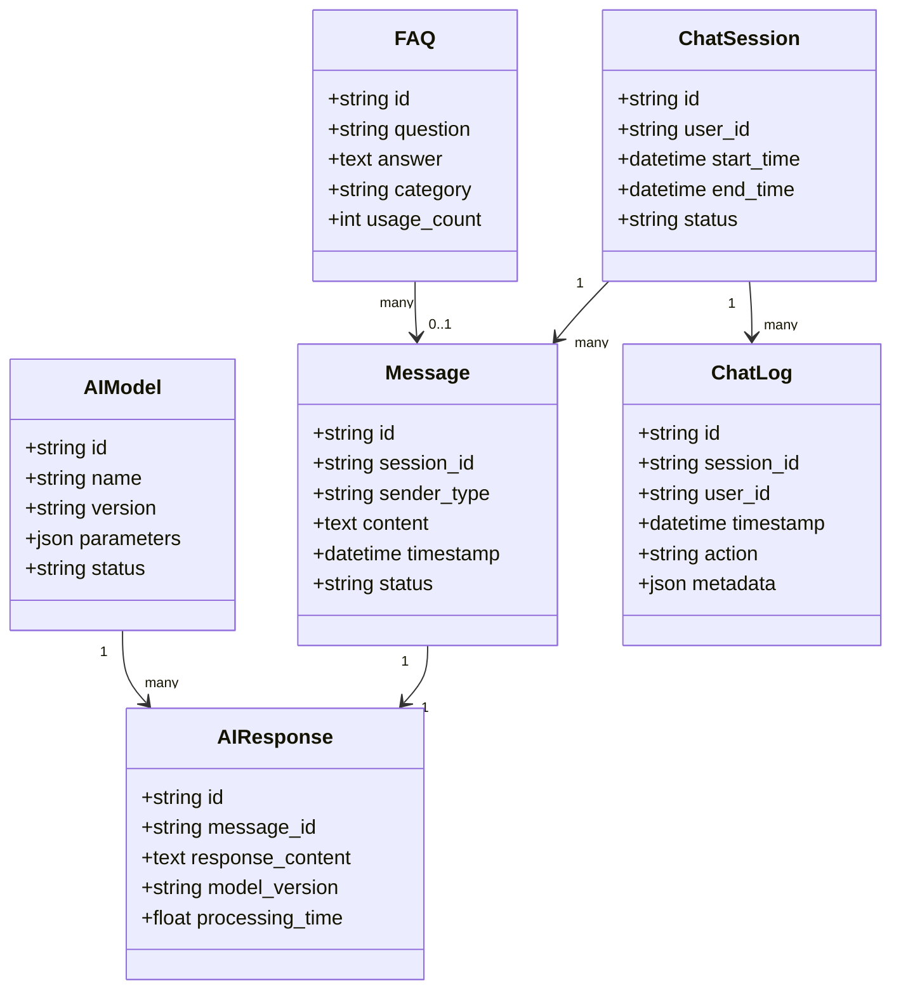
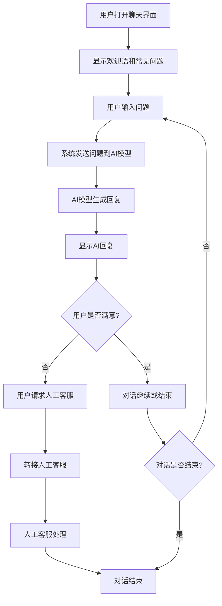
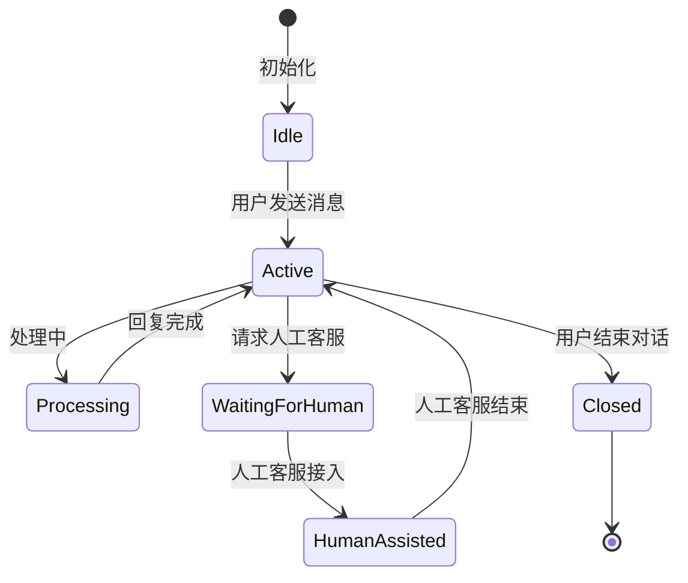

# RPD 示例（用户故事主导）：AI 聊天功能

> 说明：这里使用 `RPD` 命名（Requirements/Product Document）。如果团队习惯 `PRD`，可直接替换标题，不影响结构。

## 0. 文档信息

- 版本：`v1.0`
- 状态：`Draft`
- 目标上线：`2026-03-31`
- 负责人：`产品经理 / AI 能力小组`
- 关联范围：`AI 聊天界面`、`对话管理`、`模型配置`、`数据安全`

---

## 1. 背景与目标

### 1.1 背景问题

当前产品/服务中存在以下问题：

1. 用户需要快速获取信息或解决问题，但缺乏高效的交互方式
2. 客服/支持团队工作压力大，重复问题处理占比高
3. 信息获取路径长，用户体验不够流畅
4. 缺乏个性化的智能助手功能

### 1.2 业务目标

1. 降低客服团队工作负载，将常见问题自动化处理率提升至 `>= 60%`
2. 提高用户满意度，AI 聊天解决问题的用户评分达到 `>= 4.5/5`
3. 缩短用户获取信息的平均时间，减少 `30%` 的操作步骤
4. 收集用户意图数据，为产品迭代提供决策依据

### 1.3 非目标

1. 本期不实现多轮复杂对话推理（仅支持单轮或简单多轮对话）
2. 本期不集成外部知识库（仅使用预配置的业务知识）
3. 本期不支持多语言切换（仅支持中文）
4. 本期不实现情感分析和个性化推荐

---

## 2. 用户角色

| 角色 | 核心诉求 | 使用频率 |
| --- | --- | --- |
| 普通用户 | 快速获取信息，解决常见问题 | 高 |
| 客服人员 | 辅助回答用户问题，提高工作效率 | 高 |
| 管理员 | 配置和管理AI模型，查看对话数据 | 中 |
| 开发者 | 集成和扩展AI聊天能力 | 低 |

---

## 3. 用户故事（核心）

### US-01 启动AI聊天

**As a** 普通用户  
**I want to** 点击页面上的AI聊天入口，打开聊天界面  
**So that** 我能开始与AI助手对话，获取所需信息

**验收标准**

1. Given 用户进入产品页面  
   When 点击AI聊天入口  
   Then 聊天界面从右侧滑出，显示欢迎语和输入框。

2. Given 聊天界面已打开  
   When 用户刷新页面  
   Then 聊天界面保持打开状态，历史对话记录保留。

---

### US-02 发送和接收消息

**As a** 普通用户  
**I want to** 在输入框中输入问题并发送，AI助手能理解并回复  
**So that** 我能快速获取准确的信息

**验收标准**

1. Given 用户在输入框中输入问题并点击发送  
   When 系统接收到消息  
   Then 消息显示在聊天记录中，AI助手显示“正在输入”状态。

2. Given AI助手处理完成  
   When 生成回复  
   Then 回复内容显示在聊天记录中，支持文本、列表等格式。

3. Given 网络连接中断  
   When 用户发送消息  
   Then 显示发送失败提示，网络恢复后自动重发。

---

### US-03 常见问题快速选择

**As a** 普通用户  
**I want to** 看到系统推荐的常见问题，点击即可发送  
**So that** 我无需手动输入，快速解决常见问题

**验收标准**

1. Given 聊天界面打开  
   When 首次进入  
   Then 显示 `3-5` 个常见问题快捷选项。

2. Given 用户选择快捷问题  
   When 点击该选项  
   Then 问题自动发送，AI助手给出相应回复。

---

### US-04 对话历史管理

**As a** 普通用户  
**I want to** 查看历史对话记录，清空对话，或开始新对话  
**So that** 我能更好地管理与AI助手的交互

**验收标准**

1. Given 用户与AI助手进行过多轮对话  
   When 滚动聊天记录  
   Then 可查看完整的历史对话。

2. Given 用户点击“清空对话”按钮  
   When 确认操作  
   Then 聊天记录被清空，AI助手重新显示欢迎语。

3. Given 用户点击“新对话”按钮  
   When 执行操作  
   Then 开始新的对话线程，历史对话可在侧边栏查看。

---

### US-05 人工客服转接

**As a** 普通用户  
**I want to** 在AI助手无法解决问题时，请求转接人工客服  
**So that** 我能获得更复杂问题的解决方案

**验收标准**

1. Given 用户点击“转接人工客服”按钮  
   When 系统处理请求  
   Then 显示排队状态，等待人工客服接入。

2. Given 人工客服接入  
   When 开始对话  
   Then 聊天界面切换到人工客服模式，历史对话同步给客服。

---

### US-06 管理员配置

**As a** 管理员  
**I want to** 配置AI模型参数、训练数据和回复规则  
**So that** 我能优化AI助手的性能和准确性

**验收标准**

1. Given 管理员进入AI配置页面  
   When 修改模型参数  
   Then 修改生效，AI助手行为相应改变。

2. Given 管理员上传训练数据  
   When 数据处理完成  
   Then AI助手的知识储备得到更新。

---

## 4. MVP 范围（Story Mapping）

| 优先级 | 用户活动 | 故事 | 本期是否纳入 |
| --- | --- | --- | --- |
| Must | 初始化 | US-01 启动AI聊天 | 是 |
| Must | 核心交互 | US-02 发送和接收消息 | 是 |
| Must | 快捷操作 | US-03 常见问题快速选择 | 是 |
| Should | 对话管理 | US-04 对话历史管理 | 是 |
| Should | 人工支持 | US-05 人工客服转接 | 是 |
| Could | 系统配置 | US-06 管理员配置 | 否（下期） |

---

## 5. 对应模型

### 5.1 Domain Model（业务领域模型）

| 实体 | 关键字段 | 说明 |
| --- | --- | --- |
| ChatSession | id, user_id, start_time, end_time, status | 聊天会话 |
| Message | id, session_id, sender_type, content, timestamp, status | 聊天消息 |
| AIResponse | id, message_id, response_content, model_version, processing_time | AI回复 |
| FAQ | id, question, answer, category, usage_count | 常见问题 |
| AIModel | id, name, version, parameters, status | AI模型 |
| User | id, role, display_name, preferences | 使用者 |
| ChatLog | id, session_id, user_id, timestamp, action, metadata | 聊天日志 |

### 5.2 Business Flow / Process（业务流程模型）

### 5.3 State Machine / Lifecycle（状态与生命周期模型）

### 5.4 Permission / Access Model（权限模型）

| 操作 | 普通用户 | 客服人员 | 管理员 | 开发者 |
| --- | --- | --- | --- | --- |
| 打开聊天界面 | Y | Y | Y | Y |
| 发送消息 | Y | Y | Y | Y |
| 查看历史对话 | Y | Y | Y | Y |
| 清空对话 | Y | Y | Y | Y |
| 请求人工客服 | Y | N | Y | Y |
| 配置AI模型 | N | N | Y | Y |
| 查看对话数据 | N | Y | Y | Y |
| 导出对话记录 | N | Y | Y | Y |

### 5.5 Page Structure Model（页面结构模型）

| 页面/区域 | 子模块 | 说明 |
| --- | --- | --- |
| 聊天界面 | 消息展示区 | 显示对话历史，支持滚动查看 |
| 聊天界面 | 输入框 | 支持文本输入，发送按钮 |
| 聊天界面 | 快捷问题区 | 显示常见问题，点击发送 |
| 聊天界面 | 功能按钮区 | 清空对话、新对话、转接人工客服 |
| 聊天界面 | 状态指示器 | 显示AI处理状态，网络状态 |
| 管理后台 | 模型配置 | 设置AI模型参数，版本管理 |
| 管理后台 | 知识库管理 | 维护常见问题和回答 |
| 管理后台 | 数据分析 | 查看对话统计，用户满意度 |

### 5.6 Field Usage / Visibility Model（字段可见性模型）

| 字段 | 普通用户 | 客服人员 | 管理员 | 开发者 | 规则 |
| --- | --- | --- | --- | --- | --- |
| 聊天输入框 | 可见可编辑 | 可见可编辑 | 可见可编辑 | 可见可编辑 | 必显 |
| 快捷问题 | 可见可点击 | 可见可点击 | 可见可点击 | 可见可点击 | 必显 |
| 历史对话 | 可见 | 可见 | 可见 | 可见 | 必显 |
| 清空对话按钮 | 可见可点击 | 可见可点击 | 可见可点击 | 可见可点击 | 必显 |
| 转接人工客服按钮 | 可见可点击 | 不可见 | 可见可点击 | 可见可点击 | 仅用户和管理员可见 |
| 模型配置页面 | 不可见 | 不可见 | 可见可编辑 | 可见可编辑 | 仅管理员和开发者可见 |
| 数据分析页面 | 不可见 | 可见可查看 | 可见可查看 | 可见可查看 | 仅客服、管理员和开发者可见 |

### 5.7 Prototype Variant / Context Model（原型变体模型）

| 变体 | 适用场景 | 差异点 |
| --- | --- | --- |
| 基础版（Basic） | 简单问题咨询 | 仅核心聊天功能，无历史记录 |
| 标准版（Standard） | 日常使用 | 完整聊天功能，包含历史记录和快捷问题 |
| 高级版（Advanced） | 企业级应用 | 增加人工客服转接，数据分析，多语言支持 |

---

## 6. 非功能需求

1. 性能：AI回复响应时间 P95 `< 2000ms`（包含模型处理时间）。
2. 可用性：聊天界面可用性达到 `99.9%`，支持离线消息队列。
3. 可观测性：记录对话成功率、平均响应时间、用户满意度、人工转接率。
4. 安全性：所有对话内容加密传输和存储，敏感信息自动脱敏。
5. 可扩展性：支持模型版本管理，便于后续升级和切换模型。
6. 合规性：符合数据隐私相关法规，用户数据可删除。

---

## 7. 验收清单（Definition of Done）

- [ ] US-01 ~ US-05 对应验收标准全部通过。
- [ ] 聊天界面在不同设备和浏览器上显示正常。
- [ ] AI回复准确率达到预期标准（基于测试用例）。
- [ ] 人工客服转接流程顺畅，历史对话同步正确。
- [ ] 系统稳定性测试通过，无崩溃或异常情况。
- [ ] 安全测试通过，无数据泄露风险。
- [ ] 性能测试通过，响应时间符合要求。

---

## 8. 使用说明（给模板作者）

1. 复制本文件，按实际业务替换“背景、用户故事、模型、指标”。
2. 每条用户故事必须带 `Given / When / Then` 验收标准。
3. 至少保留以下模型：`Domain`、`Flow`、`State`、`Permission`。
4. 根据业务复杂度，可追加 `事件模型` 与 `数据血缘模型`。
5. 对于AI特定功能，可扩展添加模型训练、评估指标等内容。
6. 确保非功能需求中的性能指标与实际AI模型能力匹配。