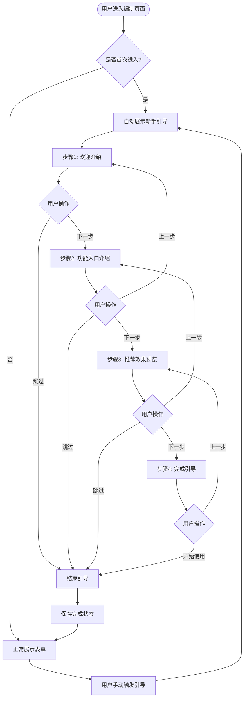

# PRD｜编制采购公告-智能推荐新手引导功能

- 文档编号：PRD-Onboarding-Guide-\[YYYY-MM-DD]-Procurement
- 负责人：\[@liurundong]
- 协作人：\[Trae AI]
- 版本：v1.0
- 状态：草稿
- 创建时间：2026-05-18
- 您好！我是小云，您的AI智能助手。我可以帮您快速完成采购公告的编制工作，让填写表单更轻松！

  \
  更新时间：2026-05-18

## 目录

- [1. 摘要](#1-摘要)
- [2. 用户与场景](#2-用户与场景)
- [3. 新手引导功能规格](#3-新手引导功能规格)
- [4. 交互流程详解](#4-交互流程详解)
- [5. 异常与边界情况](#5-异常与边界情况)

## 1. 摘要

### 1.1 一句话说明

在编制采购公告页面引入漫游式新手引导，用户首次进入页面时自动触发，通过分步骤高亮引导，向用户介绍【智能推荐】功能的位置、作用和使用方法，降低用户学习成本，提升功能使用率。

### 1.2 目标与非目标

**目标**

- 建立标准化的漫游式新手引导交互流程，帮助用户快速了解智能推荐功能。
- 通过视觉高亮和AI助手引导，提升用户对智能推荐功能的认知度和使用意愿。
- 支持用户随时跳过或重新触发引导，保证用户体验的灵活性。

**非目标**

- 本期不涉及其他功能模块的新手引导。
- 不涉及用户行为数据的采集与分析（仅记录引导完成状态）。

### 1.3 范围说明

- 适用场景：用户首次进入编制采购公告页面。
- 涉及角色：采购经办人（首次使用或清除缓存后再次进入）。
- 本期聚焦：智能推荐功能的介绍与引导。

## 2. 用户与场景

### 2.1 目标用户（Personas）

| Persona | 关键特征                          | 主要目标              | 主要阻碍                       |
| ------- | ----------------------------- | ----------------- | -------------------------- |
| 业务经办人   | 需要在各类业务系统中频繁填写复杂表单，对系统新功能了解有限 | 快速了解页面功能，高效完成表单填写 | 不了解智能推荐功能的存在和价值；不知道如何触发和使用 |

### 2.2 核心使用场景

**场景A（首次进入页面）**：用户首次进入编制采购公告页面，系统自动触发新手引导，通过分步骤高亮介绍智能推荐功能的位置和作用。

**场景B（主动跳过引导）**：用户在新手引导过程中点击跳过按钮，引导立即结束，记录跳过状态，下次进入不再自动触发。

**场景C（引导完成后重新学习）**：用户已完成新手引导，但希望再次查看引导内容，可通过页面上的帮助入口手动重新触发。

## 3. 新手引导功能规格

### 3.1 功能架构

```
┌─────────────────────────────────────────────────────────────┐
│                    新手引导功能模块                          │
├─────────────────────────────────────────────────────────────┤
│  ┌─────────────┐  ┌─────────────┐  ┌─────────────────────┐ │
│  │ 触发层      │  │ 展示层      │  │ 交互层              │ │
│  │ - 自动触发  │  │ - 遮罩层    │  │ - 下一步/上一步     │ │
│  │ - 手动触发  │  │ - 高亮区域  │  │ - 跳过引导          │ │
│  │ - 状态管理  │  │ - AI助手    │  │ - 完成引导          │ │
│  │             │  │ - 引导气泡  │  │                     │ │
│  └─────────────┘  └─────────────┘  └─────────────────────┘ │
├─────────────────────────────────────────────────────────────┤
│  ┌─────────────────────────────────────────────────────────┐│
│  │ 数据层                                                  ││
│  │ - 引导完成状态（hasCompletedOnboarding）                ││
│  │ - 当前步骤索引（currentStepIndex）                      ││
│  │ - 引导步骤配置（onboardingSteps）                       ││
│  └─────────────────────────────────────────────────────────┘│
└─────────────────────────────────────────────────────────────┘
```

### 3.2 引导步骤设计

| 步骤 | 步骤名称   | 高亮目标        | 引导文案                                            | 操作按钮         |
| -- | ------ | ----------- | ----------------------------------------------- | ------------ |
| 1  | 欢迎介绍   | 页面整体（无具体高亮） | "您好！我是小云，您的AI智能助手。我可以帮您快速完成编制工作，让编写文件，填写表单更轻松！" | 下一步、跳过引导     |
| 2  | 功能入口介绍 | 【智能推荐】按钮    | "点击这里的【智能推荐】按钮，我会根据您的采购信息，自动为您推荐合适的字段值。"        | 上一步、下一步、跳过引导 |
| 3  | 推荐效果预览 | 表单字段区域      | "推荐完成后，我会为每个推荐字段标记'荐'标签，您可以随时修改，修改后标签会自动消失。"    | 上一步、下一步、跳过引导 |
| 4  | 完成引导   | 页面整体（无具体高亮） | "现在您可以开始使用智能推荐功能了！"                             | 上一步、开始使用     |

## 4. 交互流程详解

### 4.1 整体流程图



### 4.2 关键交互节点说明

#### 4.2.1 触发机制

**自动触发条件**：

- 用户首次进入编制采购公告页面（通过 localStorage 记录状态）
- 引导完成状态为 false 或未设置

**手动触发方式**：

- 页面右上角帮助菜单中提供【查看新手引导】选项
- 点击后重新触发完整的引导流程

#### 4.2.2 遮罩与高亮效果

**遮罩层**：

- 半透明黑色背景（rgba(0, 0, 0, 0.6)）
- 覆盖整个页面，仅高亮区域透出
- 过渡动画：300ms ease-in-out

**高亮区域**：

- 步骤1和步骤4：无具体高亮，AI助手显示在页面中央偏下位置
- 步骤2：高亮【智能推荐】按钮，添加脉冲动画吸引注意
- 步骤3：高亮表单字段区域，展示"荐"标签示例

**高亮样式**：

- 高亮区域添加白色边框（2px solid white）
- 添加 box-shadow: 0 0 0 4px rgba(59, 130, 246, 0.5)
- 高亮区域 z-index 提升，确保在遮罩层之上

#### 4.2.3 AI助手与气泡提示

**AI助手形象**：

- 复用现有智能推荐的AI小人形象（小云）
- 显示在气泡左侧，带有轻微弹跳动画

**气泡提示**：

- 白色背景，圆角12px
- 最大宽度280px
- 包含标题、引导文案、操作按钮
- 根据高亮目标自动调整位置（优先显示在目标右侧，超出屏幕时自适应）

**按钮样式**：

- 主要按钮：渐变背景（紫到蓝），白色文字
- 次要按钮：透明背景，灰色文字
- 跳过按钮：文字链接样式，灰色

#### 4.2.4 引导完成状态管理

**状态存储**：

- 使用 localStorage 存储 `procurement_onboarding_completed` 字段
- 值为布尔类型，true 表示已完成引导

**状态重置**：

- 用户清除浏览器缓存后，状态重置
- 通过手动触发引导，完成后再次更新状态

## 5. 异常与边界情况

### 5.1 边界情况

**用户快速切换页面**：

- 引导过程中用户刷新页面或跳转其他页面，引导状态不保存，下次进入重新从头开始

**屏幕尺寸适配**：

- 小屏幕设备（< 768px）：气泡宽度调整为200px，AI助手尺寸缩小
- 超大屏幕（> 1920px）：气泡最大宽度保持280px，不无限放大

**高亮目标不可见**：

- 若高亮目标在可视区域外，自动平滑滚动至目标可见位置
- 滚动动画：500ms ease-out

### 5.2 异常处理

**元素定位失败**：

- 若高亮目标元素未找到，跳过当前步骤，进入下一步
- 控制台输出警告日志

**引导中断**：

- 用户关闭浏览器或标签页，引导状态不保存

***

## 附录

### C. 埋点事件

| 事件名                         | 触发时机      | 参数                                       |
| --------------------------- | --------- | ---------------------------------------- |
| onboarding\_start           | 新手引导自动触发时 | 触发方式: auto/manual                        |
| onboarding\_step\_view      | 每个步骤展示时   | step\_index: 步骤索引(0-3), step\_name: 步骤名称 |
| onboarding\_next\_click     | 点击下一步按钮时  | from\_step: 当前步骤索引, to\_step: 下一步索引      |
| onboarding\_prev\_click     | 点击上一步按钮时  | from\_step: 当前步骤索引, to\_step: 上一步索引      |
| onboarding\_skip\_click     | 点击跳过引导时   | current\_step: 当前步骤索引                    |
| onboarding\_complete        | 完成全部引导步骤时 | total\_steps: 总步骤数(4)                    |
| onboarding\_manual\_trigger | 手动触发引导时   | trigger\_source: 帮助菜单/其他入口               |

