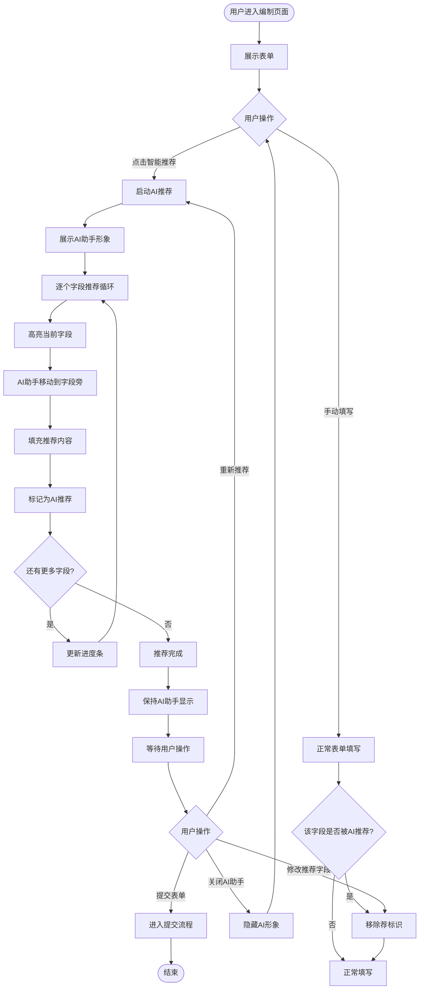

# PRD｜《编制采购公告-智能推荐功能》需求文档

- 文档编号：PRD-AI-Recommend-[YYYY-MM-DD]-Procurement
- 负责人：[@liurundong]
- 协作人：[Trae AI]
- 评审人：[待定]
- 版本：v1.0
- 状态：草稿
- 创建时间：2026-04-08
- 更新时间：2026-04-08

## 目录

- [1. 摘要](#1-摘要)
- [2. 用户与场景](#2-用户与场景)
- [3. 智能推荐功能规格](#3-智能推荐功能规格)
- [4. 交互流程详解](#4-交互流程详解)
- [5. 异常与边界情况](#5-异常与边界情况)

## 1. 摘要

### 1.1 一句话说明

在编制采购公告页面中引入AI智能推荐功能，通过可视化动画引导，自动为表单字段提供智能填充建议，帮助用户快速完成公告编制工作。

### 1.2 目标与非目标

**目标**

- 建立AI智能推荐的标准交互流程，适配表单类业务页面。
- 通过动画化AI助手形象，提升用户对智能功能的感知度和信任度。
- 实现字段级智能推荐，支持逐个字段高亮填充与人工确认机制。

### 1.3 范围说明

- 适用场景：编制采购公告页面的表单填写环节。
- 涉及角色：采购经办人。
- 本期聚焦：智能推荐的交互流程与状态流转机制。

## 2. 用户与场景

### 2.1 目标用户（Personas）

| Persona | 关键特征 | 主要目标 | 主要阻碍 |
|---------|---------|---------|---------|
| 业务经办人 | 需要在各类业务系统中频繁填写复杂表单，对表单字段和填写规范熟悉程度不一 | 快速、准确地完成表单填写，减少重复性工作 | 表单字段多、填写繁琐易遗漏；不熟悉填写规范；重复填写相似内容效率低 |

### 2.2 核心使用场景

**场景A（首次使用智能推荐）**：用户面对空白表单，点击智能推荐按钮，AI助手以动画形式逐个字段进行推荐填充，用户可以实时看到推荐过程并了解AI的工作逻辑。

**场景B（基于已有内容的智能推荐）**：用户已填写部分字段，点击智能推荐，AI仅对未填写字段进行推荐，已填写内容保持不变。

> **已填写字段定义**：前端通过监听用户交互感知字段是否被手动修改。当用户通过键盘输入、选择变更、粘贴等操作改变字段值时，该字段即被视为"已填写"。页面刷新后，感知状态重置，重新判断。

> **跳过逻辑**：智能推荐过程中，对于没有"荐"标识且有值的字段，视为已填写或已人工修改，直接跳过不推荐。

**场景C（推荐后人工调整）**：用户接受AI推荐后，根据实际业务需求对推荐内容进行修改，系统自动移除"荐"标识，表明该字段已人工确认。修改后的字段在下次智能推荐时将被跳过。

## 3. 智能推荐功能规格

### 3.1 功能架构

```
┌─────────────────────────────────────────────────────────────┐
│                    智能推荐功能模块                          │
├─────────────────────────────────────────────────────────────┤
│  ┌─────────────┐  ┌─────────────┐  ┌─────────────────────┐ │
│  │ 触发层      │  │ 展示层      │  │ 交互层              │ │
│  │ - 推荐按钮  │  │ - AI助手形象│  │ - 字段高亮          │ │
│  │ - 快捷入口  │  │ - 进度指示  │  │ - 内容填充          │ │
│  │             │  │ - 气泡提示  │  │ - 人工确认          │ │
│  └─────────────┘  └─────────────┘  └─────────────────────┘ │
├─────────────────────────────────────────────────────────────┤
│  ┌─────────────────────────────────────────────────────────┐│
│  │ 数据层                                                  ││
│  │ - 推荐状态管理（isAIRecommending、currentHighlightField）││
│  │ - 字段推荐标记（aiRecommendedFields）                   ││
│  └─────────────────────────────────────────────────────────┘│
└─────────────────────────────────────────────────────────────┘
```

## 4. 交互流程详解

### 4.1 整体流程图



### 4.2 关键交互节点说明

#### 4.2.2 字段高亮与AI助手定位

**高亮效果**：
- 当前正在推荐的字段添加醒目的边框高亮
- 过渡动画：300ms 此处前端发到QA了，看效果进行调整

**AI助手定位**：
- 默认显示在字段右侧，若右侧超出屏幕，自动调整至左侧显示
- 重要！若目标字段不在当前可视区域，自动平滑滚动至字段可见

#### 4.2.3 人工确认机制
**标签移除逻辑**：
- 字段值发生变化时，自动移除该字段的"荐"标识，变化回推荐值时，再次添加
**标签展示逻辑展示逻辑**：
- 仅编辑态下展示"荐"标签，详情态下不展示
- 未推荐字段不展示"荐"标签


## 5. 异常与边界情况

### 5.1 边界情况

**单个字段无推荐值场景**：
- 获取到的推荐值为空，不填充该字段，最后确认时文案增加，X个字段无推荐值

---

## 附录

### C. 埋点事件

| 事件名 | 触发时机 | 参数 |
|--------|---------|------|
| ai_recommend_start | 点击智能推荐按钮 | draftId, fieldCount |
