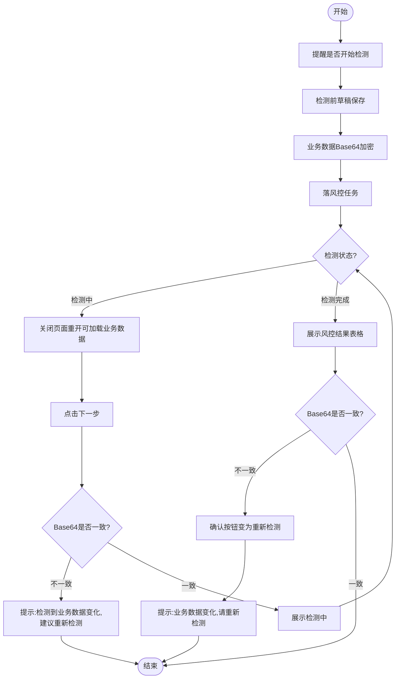
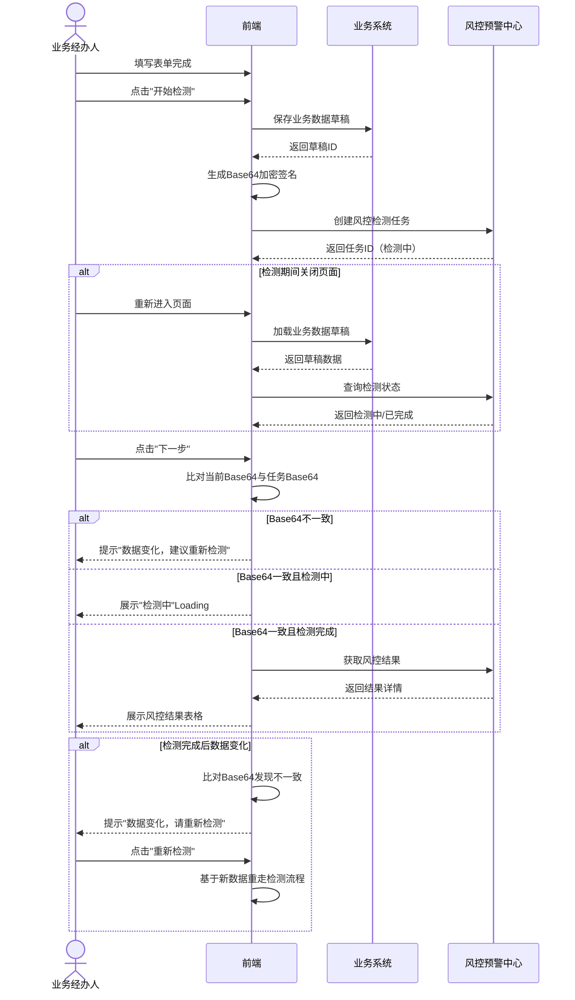
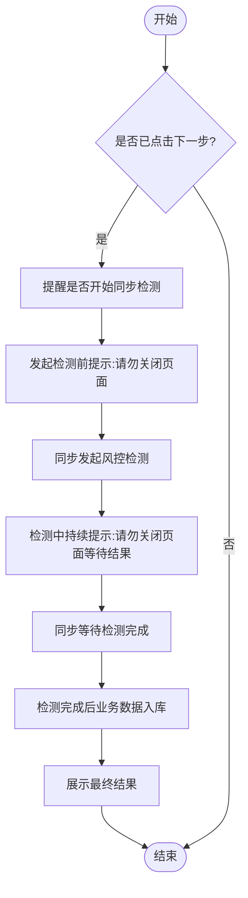
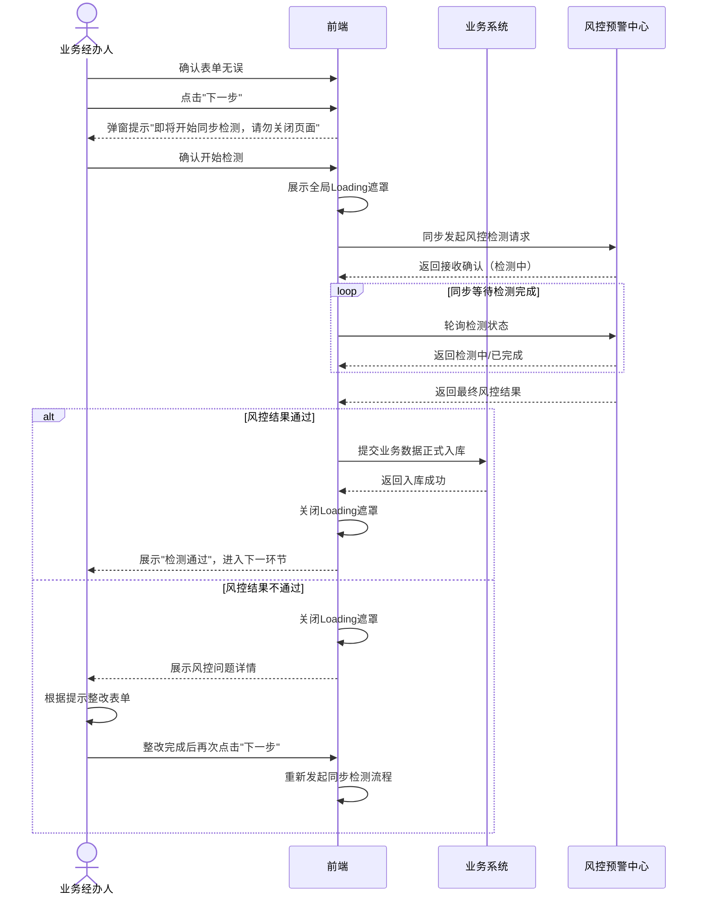

# PRD｜《数字合规官业务检测流程》需求文档

- 文档编号：PRD-Flow-\[YYYY-MM-DD]-Compliance
- 负责人：\[@liurundong]
- 协作人：\[Trae AI]
- 评审人：\[待定]
- 版本：v0.1
- 状态：草稿
- 创建时间：2026-03-24
- 更新时间：2026-03-24

## 目录

- [1. 摘要](#1-摘要)
- [2. 用户与场景](#2-用户与场景)
- [3. 核心流程规格](#3-核心流程规格)

## 1. 摘要

### 1.1 一句话说明

规范招投标系统内13个核心业务页面（如编制清单、编制公告等）在开启"数字合规官"后的风控检测标准流程，统一"下一步之前（异步预检）"与"点击下一步（同步强校验）"的交互与数据处理逻辑。

### 1.2 目标与非目标

**目标**

- 建立通用的数字合规官前端交互与后端检测流转机制，适配13个不同的业务页面。
- 确保检测期间业务数据的防篡改与一致性（通过Base64加密比对）。
- 明确不同检测阶段（异步预检 vs 同步强校验）的用户引导与异常处理策略。

**非目标（本期不做）**

- 不涉及具体风控规则引擎的底层判定逻辑（由风控后台负责）。

### 1.3 范围说明

- 适用场景：所有已在运营后台开启"数字合规官"的组织，在命中风控规则的13个业务节点页面（例如：编制公告、编制招标文件、评标等）。
- 涉及角色：采购经办人、合同经办人

## 2. 用户与场景

### 2.1 目标用户（Personas）

| Persona | 关键特征               | 主要目标                 | 主要阻碍                    |
| ------- | ------------------ | -------------------- | ----------------------- |
| 招标经办人   | 在招投标系统中录入业务数据并推进流程 | 顺利完成当前节点的表单填报并进入下一环节 | 填报内容不合规被拦截；检测等待时间过长不知所措 |
| 合同经办人   | 在合同管理系统中起草、审核合同并推进审批流程 | 确保合同条款合规并顺利完成签署流程 | 合同条款不合规被拦截；检测等待时间过长不知所措 |

### 2.2 核心使用场景（Top Scenarios）

1. **场景A（下一步之前的检测）**：用户填完表单但尚未正式提交，系统发起预检测。若中途数据有变，系统需能识别并提示用户重新检测，避免带着旧结果提交新数据。
2. **场景B（点击下一步的检测）**：用户确认表单无误并点击"下一步"，系统需进行同步强检测。检测期间锁定页面防止数据丢失，检测通过后才将业务数据正式入库流转。

## 3. 核心流程规格

本模块定义了数字合规官在各业务页面中的通用交互与流转机制。

### 3.1 场景一：下一步之前的流程（异步预检）

本阶段主要在用户填写表单的过程中触发，允许用户在检测期间进行其他操作（例如关闭页面后重开），但需保证最终展示检测结果的数据与页面当前表单数据绝对一致。

#### 3.1.1 流程图

#### 3.1.1.1 泳道图（异步预检流程）

#### 3.1.2 关键节点与校验说明

- **草稿保存与加密防篡改**：在发起检测前，系统必须先自动保存当前业务数据草稿，并对**当前参与检测的表单数据生成** **`Base64`** **加密签名**。该签名作为本次风控任务的唯一数据快照凭证。
- **异步任务流转与状态恢复**：落风控任务后，页面不强制锁定（非阻塞）。用户若此时关闭页面，下次重新进入该节点时，需能重新加载最新的业务数据草稿及对应的风控检测状态。
- **Base64一致性强校验**：
  - **在"检测中"点击下一步**：系统比对当前页面表单数据的 Base64 与发起检测时的 Base64。如果不一致，说明用户在检测期间修改了表单，拦截并提示："检测到业务数据变化，建议重新检测"；如果一致，则展示"检测中"状态（Loading遮罩）。
  - **检测完成后展示结果**：展示风控结果表格时，再次进行 Base64 比对。若发现数据有变，【确认】按钮变为【重新检测】，并提示："业务数据变化，请重新检测"，用户点击【重新检测】后基于新数据重走检测流程。

### 3.2 场景二：已经点击下一步之后的流程（同步检测/提交）

本阶段为业务流转的正式提交口。用户明确意图进入下一环节，系统必须确保合规检测完全通过，方可将最终定稿的业务数据入库并放行。

#### 3.2.1 流程图

#### 3.2.1.1 泳道图（同步检测/提交流程）

#### 3.2.2 关键节点与校验说明

- **同步阻塞与强提醒**：确认"下一步"后，发起同步强检测。此过程为**全局强阻塞状态**，前端需弹出全局遮罩/Loading，并明确提示："发起检测前/检测中，请勿关闭页面等待结果"，防止用户误操作导致流程中断或数据不一致。
- **检测与入库时序约束**：**只有在同步等待检测完成，且风控结果判定为"通过/允许流转"后**，才允许调用各业务页面的核心接口，将业务数据正式入库。
- **结果展示与阻断**：展示最终的合规结果。若存在阻断性风控问题，停留在当前页并展示异常结果，要求用户整改后再次点击"下一步"。

### 3.3 异常与边界情况处理

| 异常场景      | 触发条件                        | 系统处理策略                                                           |
| --------- | --------------------------- | ---------------------------------------------------------------- |
| 网络中断/超时   | 同步检测中途断网                    | 弹窗提示"网络异常，检测超时，请重试"，解除页面锁定，不执行业务数据正式入库。                          |
| 跨端/多开并发修改 | 在A标签页发起检测，同时在B标签页修改了数据并保存草稿 | 依赖 Base64 一致性校验机制。A标签页后续操作（如查看结果、点击下一步）时，Base64比对失败，强制拦截并要求重新检测。 |
| 强制刷新页面    | 强校验（场景二）阻塞期间，用户按F5强制刷新      | 终止当前前端的同步等待状态。页面重载后恢复至填表状态（读取服务端最新草稿），需用户重新点击"下一步"。              |
