# 研发应用成果组-数字合规官-答辩

- Source: `研发应用成果组-数字合规官-答辩.pptx`
- Total slides: 59

## Slide 1

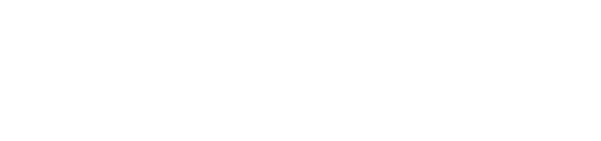

- “建证未来 智启新程”
- 中国建筑第一届人工智能创新大赛交底

- 研发应用成果组
- 数字合规官-AI智能体

2026/09/08

## Slide 2

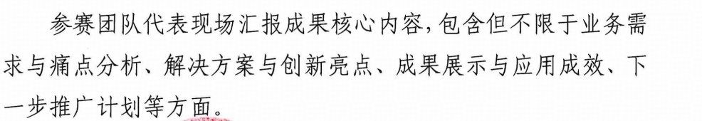

## Slide 3

一、需求与痛点分析

## Slide 4

需求与痛点分析

解决方案

创新亮点

下一步推广及建设计划

应用价值与市场前景

成果展示

01

02

03

04

05

06

政策强驱动 · 监管全覆盖

数字合规官响应四重国家级要求，直接计入中建股份智能化应用考核

- 国务院“人工智能+”行动
- 落实国家战略部署，以AI技术赋能合规管理全流程，推动人工智能在招投标、采购合规领域的深度应用与场景落地。

- 发改委195号文 · 招标投标AI
- 响应国家发改委深化公共资源交易平台整合共享要求，利用AI技术实现招投标全流程智能监测，保障交易阳光透明。

- 中纪委专项整治 · 围标串标
- 紧扣中纪委关于工程建设领域突出问题专项整治工作要求，通过AI算法精准识别围标串标线索，筑牢廉洁合规防线。

- 国资委穿透式监管 · 实时预警
- 落实国资委对中央企业采购管理的穿透式监管要求，建立实时在线的合规风险自动预警机制，确保采购全过程可追溯。

中建股份2026考核-建设指标4.0：智能化采购率核心工具，应用即认定为智能化采购达标。

中建股份2026考核-管理指标16.0：实现“一采一检”100%处置闭环，依托数字合规官完成采购全流程合规校验与问题整改。

## Slide 5

需求与痛点分析

解决方案

创新亮点

下一步推广及建设计划

应用价值与市场前景

成果展示

01

02

03

04

05

06

审计倒查 + 终身追责

政策背景：采购合规不容侥幸，监管力度持续升级

🔴 国家审计署2025第1号公告

⚖️ 国资委第46号令责任追究新规

10年+

终身问责机制：2013-2026年重大决策纳入问责范围，责任人退休、调离、辞职均不免责，实现责任追溯无死角。

追责情形扩容：从原有72种扩展至13个方面共98种，全面覆盖购销、工程、投资等关键业务领域。

倒查十年以上采购违规行为，打破“既往不咎”的惯性思维，历史遗留问题全面起底。

重大损失红线：认定标准≥5000万元，直接触发司法移送程序，刑事追责门槛明确。

严厉追责后果：涵盖诫勉、降职、撤职、薪酬追索，直至市场禁入及移送司法，形成全方位的惩戒闭环。

审计发现42个部门存在83处招标采购违规问题，部分违规行为跨度超十年，审计署已启动全链条专项倒查程序。

采购合规不再是“内部事务”，而是直接关联个人职业生涯的法律红线。

## Slide 6

治理管控层

制度 规则

风控 审计

制度 ·规则 ·监管

制度制定

风险管控

审计监督

玻璃幕墙

看得见但穿不透

业务执行层

采购 ·文件 ·供应商

供 应商信息 合同协议

采购执行

投标书

合同管理

采购文件

供应商管理

文件处理

信息流转

核心挑战： 一根针，难穿千条线；看得见，管不着；知风险，难落地。 破局方向：打通壁垒，连接上下，智能驱动，合规落地。

需求与痛点分析

解决方案

创新亮点

下一步推广及建设计划

应用价值与市场前景

成果展示

01

02

03

04

05

06

采购合规的“两层皮”：上面“一根针”,下面“千条线”

## Slide 7

人工合规审查效率低

- 法规体系复杂，合规审查
- 专业门槛高，易出错

- 要核对100+个合规节点
- 平均每个采购，经办人需耗费3小时
- 每年20万次采购耗费7.5万人天

- 需对照《招标投标法》《建筑业企业资质标准》等20+部法律法规
- 人工遗漏和出错率达到30%

需求与痛点分析

解决方案

创新亮点

下一步推广及建设计划

应用价值与市场前景

成果展示

01

02

03

04

05

06

传统采购合规四大痛点

重复低效的风险合规审查消耗大量人力，传统人工审查模式已无法满足大规模采购业务的合规需求

02

01

03

04

- 公告文件等非结构化风险
- 识别难题

风险滞后，审计被动

事后风控审计发现问题时采购已完成，审计整改成本高。

- 采购公告、采购文件、清单附件和资质附件文档100+页，人工识别工作量大
- 无法自动识别排斥性条款、资质匹配等非结构化风险

## Slide 8

二、解决方案

## Slide 9

_No extractable text content._

## Slide 10

01

需求与痛点分析

解决方案

创新亮点

下一步推广及建设计划

应用价值与市场前景

成果展示

01

02

03

04

05

06

数字合规官是什么

DeepSeek大模型+规则引擎双轮驱动，构建"永不疲倦的AI合规专员"

智能应用层

3

云筑数字合规官业务架构

训练“合规大脑”

实时扫描风险

采购全流程在线

- 智能公告
- 审查

- 智能
- 资审

智能文件审查

- 合同合规
- 校验

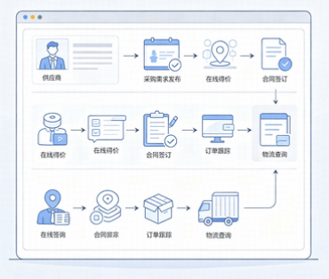

AI引擎层

2

NLP语义识别

CV图像识别

风控预警模型

建筑行业图谱

自动解析采购公告文本，提取资质要求

自动识别营业执照、资质证书真伪及有效期

围标串标识别算法（工商关联、IP重叠、报价规律）

4亿条+企业关系图谱，实时检测关联风险

云筑数字合规官核心能力

- ● 语义理解 ，读懂复杂法规文本。大模型自动解析《招投标法》等涉及合规的法律法规，建立合规风险知识库和风险审查点。
- ● 多模融合，解析异构文件信息。统一处理公告、附件PDF、图片等，提取资质证书有效期、清单数据等关键字段，打破格式壁垒。
- ● 闭环进化，人机协同越用越准。人工采纳、修正或忽略均沉淀为训练样本，驱动模型迭代，准确率逐步提升，系统越用越聪明。

实时预警

准确99.7%

实时核验

4亿+节点

数据基础层

1

历史标书库

合规知识库

法规标准库

百万份历史标书训练数据，持续学习合规风险知识

住建部《建筑业企业资质标准》等20+部法规实时更新

《云筑网采购业务全流程合规销项工具》"合规60条"结构化知识库

## Slide 11

需求与痛点分析

解决方案

创新亮点

下一步推广及建设计划

应用价值与市场前景

成果展示

01

02

03

04

05

06

- 数字合规官是什么
- 穿透式管理的AI智能体agent。

传统合规审查

AI数字合规官

- 就像一位老员工：
- • 看标书看到眼花，漏看一页
- • 查资质查到深夜，效率有限
- • 靠经验判断，标准不统一
- • 每人每天审3-5份，人力瓶颈

- 就像一位超级员工：
- • 1秒读完100页标书，永不疲倦
- • 24小时在线，3秒出结果
- • 标准统一，全国一个尺度
- • 每年节省人力成本2025万元

本质：把资深合规专家的经验，变成AI的'肌肉记忆'，7×24小时自动运转

## Slide 12

需求与痛点分析

解决方案

创新亮点

下一步推广及建设计划

应用价值与市场前景

成果展示

01

02

03

04

05

06

三层技术架构

数字合规官是怎么'长'出来的？三层架构

- • 百万份历史标书训练数据
- • 合规知识库：《云筑网采购业务全流程合规销项工具》等
- • 法规标准库：住建部《建筑业企业资质标准》等20+部法规

1 数据基础层

就像学生上课用的'教材'

- • NLP语义识别：自动解析采购公告文本，提取资质要求（准确率99.7%）
- • CV图像识别：自动识别营业执照、资质证书真伪及有效期
- • 风控预警模型：围标串标识别算法实时预警
- • 建筑行业图谱：4亿条+企业关系图谱，实时检测关联风险

2 AI引擎层

就像学生的'大脑'

- • 智能公告审查
- • 智能附件审查
- • 智能文件审查
- • 合同合规校验

3 智能应用层

就像学生毕业后干的'活儿'

## Slide 13

需求与痛点分析

解决方案

创新亮点

下一步推广及建设计划

应用价值与市场前景

成果展示

01

02

03

04

05

06

数字合规官四大'超能力'

火眼金睛

最强大脑

闪电速度

铁面无私

看文件

查关联

出结果

保标准

NLP+CV双识别

4亿节点行业图谱

审查周期缩短60%

漏检率降低80%

- 自动读公告、认资质、辨真伪
- 营业执照、资质证书
- 拍照即识，1秒验真

- 企业关系一网打尽
- 股权穿透10层
- 关联风险实时预警

- 传统人工：3小时/份
- 数字合规官：1.2小时/份
- 全年节省2025万元

- 全国统一审查标准
- 消除人为差异
- 每份标书同等严格

## Slide 14

需求与痛点分析

解决方案

创新亮点

下一步推广及建设计划

应用价值与市场前景

成果展示

01

02

03

04

05

06

- 全流程覆盖，6大阶段45项模型和规则嵌入
- 从采购发起到合同签订，AI全程护航，实现合规审查无死角

采购发起

采购响应

文件开启

采购评审

采购成交

合同签订

14

9

5

8

3

6

- 清单合规
- 公告筛查
- 资审管理
- 禁用名录
- 信息重叠检测
- ……

- 文件范本
- 报价轮次
- 评标办法
- 时效监控
- 回标分析
- ……

- 附件完整性
- 时间逻辑
- 围标识别
- 规律性报价等
- ……

- 评标设置
- 调价轮次
- 信息重叠
- 附件校验
- ……

- 结果一致性
- 成交报告范本
- 通知时效
- ……

- 评审记录
- 内容比对
- 交底监控
- ……

校验规则总数

业务阶段覆盖

平均审查耗时

重复工作替代

45项

6大阶段

1.2小时

90%

## Slide 15

三、创新亮点

## Slide 16

创新亮点

03

需求与痛点分析

解决方案

下一步推广及建设计划

应用价值与市场前景

成果展示

01

02

04

05

06

大模型技术的应用

01

02

多模态能力深度运用

多AGENT系统

从能用到好用，解决落地最后一公里问题，基于产品形态和用户需求，自动引入任务规划模块，以及具体功能tool-AGRNT模块，并通过REACT框架实现多轮多步执行，最终整体产品工具的模型识别由20+模型智能体组合构成，以及判定精准度上突破实现行业顶级；

多模态视觉语义深度推理OCR、能支持深度语义推理内容提取，模态形式支持多样化：PDF/图片/word/EXCEL

03

04

动态模型优化和选取

自适应学习机制

构建自有评测集（70个）和通用评测集（20个），涵盖了文本理解、视觉感知、推理分析等全方位模型能力评测。根据评测结果，针对性选择效果不好和关键能力进行优化，通过标准测试集动态评分，动态选择模型

基于图增强的记忆系统，管理超长招投标历史记录，并根据通过用户历史反馈数据，对记忆进行优化增强，从而提升检测准确率，试点期误判率下降80%。

## Slide 17

创新亮点

03

需求与痛点分析

解决方案

下一步推广及建设计划

应用价值与市场前景

成果展示

01

02

04

05

06

AI 智能识别：多模态、RAG 与多智能体协同

多源材料输入

Agent 协同网络

结构化核查报告

风险结论

任务规划 Agent

PDF

Word

Excel

图片

识别风险类型与等级判定

原文证据

Tool-Agent

支持多格式业务材料的

OCR Agent

定位命中原文位置与上下文

规则库 · 资质查询 · 文本比对

文本、表格、版式和内容提取

引用依据

知识库 Agent

关联法规制度与检索知识来源

RAG 检索

OCR 识别 · 版面分析 · 结构化提取

法规标准 · 内部制度 · 历史文件

表格还原 · 附件解析 · 语义分段

比对 Agent

建议动作

提示、复核、拦截或整改建议

20+ 模型智能体

RAG 知识支撑层：

法规标准库

·

内部制度库

·

历史文件库

·

场景知识库

->

检索召回

->

上下文组装

A

B

C

排斥性条款

附件符合性

异常相似性

结合条款上下文和法规制度，识别关键词

理解公告要求并与多家分供商附件逐项比对

识别不同文件中的文本结构、措辞、排版

规则难以覆盖的隐含限制或倾向性表述

定位缺失、不匹配或信息冲突

和非正常错误模式等模糊相似特征

## Slide 18

创新亮点

03

需求与痛点分析

解决方案

下一步推广及建设计划

应用价值与市场前景

成果展示

云筑大模型的5大核心算法

01

02

04

05

06

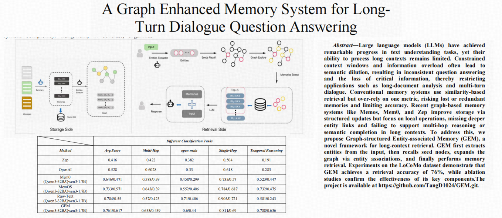

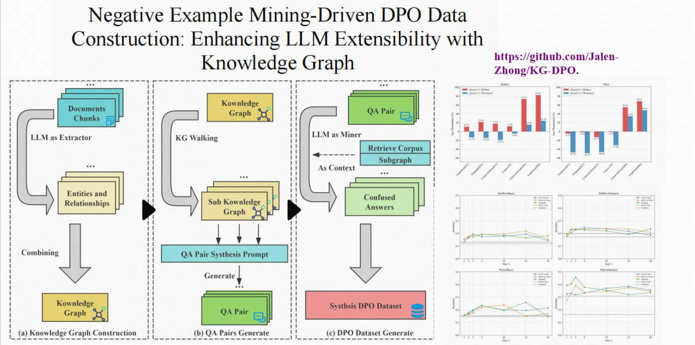

数据合成技术

数据记忆优化技术

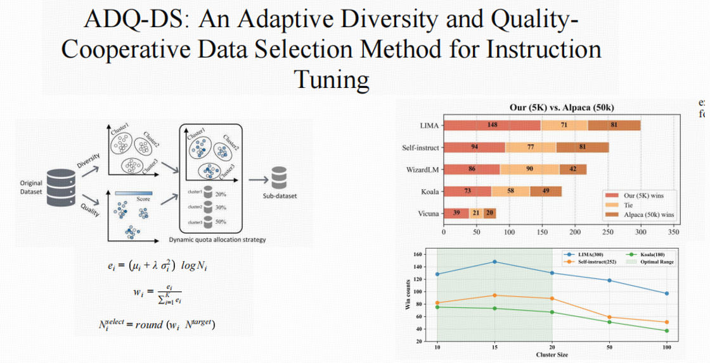

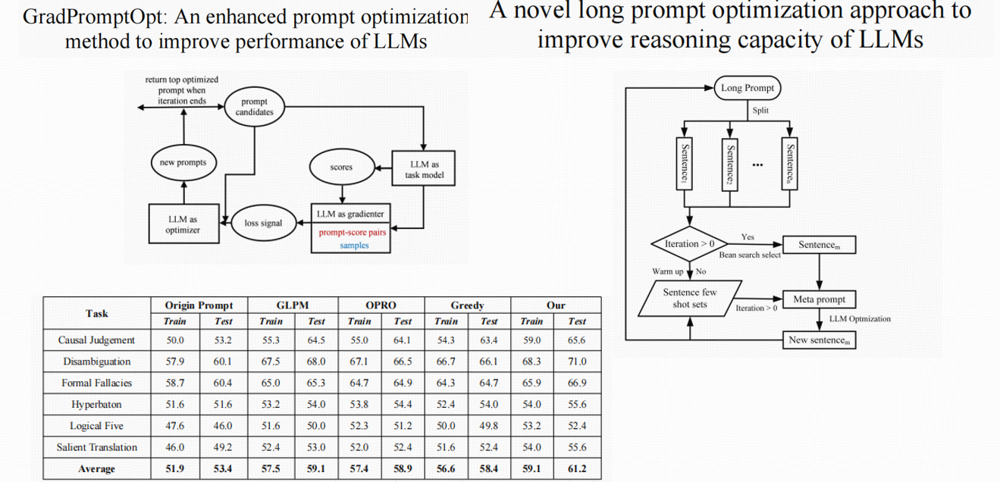

数据筛选技术

通用prompt+长prompt优化技术

## Slide 19

创新亮点

03

需求与痛点分析

解决方案

下一步推广及建设计划

应用价值与市场前景

成果展示

业务赋能 & 技术创新(ieee论文）

01

02

04

05

06

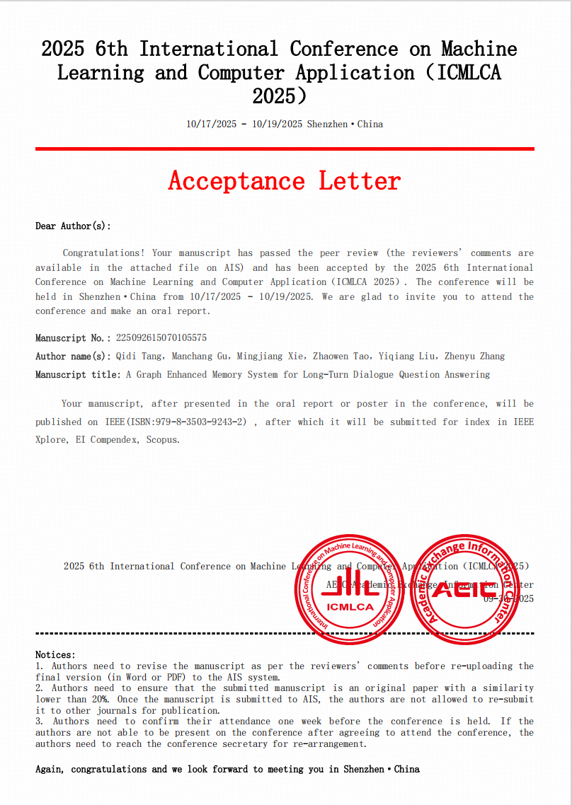

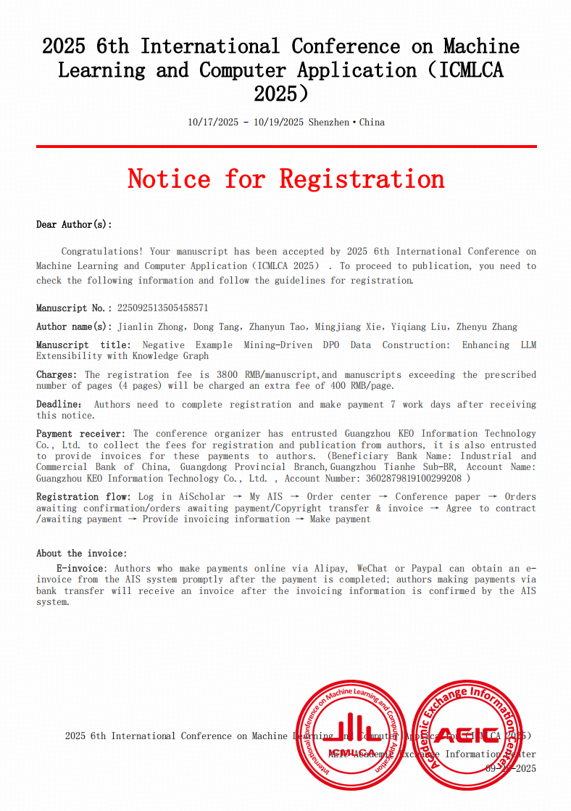

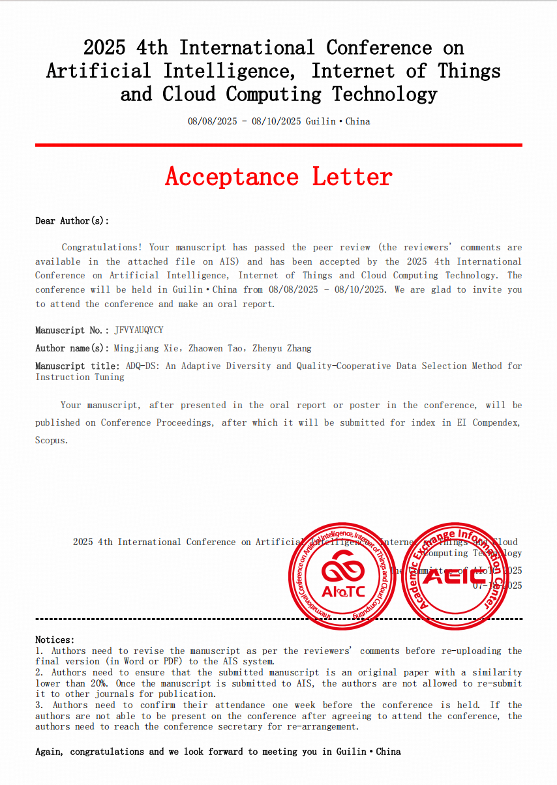

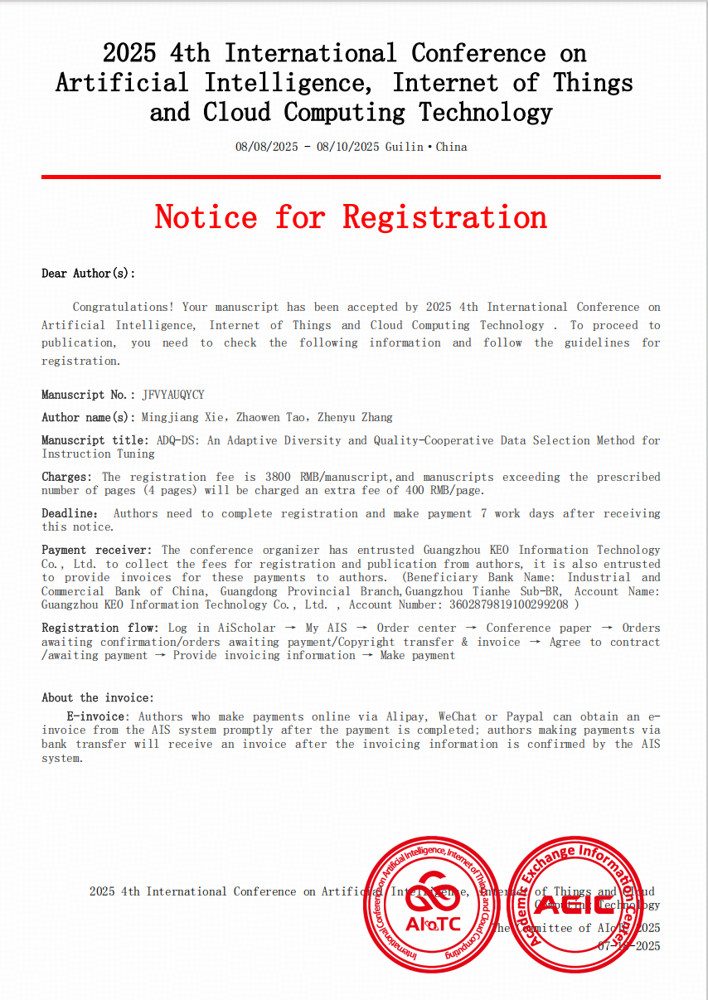

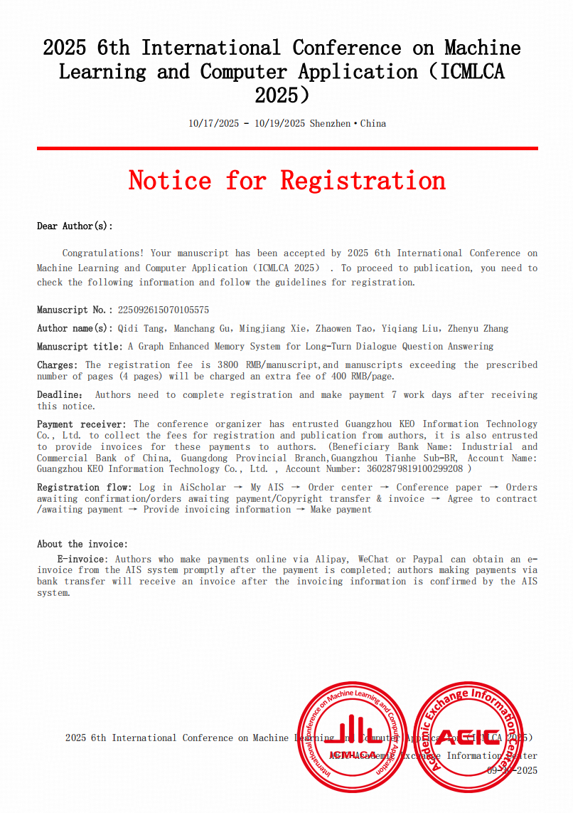

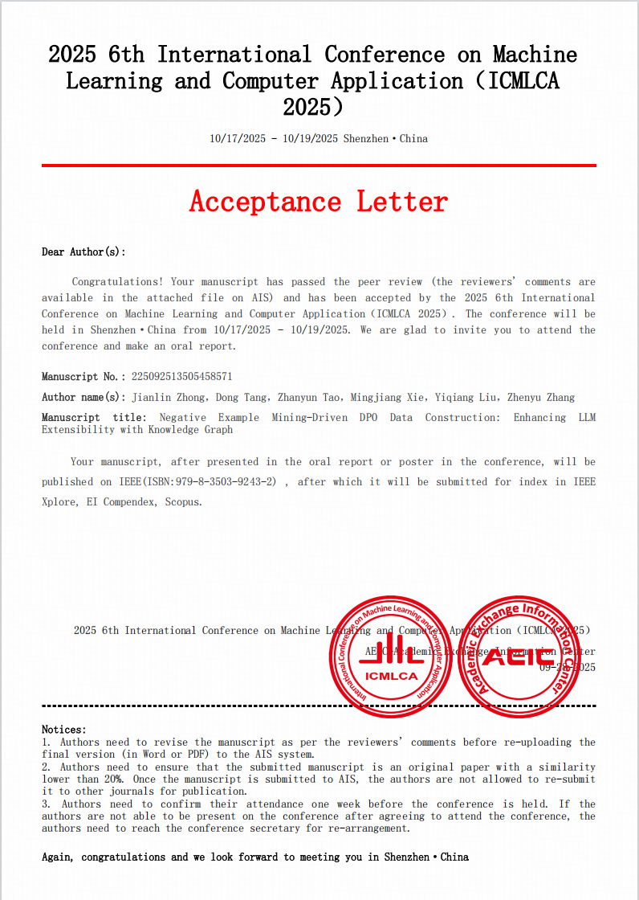

Negative Example Mining-Driven Construction of High-Quality DPOData:Facilitating Extensibility Optimization of Knowledge GraphModels

ADQ-DS: An Adaptive Diversity and Quality-Cooperative Data Selection Method for Instruction Tuning

A Graph Enhanced Memory System for Long-Turn Dialogue Question Answering

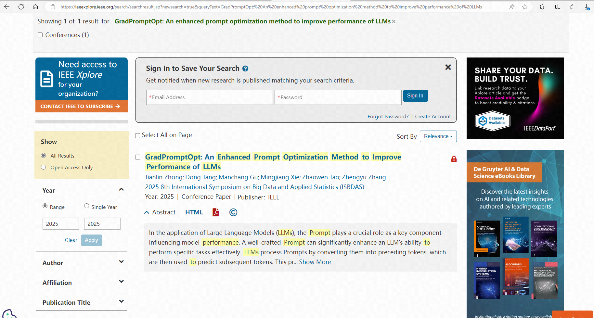

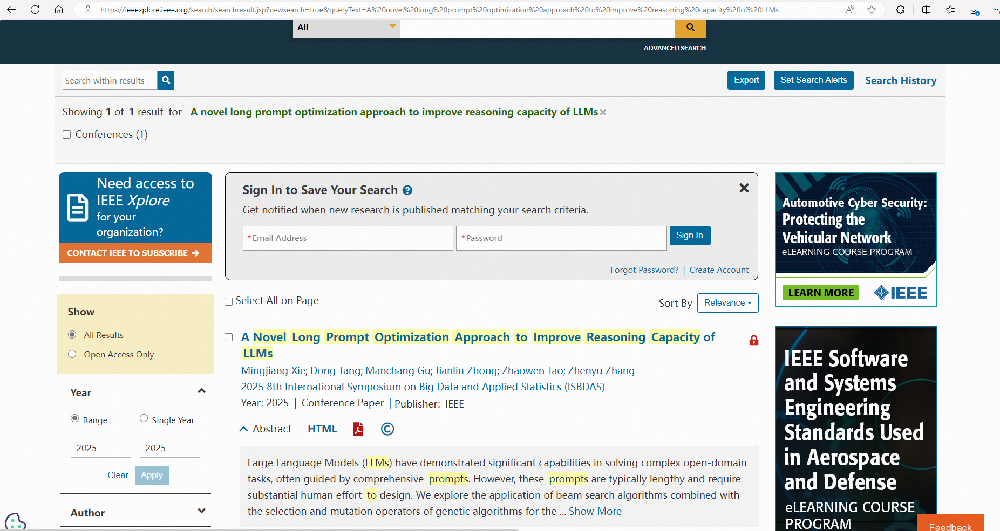

GradPromptOpt An enhanced prompt optimization method to improve performance of LLMs

A Graph Enhanced Memory System for Long-Turn Dialogue Question Answering

检索结果

## Slide 20

创新亮点

03

sensing VLM

reasoning VLM

Memory系统

planning系统

reasoning LLM

ICL-LLM

verifier系统

prompt优化系统

需求与痛点分析

解决方案

下一步推广及建设计划

应用价值与市场前景

成果展示

01

02

04

05

06

业务-数据-模型闭环三驱动创新

模型Data-Centric 侧

业务User-Centric侧

应用需求入口

应用验证样本

数据合成与负样本拓展

知识图谱构建

应用agent DSL生成

数据筛选算法

基础系统组装

autorun接口实现

检索结果

## Slide 21

建筑行业供应链高质量数据集

高结构性

强行业适配性

高标签精度

数据优势

数据集评级

数据集规模

- 数据集通过中国信通院人工智能数据集质量评估4级评级，成为国内首家获得当前最高评级的建筑行业中央国资企业
- “建筑行业供应链高质量数据集”入选国务院国资委、国家数据局发布的高质量数据集典型案例

- 实体提取数据集：供应商数据（1万条）、商品数据（3万条）、工程业绩数据（1万条）
- 行业问答数据集：5类业务场景（绿色建筑、施工、政策等）
- 总计：10万条高质量标注样本

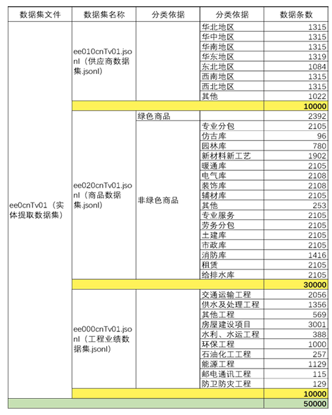

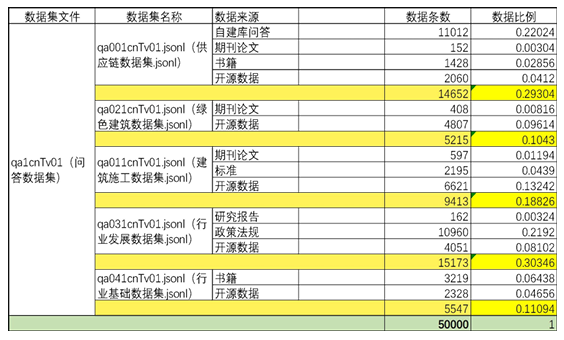

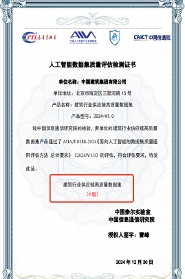

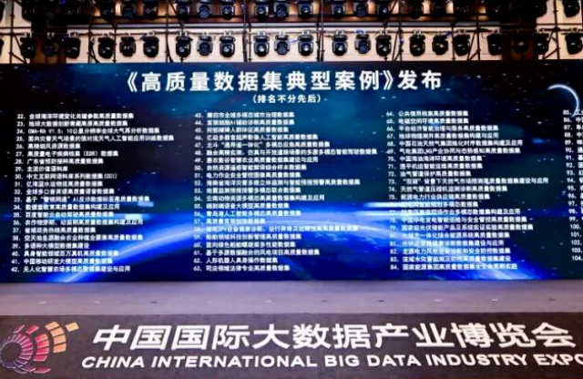

## Slide 22

“云端”+“智能”的技术架构体系，构建强大的联接引擎

AI场景

AI寻源

AI集采

AI收验货

AI数科

AI商城

AI用工

AI支持服务

AI找供应商

AI投标智检

AI无人值守

AI资审

AI商品审核

AI工地管理

AI客服

日调用量52万次

AI找价格

AI数字合规官

AI防作弊

AI融资

AI采购

AI合同

AI财务

AI平台

数据管理平台

训推一体化平台

AI应用开发平台（云筑万象）

数据采集

数据预处理

预训练

监督微（SFT）

模型轻量化

PE

Agent编排

数据标注

数据蒸馏

参数高效微（PEFT）

模型蒸馏

RAG

工作流模版

模型部署

智能体200+

数据合成

数据增强

强化学习

后训练

推理加速

Agent交互

插件中心

训练管理

训练评估

推理评估

知识中心

模型评测

数据评估

数据集管理

模型能力

基础大模型

行业大模型

场景大模型

其他AI

DeepSeeK

Qwen

Qwen-VL

招投标行业大模型

投标检测大模型

印章/合同大模型

NLP

OCR

核心数据1.7+PB

模型能力

公有云算力

私有云算力

云存储

部署容器

网络专线

信创对接

分布式服务框架

CDN

## Slide 23

（一）

内外部数据融合

按照“内部数据全贯通、外部数据广引入”的原则，构建多维度、全口径的数据采集体系，对内贯通网、省、地各级核心业务系统，实现横向到边、纵向到底的数据穿透；对外引入工商、采购、交易、合规监管等权威数据，实现供应链全环节、全级次、全要素数据的实时采集和汇聚，为穿透式监管提供全面的数据支撑。

关联分析穿透

数据汇总数据提取数据治理

网

- 接口对接
- 数据采购

省

地

风险数据资源池

全要素穿透

全级次穿透

供应链数据

投标标信息

采购数据

监管信息

‘

物流数据

交易信息

人力数据

财务数据

基建数据

生产数据

工商信息

- 电网管理平台
- （供应链域）

- 中国招标投标
- 公共服务平台

- 南网
- 电子商城

- 央企采购交易
- 在线监管系统

- 赫兹
- 运力平台

- 全国企业采购
- 交易服务系统

- 电网管理平台
- （财务域）

- 国家企业信用
- 信息公示系统

- 电网管理平台
- （人资域）

- 电网管理平台
- （生产域）

- 电网管理平台
- （基建域）

## Slide 24

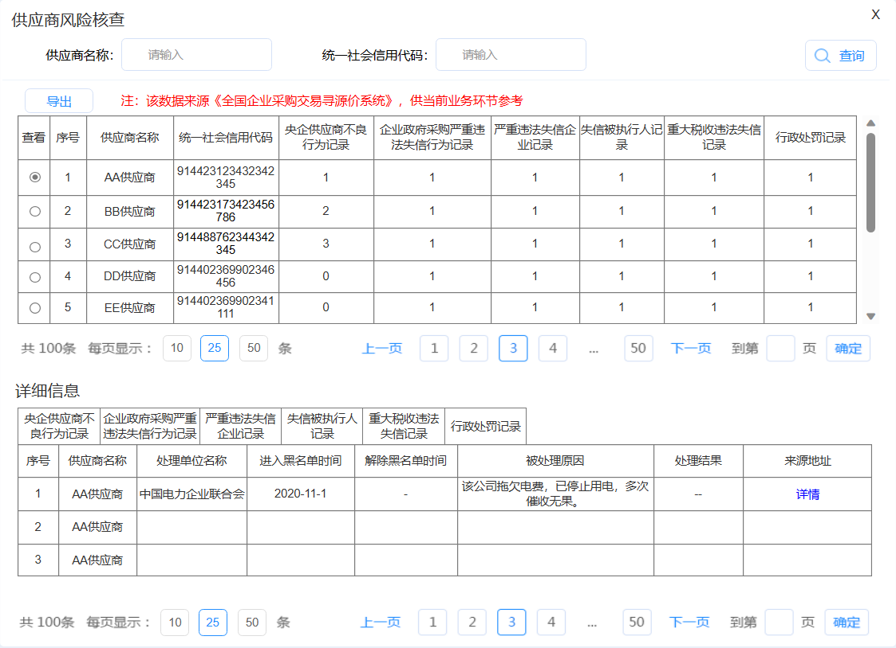

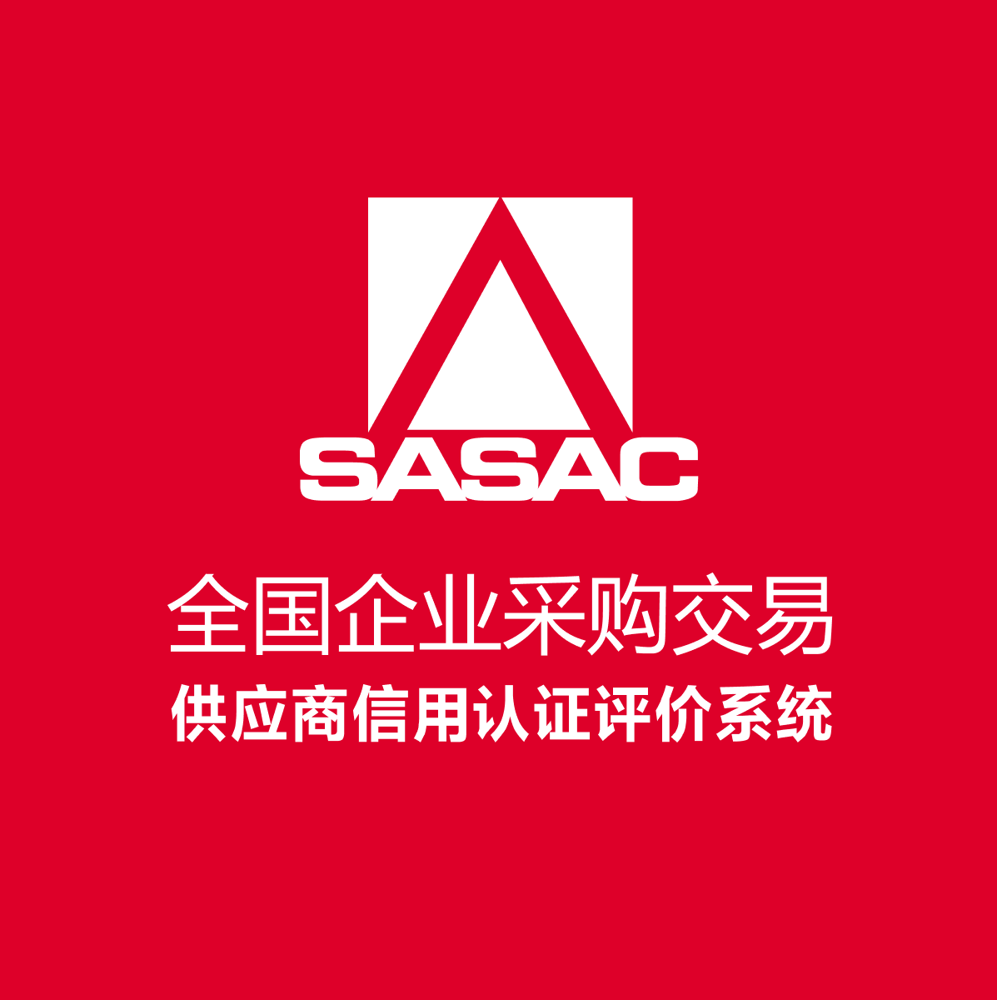

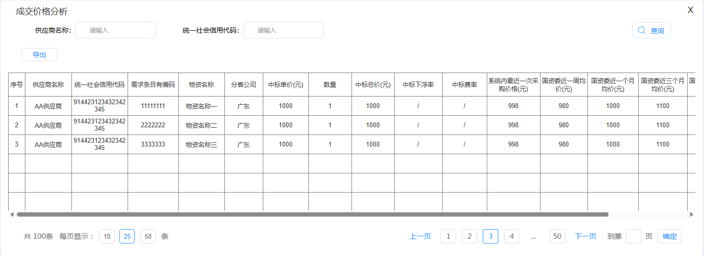

（一）

外部跨平台对接

按照供应链实际业务需要，对接全国企业采购交易寻源询价系统、全国企业供应商信用认证评价系统，在综合管理、供应商管理、需求管理、采购管理、监督管理5个模块应用，共完成风险核查9个应用场景开发，价格辅助3个应用场景开发，已于2023年6月15日上线。公司采购风险智能预警平台对标国资监管平台标准，在业务数据上报国资监管平台前，前置完成 8 张核心业务表的风险校验验证，对采购相关数据开展合规筛查、风险识别与预警研判。

cvcv

cvcv

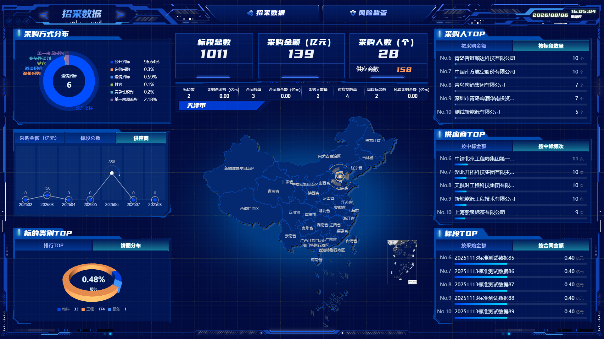

国资监管平台

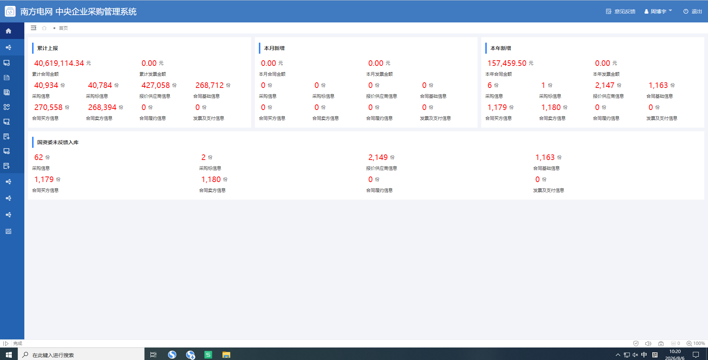

## Slide 25

合同与招标文件不一致

验收与物流不符合

发票与合同金额偏差

报价异常

需求虚高

循环持股

资金异动

评分偏高

资金流向图谱

人员关联图谱

业务链条图谱

传导式风险追踪

知识图谱引擎

搭建知识图谱可视化平台，直观展示股权穿透、资金流向、人员关联、业务链条及传导式风险追踪等核心关系，支持图谱查询、关联分析、疑点标记、轨迹追溯等功能，监管人员可通过拖拽、筛选等简单操作，快速掌握各类隐性关联关系，提升风险识别的效率和深度，从根源上解决“查不清”的痛点。

（二）

知识图谱引擎

深度遍历、最短路径、循环检测

环路检测、异常路径、资金聚集

NLP实体对齐、多维度关系挖掘

四流合一、业务全景关联

图神经网络

股权穿透图谱

风险事件查看

异常拆借

任职交集

交叉持股

资金闭环

亲属关系

体外循环

异常通讯

股权变更

集中回款

同单位

多层代持

应用场景落地

一键下钻：查看供应商的股权结构，可视化展示供应商与其他企业、内部人员的股权关联。

一键追溯：实时追踪资金的完整流转路径，实现资金异动的实时预警和快速核查。

强制回避：禁止敏感专家参与本次评标，对未主动申报关联关系的专家记录违规行为并纳入信用评价。

四流合一：构建合同流、物流流、发票流、资金流全景图谱，实现供应链全流程可视化追溯。

链条追踪：将分散得异常点关联成风险链条，推送并标注风险等级和核心线索。

横向关联：关联采购、合同、资金等业务数据，快速发现隐性关联风险。

实时预警：结合AI时序分析技术，对资金流转的时间、金额、频次进行异常检测。

围串标识别：穿透核查人员及供应商的关联网络，实现廉洁风险全周期管控。

链条式核查：关联各环节数据，发现链条式风险，快速定位责任主题，实现责任可倒查。

新型舞弊自适应：自适应学习新型舞弊手法的风险链条特征，提升风险识别能力。

## Slide 26

陪标

履约缩水

数据篡改

库存挤压

证据链

履约违规

串通投标

签字伪造

合同篡改

风险得分

深度学习技术

时序预测技术

围串标智能识别大模型

预测性风险大模型

- 硬件信息（IP地址、MAC地址、硬盘序列号）
- 文档特征（投标文件相似度、排版格式一致性）
- 报价行为（报价规律、报价时序、报价偏差）
- 关联关系（供应商、专家、内部人员关联）

- 历史履约数据（交付及时率、验收合格率）
- 质量数据（抽检合格率、质量时间记录）
- 信用数据（处罚记录、司法诉讼、纳税评级）
- 市场数据（原材料价格、进出口政策）

围标

需求虚高

AI与大模型引擎

依托计算机视觉、自然语言理解、时序预测、深度学习、机器学习等核心技术，系统构建各类智能模型与引擎，推动监管模式深度转型，精准破解监管工作中“抓不准”的痛点难点，突破传统监管“经验驱动、单点防控”的固 有局限，为构建“横向到边、纵向到底”的全方位、全流程、全覆盖智慧监管体系提供坚实的智能支撑。

（三）

自然语言处理技术

计算机视觉技术

AI先进技术与大模型引擎

文本智能解析大模型

图像智能核验大模型

- 投标文件（资质要求、技术参数、服务承诺）
- 招标文件（资格条件、评标办法、技术规范）
- 合同文本（核心条款、履约节点、合同金额）

- 证照照片（拍摄时间、拍摄内容、证照类别）
- 物资单据（物资类别、物资编号、物资名称）
- 采购文件（采购策略、采购结果、供应商）
- 采购影像（影像时间、风险识别、评标基地）

价格异常

盖章伪造

机器学习技术

隐性风险量化评分大模型

- 报价行为（报价离散指数、异常低价）
- 文档特征（文本雷同性、格式一致性）
- 硬件信息（MAC地址、IP地址）
- 关联关系（股权穿透、人员交叉）

风险路径

## Slide 27

虚高需求

资质业绩

股权结构

合同结算

无效投资

履约表现

历史投标

关联关系

重复提报

股权穿透

任职交叉

合同履约

需求提报单位

- 履约
- 相关方

供应商

法人

资金低效

财务状况

失信执行

发票金额

无依据

人员关联

投资关联

项目验收

频繁紧急

司法诉讼

资金往来

资金往来

- 主体
- 智能画像
- 中心

执业资质

采购计划

岗位职责

专业资质

异常导出

变更记录

敏感操作

投诉举报

操作痕迹

招标文件

审批权限

抽取记录

招标代理机构

关键岗位

评标专家

招标人

违规下载

预算文件

亲属关联

偏离度

敏感操作

专家评审意见

操作轨迹

评标时长

违规操作

开标记录

历史经办

打分轨迹

智能画像

主体智能画像中心针对供应商、招标人、招标代理机构、需求提报单位、合同履约相关方、法人、评标专家、关键岗位人员等核心监管对象，构建多维度、动态化、可量化全息画像，形成“一人一档、一企一档、一机构一档”的精准监管视图，为智能预警、精准研判、闭环处置提供统一决策支撑。

（四）

…

…

…

…

…

## Slide 28

合规要求

判定逻辑

监督标准

停用

删除

监管算法规则库

以业务探针为感知末梢，构建可插拔、可扩展、实时迭代的算法规则库，将合规要求、风险特征与监督标准固化为可配置模型，覆盖供应链全链条并支持灵活调整。通过松耦合架构实现规则实时同步生效，结合算法引擎开展智能识别、关联分析与异常研判，全面提升风险事前预防、事中精准动态管控能力。

（五）

风险特征

固化

固化

统一的算法规则库

灵活调整

动态更新

即插即用、动态更新、实时预警

新增

更新

修改

形成覆盖供应链全链条的标准化、可复用规则体系

## Slide 29

南网供应链全过程风险监督预警平台

- 应
- 用
- 层

监管驾驶舱

- 国
- 资
- 监
- 管

- 数资监管
- 数据报送

概览

可视化图谱（体系、业务）

关键要素画像

风险处置闭环管理

监管报告

全过程监管

贸易管理

需求管理

招标采购

评标专家

供应商管理

合同履约

质量安全

仓储物流

逆向物流与资产

需求提报全流程监管

招标前期监管

专家资质全生命周期

准入全流程穿透监管

合同签订环节监管

生产环节质量监管

全网库存智能化管控

逆向物流全流程监管

贸易伙伴穿透式监管

贸易合同全流程监管

需求整合监管

招标实施过程监管

专家抽取过程监管

履约全流程监管

合同履约过程监管

监造环节质量监管

仓储管理全流程监管

资产报废全流程监管

- 组
- 织
- 与
- 制
- 度
- 保
- 障

……

……

……

……

……

……

……

……

……

风险识别

风险识别

- 服
- 务
- 层

知识图谱引擎

AI与大模型引擎

智能画像

模型管理

规则库

股权穿透图谱

围串标智能识别

文本智能解析

供应商

训练

测试

资金流向图谱

评标专家

指标规则

人员关联图谱

图像智能核验

预测性风险

需求部门

部署

监控

业务链条图谱

关键岗位人员

业务规则

隐性风险量化评分

……

迭代

……

传导式风险追踪

……

……

……

数据提取

数据治理

- 数
- 据
- 加
- 工
- 层

统一数据治理

数据结构化

数据质量管控

亮点及创新点

统一主数据标准

统一指标数据标准

OCR识别

NLP解析

图像识别

质量监控及考核

合同

发票

招标文件

投标文件

验收影像

现场照片

完整性

准确性

供应商主数据

物资品类主数据

库存周转率

采购成本偏差率

磅单

……

合同条款

……

物流轨迹

……

一致性

及时性

专家主数据

……

供应商交付及时率

……

信息检索抽取

业务数据采集

- 数
- 据
- 资
- 源
- 层

- 外
- 部
- 数
- 据

- 内
- 部
- 数
- 据

内部协同

工商信息

司法涉诉

信用评级

跨域数据

市场数据

其他数据

业务系统数据

横向到边

云边协同数据

纵向到底

- 股权结构
- 法人/高管信息
- ……

- 失信被执行人
- 开庭公告
- ……

- 企业信用评级
- 行业信用指数
- ……

- 原材料价格指数
- 大宗商品价格
- ……

- 国际制裁清单
- 行贿犯罪档案
- ……

- 自下而上
- 实时汇聚

电网管理平台（供应链域）

基建

生产

南网电子商城

赫兹运力平台

人资

财务

核心技术和亮点

1. 架构体系创新，构建全域一体化穿透监管新格局

  - 搭建数据、中台、应用、闭环四位一体方案，贯通各级业务与内外多源数据，破除数据孤岛，实现供应链四全覆盖。全域监管架构打通层级壁垒，补齐传统监管覆盖短板，完成局部监管向全域监管转型，夯实数智监管底座。

网侧数据

省侧数据

各地市侧数据

## Slide 30

供应商画像

招标人画像

代理机构画像

需求单位画像

履约相关方画像

实际控制人画像

评标专家画像

关键岗位人员画像

信用升降级

责任倒查

行为分析

合理性评估

履约评估

穿透识别

专家评价

权限审计

重点盯防

异常识别

风险提示

异常预警

资金监控

资金链路

行为分析

行为监控

风险预警

信用评估

分级监管

重点管控

风险预警

重点町防

风险预警

风险提醒

亮点及创新点

资质履约

关联关系

资金轨迹

信用司法

操作行为

履职合规

风险评分

整改记录

核心技术和亮点

3. 监管维度创新，实现全主体全息精准管控

  - 搭建八大类市场及从业人员动态量化全息画像，归集资质、资金、信用、履职等多维数据，建立企业、个人专属监管档案，全方位穿透核查各方主体，精准定位实际控制人与违规责任人，解决传统监管判定追责困难问题。

穿透识别目标

幕后控制人

违规责任人

异常利益链

全主体画像中心

评分异常链

付款异常链

数据底座

## Slide 31

四、成果展示

## Slide 32

落地成效 | 经济效益

创新亮点

03

需求与痛点分析

解决方案

下一步推广及建设计划

应用价值与市场前景

成果展示

01

02

04

05

06

高精度识别与高准确率预警，构成穿透监管的核心能力底盘。

- 99%
- 项目概况

- 92%
- 采购范围

- 87%
- 通用资格

- 90%
- 专用资格

- 87%
- 初审项

- 90%
- 风险预警准确率

从单点告警升级为链条式、传导式、全景式风险识别，提升风险感知的全面性与前瞻性。

精准识别采购内容、数量、规格及技术要求，防止包装分拆、需求失真。

对供应商通用资质、信用、业绩等进行核验，识别虚假、挂靠、串标等风险。

对专业资质、特定业绩、人员设备等进行核验，确保专业条件真实有效。

对初审环节全部审查要点进行覆盖识别，提升审查完整性与合规性。

从单点告警迈向链条式、传导式、全景式风险识别，精准锁定风险发生点与传导路径。

- 围标串标
- 违规分包
- 评审异常
- 虚假应标
- 违规转包

- 合同异常
- 资格造假
- 低价异常
- 履约异常

- 九类高频违规场景精准识别
- 隐性违规识别能力显著提升无效预警显著下降

监管人员可快速掌握风险本质和传导路径，支撑精准研判、精准处置

## Slide 33

落地成效 | 管理效益

- 10-30分钟
- 单项目初筛时间

传统人工核查

智能初筛(AI赋能)

- 60%
- 人工核查工作量降低

- 1,200人工小时/150个工作日
- 年度节约

- 重构采购全流程合规监管模式，将重复核查转为自动化初筛，
- 让监管人力聚焦高价值风险研判与处置。

- 人工逐份核查
- 逐份查看、手工比对

- 自动规则识别
- 内置规则引擎，自动识别异常线索

- 相似度比对
- 多维相似度计算，快速比对筛选

- 周期长
- 流程多、等待久、响应慢

- 负荷高
- 人力消耗大、易疲劳、易遗漏

- 关联挖掘
- 多表关联、穿透分析，深挖风险关系

- 前端化常态监管
- 实时预警、持续监测、闭环处置

审计、监督、内控实现前端化、常态化、智能化

## Slide 34

04

03

02

01

价值创造

成本控制

溢价干预

风险识别

- 筑牢电网物资安全防线保障能源稳定供应，打造央企数字化监管标杆样板，
- 以数智化治理助力国企治理现代化与社会高质量发展。

- 避免异常溢价
- 1%-3%

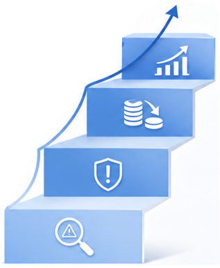

驱动管理优化与模式创新，释放数据要素价值，支撑战略决策与高质量发展。

识别并优化低效环节，降低采购与履约成本，提升资源配置效率。

落地成效 | 社会效益

- 潜在采购成本控制效益
- 1000万-3000万元

对异常溢价及时预警与干预，遏制不合理溢价，规范采购行为。

构建多维度风险识别模型，实时监测预警前置防控采购风险。

示范输出结论：形成可复制、可推广、可输出的“南方电网方案”，为央企监管数字化转型提供样板。

## Slide 35

风险识别案例

## Slide 36

判重字段

- 合同执行时IP 地 址 、
- 操作人/联系人/送货人手机号
- 身份证号、邮箱
- 物流送货地址、
- 送货车辆车牌号

判重阶段

报 名 投标 调价 定标 履约

判定逻辑-精准识别

第一层·识别能力：核心规则-全流程信息重叠识别

基于投标人主体、 联系人、 地址电话等多维信息的围串标重叠识别，多环节交叉比对

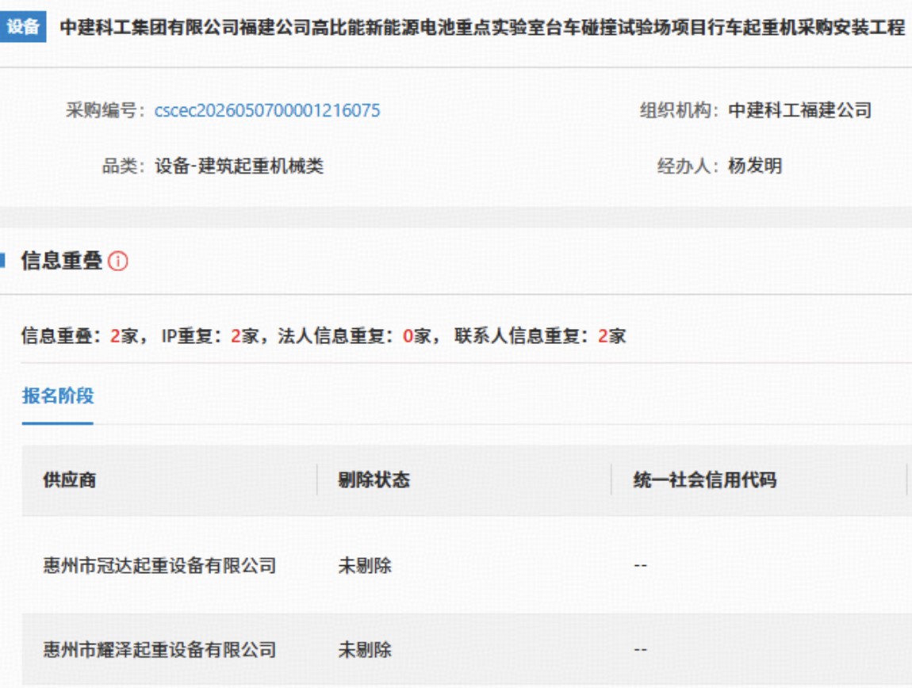

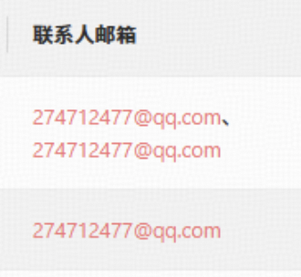

## Slide 37

关联比对

中建股份/局级黑名单企业

投标人

第一层·识别能力：核心规则-换马甲识别

基于股权结构、 主体信息、 联系方式的多维关联识别，杜绝投标人通过换马甲规避惩罚

判定逻辑-精准识别

判定信息来源

判定规则

比对投标人与中建股份/局级黑名单企业的关联关系。

100%

50%

35%

- 股权关联：
- 对接第三方工商信息查询平台，获取企业实时工商数据

全资

绝对控股

相对控股

Q

- 信息相似：合同执行时IP 地址
- 操作人/联系人/送货人手机号
- 身份证号、邮箱
- 物流送货地址、
- 送货车辆车牌号

电话

地址

邮箱

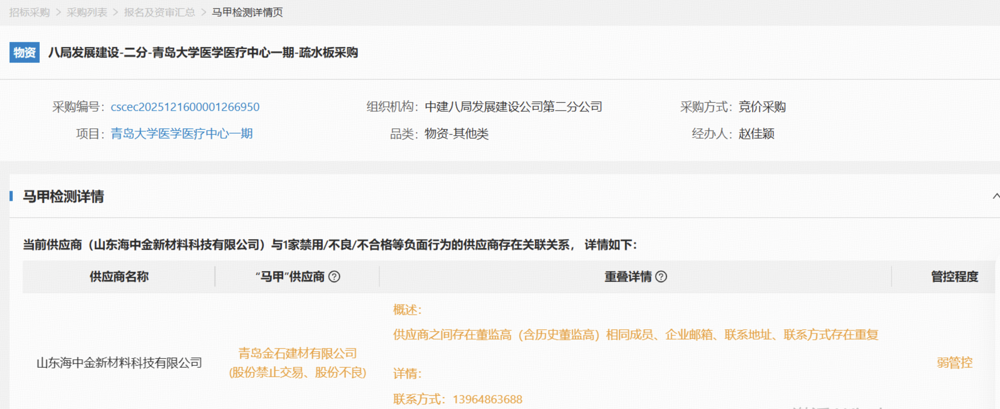

## Slide 38

换马甲结果示例

## Slide 39

第一层·识别能力：核心规则-规律报价

通过双模式算法识别、动态筛选与业务联动，实现疑似规律报价的快速发现、精准判定与闭环管控

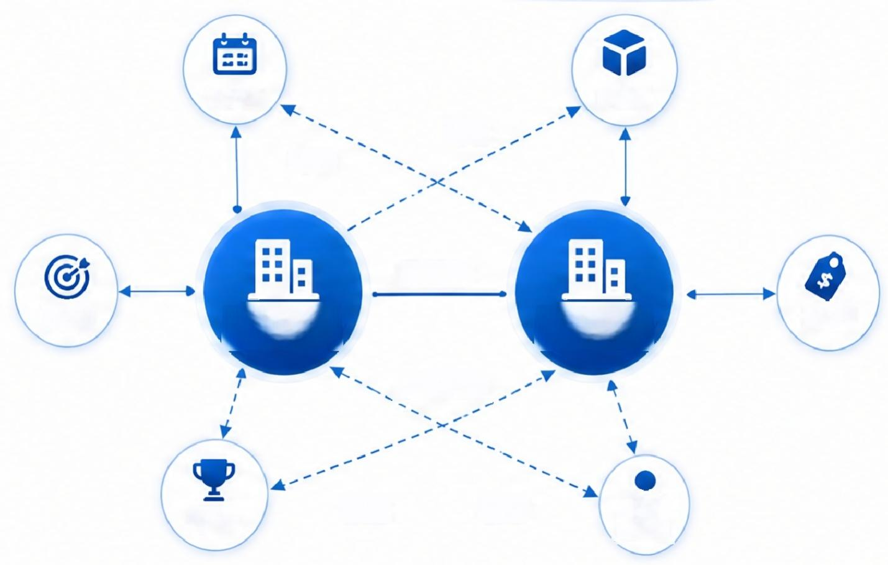

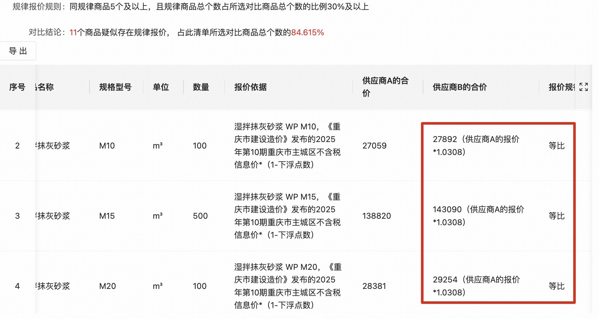

商品

轮次

等差等比

同规律

- 分
- 阀值 分供商A 分供商B

价型

分供商B

占比40%

中标 预警 剔除 澄清

03

01

业务闭环管控

核心算法引擎

动态筛选机制

支持人工澄清审批后剔除统计

·双模式识别：等比与等差自动检测

商品总个数比例过滤低占比疑似规律

## Slide 40

规律报价结果示例

## Slide 41

第一层·识别能力：核心规则-抱团投标预警

基于历史报名大数据的围标风险识别与预警，通过长期与近期双维度经常同时报名分供商分析，快速识别高风险围串标组合

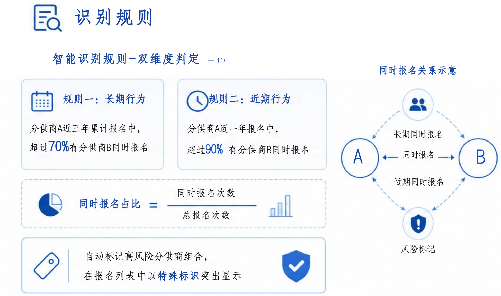

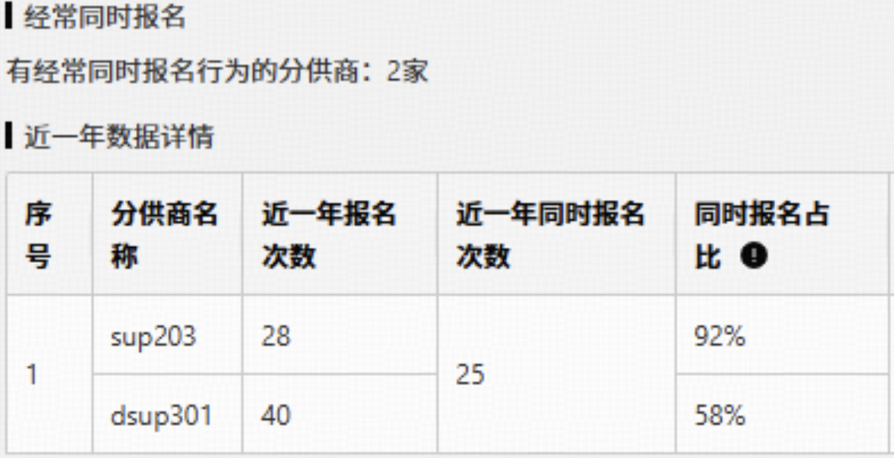

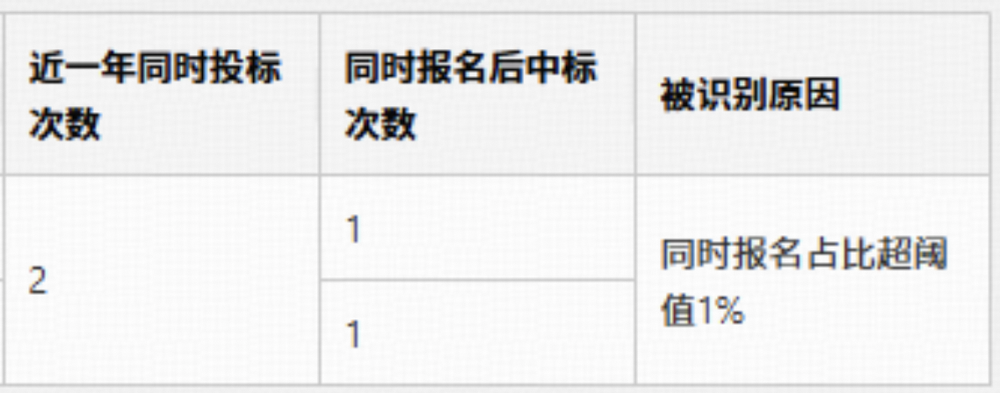

## Slide 42

_No extractable text content._

## Slide 43

五、下一步推广及建设计划

## Slide 44

从“规则引擎”到“合规操作系统”——五大机制升级

规则工厂与版本管理

数据底座扩展

聚合分析与画像

处置闭环与考核

人机协同与优化

将规则拆解为触发、对象、逻辑、阈值、处置五要素模型，实现参数化灵活配置。引入版本号与法规依据，支撑终身追责场景下的合规复核需求。

确立财务、审批流、履约系统等核心数据的接入优先级，从单向只读模式逐步升级为双向实时联动，夯实合规系统的数据支撑基础。

构建供应商、采购人及项目的多维风险画像，将单标审查结果与画像评分智能叠加，输出精准的综合风险评级，实现全域风险感知。

建立预警状态机管理，覆盖采纳、修正、忽略全流程。支持整改证据回传与销项确认，自动生成合规台账与考核报表，落实管理责任。

规则附带置信度与证据链，人工反馈回流为模型训练样本。支持单位级白名单与场景豁免，持续降低误报率，实现人机协同进化。

## Slide 45

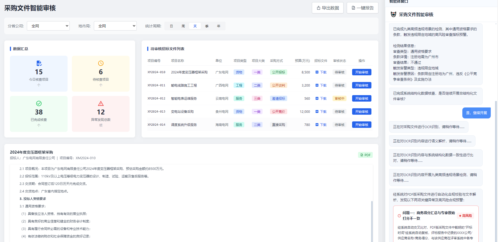

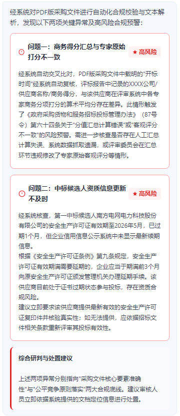

- 痛点
- 难点

- 举措
- 成效

- 人工审核标准不统一，易因人为主观疏漏产生合规漏洞；
- 纸质/电子PDF人工翻阅，违规点位查找慢、整改溯源难；
- 九大类违规、百余项细分情形依靠人工逐一核对，审核耗时久；
- 无自动定位工具，复核重复工作量大

- 统一招标审查标准，规避歧视性、不合规条款，降低采购法律风险；
- 覆盖全部9大类、100余项高频违规情形，实现全维度无遗漏筛查；
- 自动解析PDF并精准标注违规页码，省去人工通篇检索；
- 全流程线上闭环，大幅缩减标书审核、整改、复核人工工时。

招标穿透监管 | 1.采购文件智能审核

覆盖招标文件全要素智能审核，设定结构化数据校验、非结构化文件审核模式。围绕九类采购高频违规场景，梳理100余项违规情形形成检测清单，自动校验分值、资质、采购规模等结构化指标；支持PDF全文解析、分章审查、页码定位、违规标注，全面提升审查效率、统一审查标准、降低合规风险。

（一）

## Slide 46

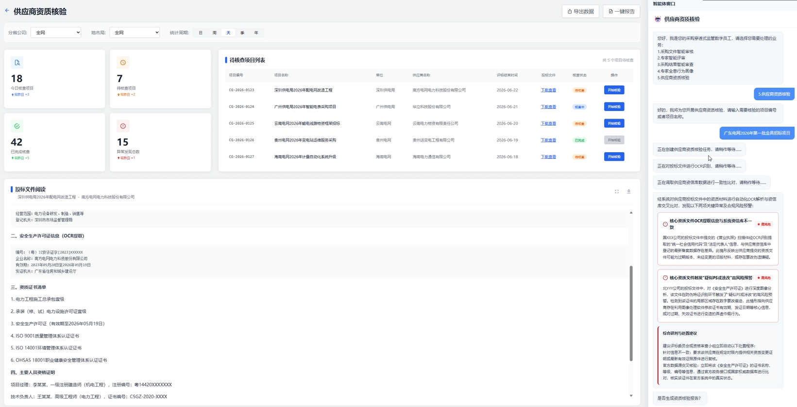

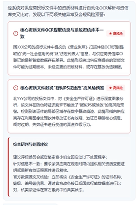

- 痛点
- 难点

- 举措
- 成效

- 纸质证照变造、业绩造假肉眼难以识别，多层股权隐性关联人工无法穿透；
- 供应商综合实力、信用情况无统一量化标准，准入判断主观性强。
- 海量供应商证照、信用信息人工跨平台逐项核验，审核周期长。

- OCR + 外部官方接口实现资质、失信记录自动核验拦截；
- 知识图谱无限层穿透识别各类隐蔽利益关联主体；
- 多维量化评估 + 动态信用评级，分级管控供应商准入；
- 前置拦截虚假资质、失信、利益关联供应商，筑牢采购准入关口。

投标穿透监管 | 2.供应商资质核验

构建供应商资信库，通过AI智能核验资质真伪、知识图谱穿透隐性关联、量化模型动态评级，运用OCR与AI文本解析技术智能核验资质文件真实性，并对接官方平台核查失信涉诉记录，自动拦截问题供应商；通过知识图谱、多维度量化评分模型，构建多层穿透体系，识别隐蔽股权结构及利益关联，对存在关联风险的供应商限制准入，实现供应商准入审查从“人工经验判断”向“智能核验、穿透关联、量化评分、动态分级”的全流程自动化管控。

（二）

## Slide 47

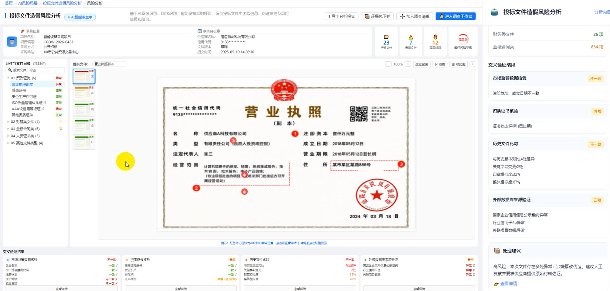

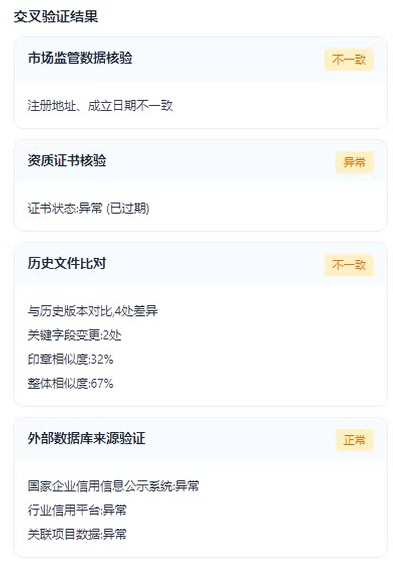

- 痛点
- 难点

- 举措
- 成效

- 人工核查难以分辨细微雷同，围串标线索隐蔽难发现；
- 人工逐条核对资质、技术参数、报价，易遗漏不合规条款；
- 企业股权、人员、网络报名等跨主体隐性关联依靠人工无法穿透排查。

- 实现投标文件造假、围串标风险自动化识别，补齐人工核查盲区；
- 多维度联动筛查，提前阻断投标环节违规行为，降低采购廉政与合规风险；
- 集中预警多类违规问题，大幅压缩风险筛查与线索摸排时长。

投标穿透监管 | 3.供应商投标文件造假风险分析

构建覆盖工商资质造假、体系认证造假、财务信息造假等10类风险维度、33项探针规则的标准化识别体系，利用AI大模型对投标文件进行智能解析，借助跨平台数据交叉对比、智能图像识别、逻辑闭环校验、细节差异比对等数字化技术，精准识别各类显性、隐蔽性投标造假行为，实现投标文件造假识别与合规风险预警的自动化、精准化，全方位筑牢采购准入合规底线。

（二）

## Slide 48

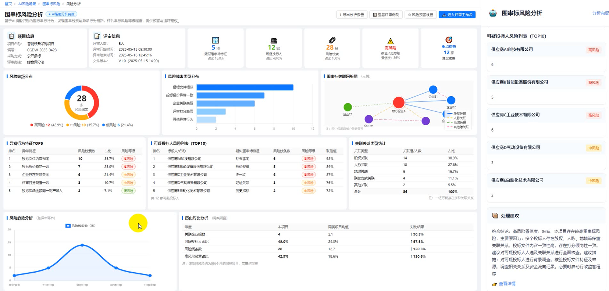

- 痛点
- 难点

- 举措
- 成效

- 各业务数据相互割裂，人工无法串联多维度信息挖掘隐性关联；
- 围串标形式隐蔽，人工难以识别轮流中标、地域抱团等行为；
- 跨项目、多年份海量投标数据人工比对筛查，工作量庞大；
- 股权、网络、资金、人员多线索交叉核验，人工梳理耗时极长。

- 突破单一维度核查短板，实现隐蔽围串标行为全维度溯源；
- 跨周期追踪投标主体关联关系，长效遏制团伙违规投标；
- 批量自动完成多维度数据关联比对，省去人工逐条线索排查；
- 一键定位跨项目长期串标团体，大幅缩短风险研判周期。

投标穿透监管 | 4.围串标风险分析

整合招投标、供应商、合同履约、财务结算、工商关联、资质业绩、第三方征信等多源数据，从投标价格、投标文件、投标行为、主体关系、履约能力、评审项定制六个维度构建风险识别体系，搭建多维数据全景关联图谱，识别报价规律异常、文件高度雷同、IP及设备共用、供应商关联关系异常、资质能力与项目不匹配等风险信号，最终输出风险等级、证据链条和处置建议，全方位挖掘隐蔽抱团投标风险，实现团体化违规行为提前识别预警。

（二）

## Slide 49

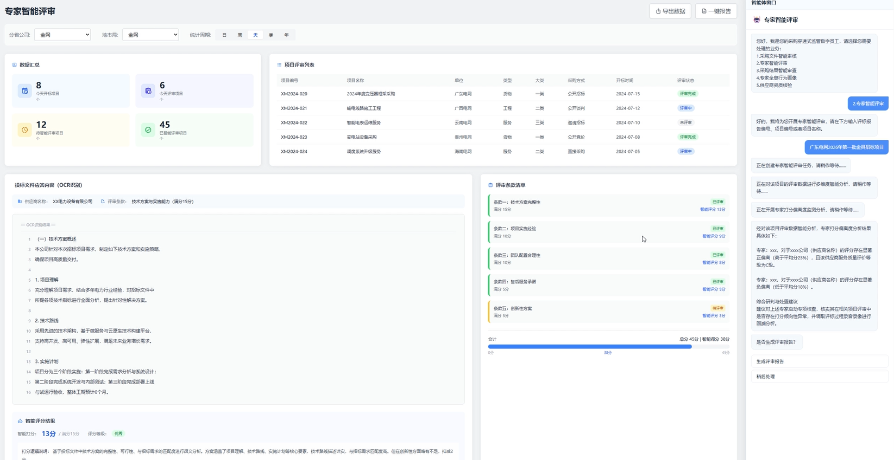

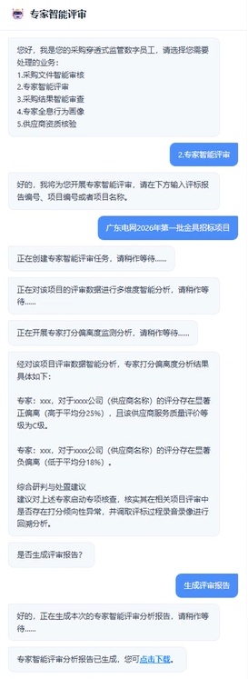

- 痛点
- 难点

- 举措
- 成效

- 单份技术标书可达上万页，多供应商材料汇总人工预处理耗时巨大；
- 营业执照、业绩、资质等多类证照需人工逐项比对核验；
- 清标筛查、分值计算、多项目对比复盘全部手动完成，专家工作负荷重。

- 支撑上万页复合型投标材料自动解析，无需人工整理拆分；
- 全覆盖证照类型自动验真，替代人工逐项真伪核对；
- 自动完成清标筛查、分值计算、跨项目数据分析，大幅减轻专家文案工作量。

评标穿透监管 | 5.专家智能评审

聚焦采购评标全生命周期业务环节，集成大文件解析、智能证照验真、智能清标、智能详评、智能后评价等核心能力，打造一体化智能评标应用体系。可处理上万页复合型招投标材料并标准化结构化，自动核验各类证照真伪；替代人工完成初审清标筛查，辅助专家定量算分、定性出具评审参考；自动生成标准化复盘分析报告，全链条减负，提升评标精准度与工作效率。

（三）

## Slide 50

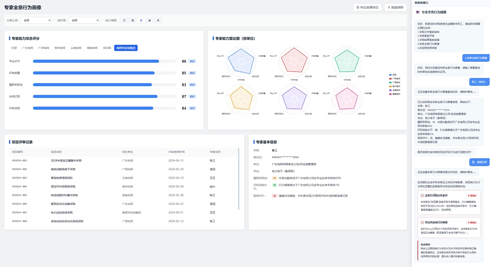

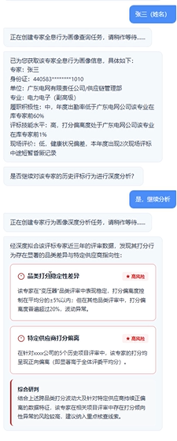

- 痛点
- 难点

- 举措
- 成效

- 专家履职数据分散，无法综合研判打分倾向性、履职规范性；
- 打分、现场行为、书面报告多环节分开管控，监督存在断点；
- 全部专家打分数据、评审时长人工核算比对，实时监控人力成本高；
- 逐份履职报告人工核查完整性、真实性，复核效率低下。

- 实现专家全周期、全环节一体化监督，规范评标履职行为；
- 多维度交叉校验，消除单一环节监管盲区，保障评审公平；
- 全量打分、时长数据自动测算比对，无需人工实时统计；
- 自动识别现场、报告多类违规，减少人工复核工作量。

评标穿透监管 | 6.专家全息行为画像

整合专家评标轨迹、打分偏离度、评标时长、回避行为、历史评标记录、违规记录、培训情况、信用评价等多维度数据，构建专家全息行为画像，动态更新履职评分。自动校验打分偏离度、识别倾向性打分，监控评审时长甄别审核效率异常；联动视频监控捕捉私带手机、私下交流等现场违规，AI 自动筛查履职报告缺漏造假，实现专家履职全流程行为实时监管、违规自动预警、全程留痕管控。

（三）

## Slide 51

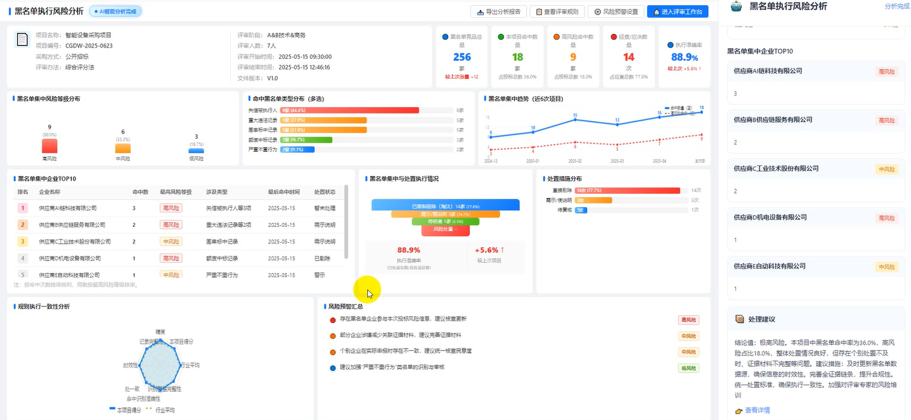

- 痛点
- 难点

- 举措
- 成效

- 供应商信用、负面信息分散，缺少常态化排查机制；
- 黑名单标准不清晰、各采购环节执行力度不一，管控约束作用弱化；
- 海量供应商人工定期核查资质、履约、关联关系，人力成本高；
- 负面舆情人工检索效率低，无法同步获取供应商违法、投诉线索。

- 周期性自动排查供应商多维度风险指标；
- 对接舆情系统自动抓取负面信息，动态调整信用等级；
- 明确黑名单纳入标准，在采购全流程刚性限制黑名单供应商。

评标穿透监管 | 7.黑名单执行风险监控

聚焦黑名单执行不到位风险，围绕黑名单供应商的纳入、黑名单库的应用、黑名单供应商的解除及更新3个风险维度，梳理形成16个风险情形、29条规则逻辑。综合运用规则引擎、知识图谱、计算机视觉等数智技术，自动识别供应商应纳未纳、应拦未拦、应解未解、应更未更等异常问题，输出风险疑点和处置提示。

（三）

## Slide 52

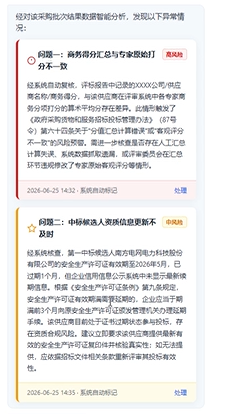

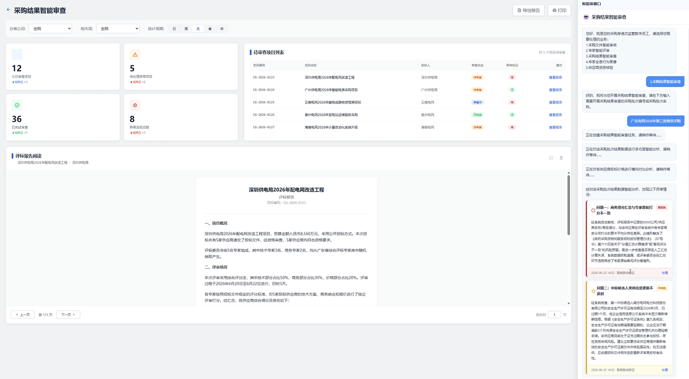

- 痛点
- 难点

- 举措
- 成效

- 人工复核易遗漏计分错误、中标资格不合规、打分畸偏等隐蔽问题；
- 定标查阅法规、案例依靠人工检索，审查依据支撑不足；
- 多份投标文件、全部专家打分数据人工交叉核对，复核周期长；
- 逐条匹配招标法规、历史案例，需投入大量人工查阅资料。

- 全覆盖筛查评审、定标环节各类合规漏洞，保障定标程序合法公正；
- 智能提供法规支撑，提升结果审查专业性与严谨度；
- 批量自动校验全部打分与中标数据，缩短结果复核周期；
- 一键匹配法规案例，省去人工查阅检索的重复工作。

定标穿透监管 | 8.采购结果智能审查

利用AI模型自动比对评标结果与评标标准、投标文件、招标公告，识别评标结果异常（中标人资质不符、报价异常、未按评标排名确定中标人）、评标分数计算错误等问题，自动预警，督促相关单位复核整改。自动关联相关法规条款与典型案例，为定标合规性审查提供精准依据，确保定标程序合法、结果公正。

（四）

## Slide 53

_No extractable text content._

## Slide 54

六、应用价值与市场前景

## Slide 55

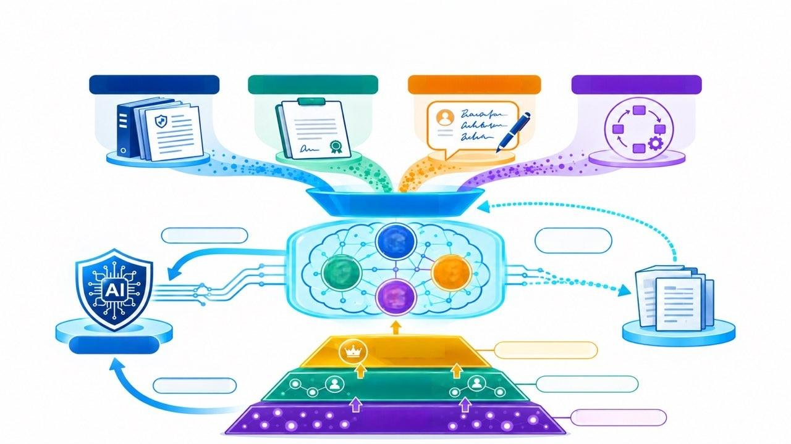

从隐性知识到企业资产,AI驱动的知识运营闭环

业务实践与流程

政策文件与法规 合同模板与条款 评审意见与批注

合同

知识精炼器

合规标准

输出结构化规则

日常审查记录反馈

评 审规则

风险偏好

例外条件

AI审查引擎 企业资产层 制度化规则 ·版本管理

持 续 学 习 与 优 化 团队知识层 同伴验证 · 知识沉淀

个人经验层 工作记录 · 决策经验

## Slide 56

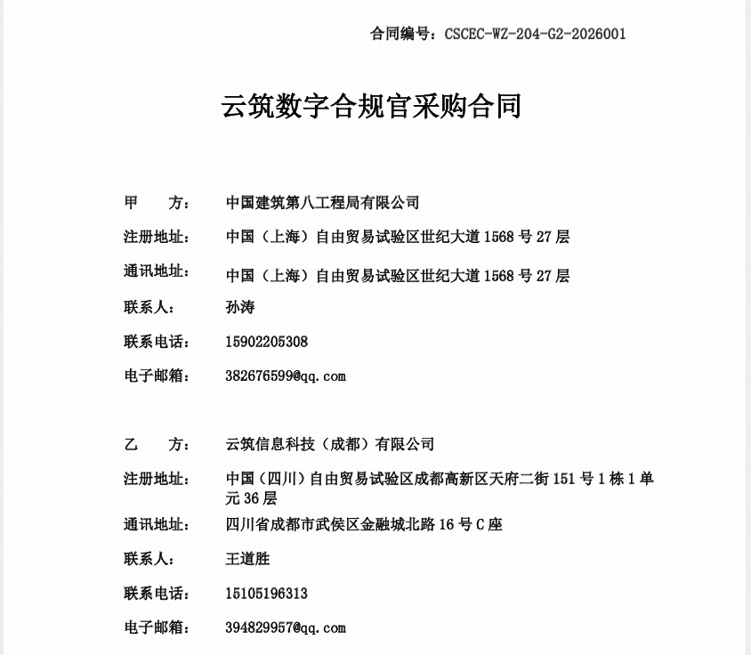

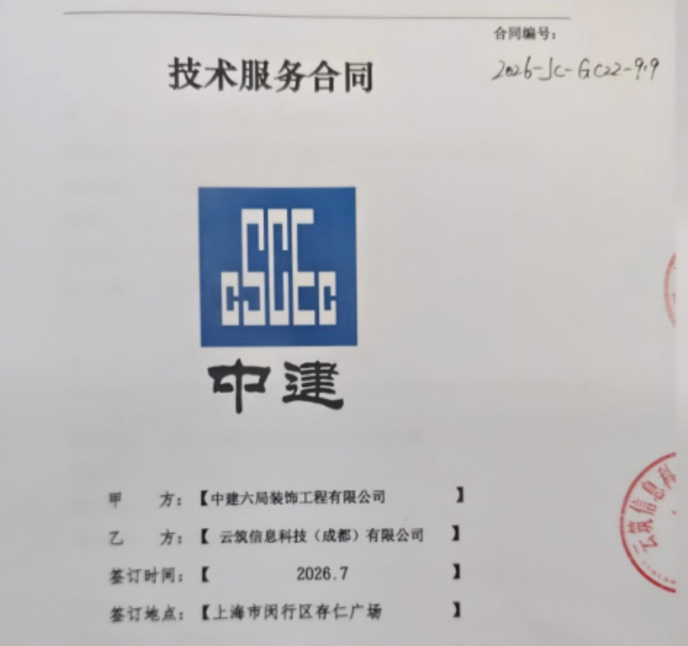

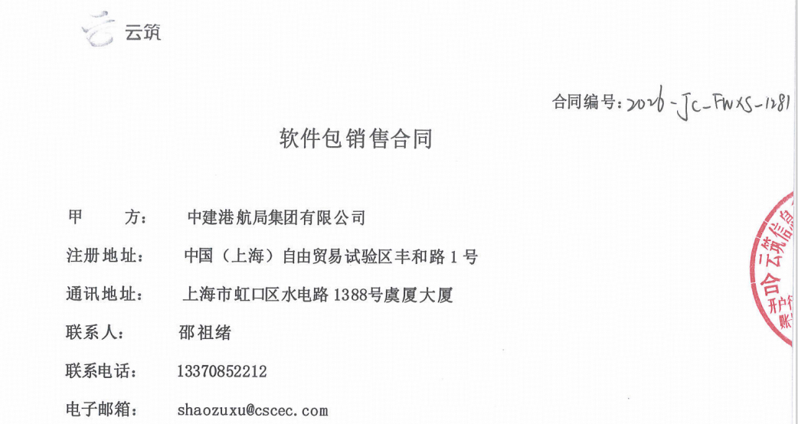

## Slide 57

推广价值 | 跨行业快速复制、推广应用

基于标准化、通用化、平台化的穿透式监督管理智能应用，按照“以调研精准匹配客户痛点、以实证建立信任、以价值推动决策、以服务成就客户”的策略方法能够快速有效推广至其它重资产企业。

电网

发电

新能源

水务

环保工程

燃气

核化工

轨道交通

石油重工

船舶海洋

航天航空

矿采工程

- 算力：主流国产化算力100%适配
- 自建300P，租赁700P

- 模型：行业主流模型100%纳管
- 5+基础模型，90+专用模型

- 数据：行业核心场景数据100%覆盖
- 10+通用数据集，90+场景数据集

DeepSeek

盘古

文本

语音

视频

图片

- 不少于5类
- 芯片

- 4类
- 模态

- 通用
- 模型

智谱

千问

- 100+
- 高质
- 量数
- 据集

招标行为数据集

气象预测

稳定计算

- 专用
- 模型

投标行为数据集

- 环境：实现场景100%可用
- 对应10大场景搭建测试环境

规划生成

状态评估

......

- 工具链：人工智能应用全环节100%支撑
- 包含：训练、推理、智能体、中试等平台

训练平台

中试平台

推理平台

智能体平台

## Slide 58

中台标准化，标准接口与事件协同使数字合规官易于嵌入交易流程，采用SaaS模式可快速复制推广至建筑、能源、交通、水利等领域。项目兼具创新性、实用性和可推广性

应用价值与

核心问题

数据来源与要素

技术方案与

应用规模

应用效果与

06

01

02

03

04

05

市场前景

利用方式

创新点

范围

量化成效

业务系统

外部协同平台

监管平台｜问题线索与处置

采购项目・公告・响应文件

数字合规官

信用平台｜信用处罚失信信息

评审结果・合同

监管中台

资质平台｜主体证书有效状态

风险识别・证据汇聚・分级处置・结果反馈

业务节点事件

审计平台｜日志证据与处置记录

接收预警 / 拦截 / 核验结果

数据输入

风险输出

处置反馈

审计交换

接口治理底座

身份认证｜权限控制｜数据脱敏｜调用日志｜失败重试｜版本管理

标准化的输入输出，数据清洗层使得数字合规官能够便捷的跨平台对接

## Slide 59

感谢观看
