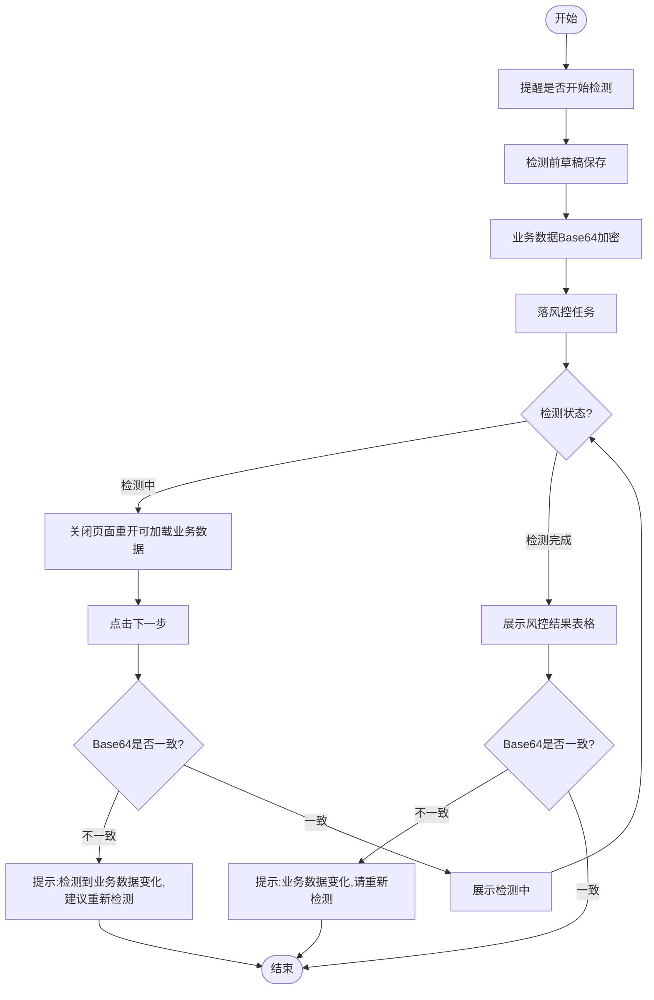
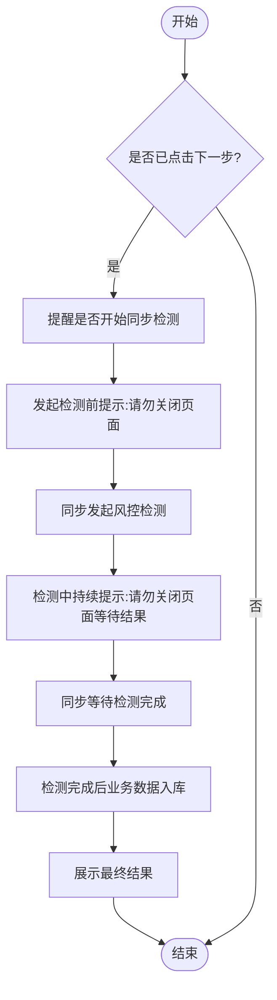

下一步之前的流程

```mermaid
flowchart TD
    Start([开始]) --> StartEnsure[提醒是否开始检测]
    StartEnsure[提醒是否开始检测] --> SaveDraft[检测前草稿保存]
    SaveDraft --> Encrypt[业务数据Base64加密]
    Encrypt --> CreateRisk[落风控任务]
    CreateRisk --> CheckStatus{检测状态?}
    
    CheckStatus -- 检测中 --> LoadData[关闭页面重开可加载业务数据]
    LoadData --> ClickNext[点击下一步]
    ClickNext --> CheckEncrypt1{Base64是否一致?}
    CheckEncrypt1 -- 不一致 --> Tip1[提示:检测到业务数据变化,建议重新检测]
    CheckEncrypt1 -- 一致 --> ShowChecking[展示检测中]
    
    CheckStatus -- 检测完成 --> ShowResult[展示风控结果表格]
    ShowResult --> CheckEncrypt2{Base64是否一致?}
    CheckEncrypt2 -- 不一致 --> Tip2[提示:业务数据变化,请重新检测]
    CheckEncrypt2 -- 一致 --> End([结束])
    
    ShowChecking --> CheckStatus
    Tip1 --> End
    Tip2 --> End
```
已经下一步过了

```mermaid
flowchart TD
    Start([开始]) --> CheckClick{是否已点击下一步?}
    CheckClick -- 是 --> StartEnsure[提醒是否开始同步检测]
    StartEnsure[提醒是否开始同步检测] --> TipBefore[发起检测前提示:请勿关闭页面]
    TipBefore --> SyncCheck[同步发起风控检测]
    SyncCheck --> TipDuring[检测中持续提示:请勿关闭页面等待结果]
    TipDuring --> WaitResult[同步等待检测完成]
    WaitResult --> SaveData[检测完成后业务数据入库]
    SaveData --> ShowFinal[展示最终结果]
    ShowFinal --> End([结束])
    
    CheckClick -- 否 --> End
```